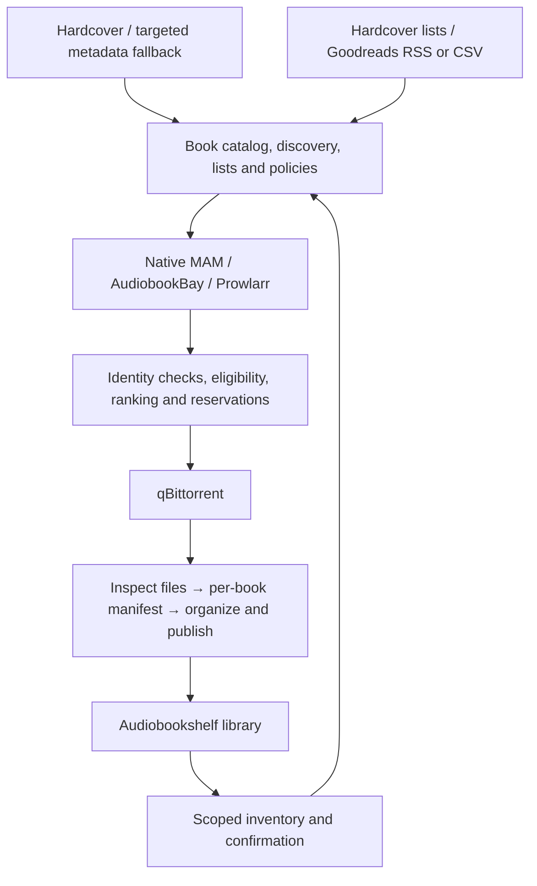

# Product and development handoff

September 17, 2026 · v1.4 planning guide, not a claim of implemented functionality.

Build a self-hosted book discovery, curation and acquisition app above Audiobookshelf. The experience should feel familiar to a Seerr user: browse attractive shelves, open one book page, see what is already owned, inspect available versions and sources, and request missing media. The app also owns organizing its newly downloaded files so that Audiobookshelf can serve them correctly.

This guide is the short entry point. The complete specification is in [PRD](PRD.md), the engineering backlog in [Implementation Plan](IMPLEMENTATION-PLAN.md), researched choices in [Implementation Decisions](IMPLEMENTATION-DECISIONS.md), and verification in [Acceptance Plan](ACCEPTANCE-PLAN.md). [Implementation Status](docs/IMPLEMENTATION-STATUS.md) records what has actually been built and tested.

## 1. Product boundary

| Concern | Owner |
|---|---|
| Browsing, recommendations, local lists and followed lists | This app |
| Work identity, catalog editions/recordings and metadata provenance | This app, using attributed provider evidence |
| Source search, selection policy and acquisition requests | This app |
| Download execution and original seeding paths | qBittorrent |
| New-download inspection, naming, hardlinks and import recovery | This app |
| Serving-library inventory, playback, reading and listening progress | Audiobookshelf |
| Visual references and eligible reusable presentation code | Seerr; no dependency on its film/TV domain |
| Rich native MAM behavior to reference or adapt with notices | MouseSearch |

Use a modular backend with isolated adapters, a separate durable worker, PostgreSQL and a React frontend. Do not require users to install another acquisition manager. Prowlarr is an optional source integration; native MAM remains first-class. BookOrbit is a later backend adapter and an architectural reference, subject to its separate license boundary.

## 2. The defining experience

1. Connect Audiobookshelf and select accessible libraries. Existing books become visible without acquiring anything.
2. Connect qBittorrent, MAM and its required proxy route; validate download/library paths and hardlink behavior. Additional sources are optional.
3. Optionally connect Hardcover; browse/search with straightforward metadata defaults and protected corrections.
4. Follow a Hardcover or Goodreads list. Choose Browse, Manual or Automatic, desired media, and a reusable profile. Automatic activation previews current entries versus future additions.
5. A newly observed member resolves to a work. Existing accessible media and compatible pending requests are checked before source selection and again before dispatch.
6. Select an eligible release or series pack. The UI explains the winner and preserves raw MAM detail. One failing source does not hide the others.
7. Download, inspect the actual files and organize each resolved book/version. Hold ambiguous children without blocking successful siblings.
8. Confirm the resulting items in Audiobookshelf. Only then show new acquisitions as available. Repeated list syncs do not repeat the acquisition.

The main navigation is **Discover · Search · My Library · Lists · Activity**. A book page separates **Overview · Editions/recordings · Sources · Lists · Activity**. Normal settings expose useful choices; advanced controls show their inherited values and a reset action.

## 3. Decisions to carry into implementation

These are the recommended baseline, not unanswered setup questions. Exact service/account/filesystem capabilities are verified when integrating.

| Priority | Decision | Required behavior | Gate |
|---|---|---|---|
| P0 | Work identity | Separate work, catalog version, encoding, source release and actual asset. Tracker results never inflate edition counts. | S01–S03 |
| P0 | Ownership | Either complete ebook or audiobook establishes overall ownership. A request for both still wants any missing medium. Exact-version requests stay independent. | S03, S05 |
| P0 | File integrity | Preserve original download paths and bytes. Validate real hardlinks, stage outside watched roots and publish without replacing unrelated files. | S04 |
| P0 | Side effects | Persist requests/reservations/jobs atomically; reconcile uncertain qBittorrent submissions before retrying. | S01, S05 |
| P0 | Privacy | Keep private lists/tokens private and enforce backend-library grants on the server. Shared infrastructure must not reveal private holdings. | S01, S03, S08 |
| P1 | Metadata | Hardcover-first when connected; targeted fallback after identity validation. Preserve provenance, selected covers and manual edits. Unknown recording details remain unknown. | S02 |
| P1 | Ranking | Filter wrong work/language/version and blocked formats before comparing coverage, format, source and availability. Provide an explanation, not hidden scoring. | S05–S06 |
| P1 | Collections | Verify each child's coverage. Import missing qualifying children separately; represent an inseparable omnibus as one shared asset. | S04, S06 |
| P1 | Layout | Use separately identifiable version leaves. Enable book/version nesting only after actual ABS scanner certification. | S04 |
| P1 | List semantics | Inbound first; explicit backfill; persistent exclusions; RSS omission never means deletion. Optional Hardcover write-back requires supported account capabilities. | S07–S08 |
| P1 | Recovery | No automatic upgrades, deletion replacement or existing-library reorganization by default. Restore with dispatch paused until external state reconciles. | S09 |

Defaults: EPUB preferred; M4B then MP3; MAM preferred; eligible series packs preferred; upgrades off; hardlinks required unless copy behavior is explicitly selected. Select desired media during setup rather than assuming everyone wants both. Source preference and format preference are ordered criteria, so the chosen profile must explain how conflicts resolve.

“Prefer series packs” can expand a missing target to a suitable pack. It does not acquire a series merely because an already-owned title reappears in a list. “Complete series” is a separate deliberate scope. Size and expansion limits bound automatic acquisition.

## 4. End-to-end delivery stages

Detailed tickets, dependencies, role ownership and acceptance references are maintained in the [stage backlog](IMPLEMENTATION-PLAN.md#3-stage-work-packages-and-gates). There are 55 work packages through v1 and six later expansion packages; package counts are not duration estimates.

| Stage | Build | Demonstrable exit |
|---|---|---|
| S00 — Scaffold | Repository, contracts, Compose, migrations, fixtures, CI and reuse ledger | Reproducible clean startup and generated client; runtime and license checks recorded |
| S01 — Durable foundation | Identities, roles, grants, encrypted secrets, jobs, idempotency and correction history | Concurrent/restarted work retains one authorized compatible intent without lost state |
| S02 — Catalog and UI | Metadata adapters, provenance, protected edits, catalog/version views, Seerr-style presentation and local lists | Find a book, inspect versions, protect an edit and curate it without advanced setup |
| S03 — Connected library | ABS inventory, reconciliation, matching, grants and availability projections | Correct owned/media indicators; failed pages cannot erase inventory; private holdings stay private |
| S04 — Certified import | Inspect/group files, manifests, naming preview, hardlinks, safe publication, sidecars and scan confirmation | A synthetic pack produces correct ABS items; sources remain unchanged; interrupted children resume |
| S05 — Manual acquisition | Native MAM, proxy/session handling, qBittorrent and full request lifecycle | Search → download → import → ABS confirmation, including lost submission response recovery |
| S06 — Aggregation and series | ABB, Prowlarr, incremental results, ranking profiles, coverage and series policies | Compare sources, explain selection and import a partially owned pack correctly |
| S07 — List automation | Hardcover lists, Goodreads RSS/CSV, subscriptions, exclusions, backlog and scheduling | Adding a list member acquires missing requested media once, including retries/overlapping lists |
| S08 — Discovery and curation | Attributed shelves, related titles, supported community lists, sharing, optional write-back and usability | Browse/follow/curate/share with clear recommendations and simple defaults |
| S09 — Production release | Recovery, backup/restore, compatibility, performance, accessibility, packaging and operator guides | Fresh install, upgrade, restore and all mandatory journeys pass with recorded evidence |
| S10 — Expansion releases | Upgrades, existing-library reorganization, other backends, richer recommendations, other download clients and SSO | Each feature passes its own compatibility and recovery gate |

**Private alpha:** S05. **Automated-list beta:** S07. **Complete discovery beta:** S08. **Production v1:** S09. S10 remains on the roadmap; it cannot absorb unfinished v1 requirements.

The dependency order matters: importing is proven on synthetic completed downloads before automatic downloading is enabled. List automation uses the same acquisition path as manual requests. It must not become a second downloader implementation.

## 5. What must remain simple in the UI

| User action | Default experience | Advanced control |
|---|---|---|
| Choose metadata | Automatic provider resolution | Group/field preference and per-book locks |
| Request a title | Clearly labelled ebook/audio/both/either actions and ownership | Exact recording/edition constraints |
| Select a download | Best eligible result with a short explanation | Source/format ordering, most-seeded preference and manual selection |
| Follow a list | Three modes, desired media, profile and activation preview | Exclusions, bounded backlog and supported write-back |
| Organize files | Preset and before/after preview with expected ABS item count | Metadata token picker and conditional naming |
| Resolve a problem | Stage, reason and next action | Manifest, raw source detail and redacted diagnostics |

Never require numerical matching weights, per-field metadata rules or naming-template syntax to complete onboarding. Separate catalog versions from download options visually. A green ownership check remains visible when the user inspects alternative versions; progress for a missing requested medium appears alongside it.

## 6. Release evidence and immediate handoff

The plan defines **42 functional requirements**: 36 for v1 and six later capabilities, plus **12 nonfunctional requirements** and **35 acceptance scenarios**. Production v1 requires the full relevant scenarios, not only their foundation subsets. Evidence includes API/browser behavior, concurrency and crash recovery, source-file integrity, actual ABS item boundaries, provider capability checks, migration/restore and accessibility.

Code existence, fixture success, live compatibility and stage acceptance are separate statuses. Missing service credentials or container/runtime certification must remain visible as unverified gates. No P0/P1 integrity, privacy, wrong-book acquisition, false-ownership or mandatory-workflow failure is acceptable for production v1.

For the existing workspace, use the verified [status](docs/IMPLEMENTATION-STATUS.md) instead of rebuilding the scaffold. Close the remaining S01 contracts, finish S02 metadata/catalog and S03 inventory compatibility, and complete S04 from its existing reviewed-import implementation. S04 still needs broader format/collection handling, automatic matching, file-alias reconciliation and the full recovery/compatibility matrix. Keep unverified integration work distinct from tested checkpoints. Partial import evidence does not establish the complete source-to-library workflow; source acquisition and external-list automation remain pending.

At each stage start, split its packages into reviewable tickets with an owner, affected FR/AT IDs, input/output contract, success/failure fixtures and demo. Estimate after inspecting the existing implementation and measuring throughput; revise estimates for provider and filesystem uncertainty. At stage end, attach the revision and actual results, update coverage, and resolve blockers before enabling the dependent capability.

The [capability activation and readiness matrix](IMPLEMENTATION-PLAN.md#10-capability-activation-and-integration-readiness) specifies when each user-facing workflow can be enabled, its installation prerequisites and its useful fallback. It also assigns unresolved integration questions to work packages and provides a ticket template for the development handoff.

Use the [end-to-end product walkthrough](PRD.md#15-end-to-end-product-acceptance-walkthrough) as the common trilogy/list/pack fixture throughout development. The [stage evidence scopes](ACCEPTANCE-PLAN.md#7-stage-evidence-scopes) separate early subsets from full release acceptance, so catalog work is not blocked by a downloader that belongs to a later stage. Production v1 still requires the complete integrated evidence.

The v1.3 handoff also fixes [settings precedence and in-flight changes](PRD.md#effective-settings-and-changes-during-acquisition-fr-20fr-23-fr-27-fr-33): show effective values, retain each request reason's constraints, freeze submitted choices and import manifests, and recheck current permissions before side effects. Sample naming previews are usable before filesystem setup; only inspected, validated plans can qualify for publication. Unsupported archives stay reviewable without being mistaken for supported book containers or directly hardlinkable media.

The v1.4 handoff adds an explicit [P0/P1 release-blocker policy and stage review record](IMPLEMENTATION-PLAN.md#11-release-blockers-and-stage-review). It distinguishes remaining planned scope, unavailable integration evidence and actual product defects. Use it to decide which capabilities can be enabled at each milestone; it does not turn partial implementation into completed stages.

## 7. Your requirements mapped to delivery

This table is the product review checklist. Requirement and acceptance IDs refer to the PRD and acceptance plan; they describe required outcomes, not implementation status.

| Requested experience | Implementation boundary | Requirements | Delivery and proof |
|---|---|---|---|
| Familiar Seerr visual experience | Adapt navigation, cover shelves, detail pages and request dialogs to the book domain; no film/TV service dependency | FR-09–FR-12; NFR-07 | S02, S08; AT-04–AT-05, AT-28 |
| Keep Audiobookshelf as the player | Inventory adapter and deep links; no reading, audio playback or listening-progress engine in this app | FR-13–FR-15 | S03; AT-06–AT-07 |
| One title with ebook editions and audiobook narrators | App-owned work/version/representation model; separate catalog identity from tracker releases | FR-05–FR-06, FR-10 | S01–S03; AT-02, AT-04 |
| A green check when either complete medium exists | Overall ownership separate from desired-media satisfaction; companion documents cannot establish ebook ownership | FR-14, FR-21–FR-22 | S03, S05; AT-06, AT-13 |
| Accurate, detailed MAM search | Native adapter preserves raw titles, descriptions, narrators, genres and release evidence; direct search remains available | FR-09, FR-16 | S05; AT-04, AT-08 |
| qBittorrent, mam_id and Gluetun settings | Direct downloader integration; encrypted MAM session and explicit integration proxy route; torrent VPN routing remains deployment configuration | FR-03–FR-04, FR-16, FR-23 | S05; AT-01, AT-08, AT-13 |
| Compare MAM, AudiobookBay and Prowlarr results | Independent source adapters, partial results and origin-aware deduplication; native and Prowlarr MAM paths do not duplicate queries | FR-17–FR-20 | S06; AT-09–AT-12 |
| Prefer sources, seed counts and file formats | Eligibility first, then ordered profile preferences with explanations; EPUB and M4B/MP3 defaults, editable without numerical weights | FR-20–FR-21 | S05 baseline, S06 complete; AT-12 |
| Prefer series packs and account for each book | Explicit series scope, bounded expansion, actual-file inspection and independent child imports; shared omnibus assets stay truthful | FR-24–FR-26 | S04, S06; AT-14–AT-15 |
| Author/series/book/version naming and hardlinks | Presets, token picker, frozen preview, separate version leaves, source preservation and actual ABS layout certification | FR-27–FR-30 | S04–S05; AT-16–AT-19 |
| Multiple metadata providers without configuration overload | Automatic provider resolution, provenance and protected edits; advanced rules are optional | FR-07–FR-08 | S02–S04; AT-03 |
| Hardcover and Goodreads lists trigger missing downloads | Durable observations, future-only or reviewed backfill, per-list media/profile, exclusions and one shared acquisition engine | FR-31–FR-33 | S07; AT-20–AT-22 |
| Useful native list synchronization | Hardcover inbound and capability-gated optional list write-back; Goodreads RSS/CSV inbound, without promising RSS write-back | FR-31–FR-34 | S07–S08; AT-20–AT-23 |
| Bookstore browsing, related titles and community lists | Attributed provider-supported shelves, explainable local recommendations, accessible list following and local sharing | FR-11–FR-12 | S08; AT-05, AT-28 |
| Never redownload merely because lists overlap or workers restart | Independent request reasons, compatible reservations, submission reconciliation and final accessible-library confirmation | FR-22–FR-23, FR-30, FR-33 | S01, S05–S07; AT-13, AT-19, AT-22, AT-30 |
| Recover and operate the finished app | Stage-specific repair, redacted diagnostics, migrations, backups, restore reconciliation and a supported deployment matrix | FR-35–FR-36; NFR-01–NFR-12 | Continuous work; S09 release; AT-24–AT-30 |

The core requested product is delivered through S09. Additional backends such as BookOrbit, more advanced recommendations, other download clients and deliberate existing-library reorganization are explicit S10 expansions. Basic related-title recommendations, useful customization and organization of new downloads are already v1 requirements; they must not be deferred under those expansion headings.
