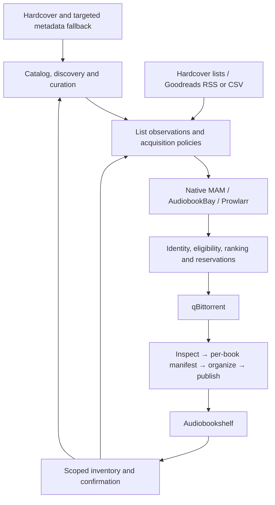

# Product and development handoff

September 19, 2026 · Product baseline v1.9 · Planning review against committed revision `ec85b46`.

Build a self-hosted book discovery, curation and acquisition app above Audiobookshelf. Browse a familiar Seerr-style catalog, see existing holdings, compare ebook editions and audiobook recordings, aggregate releases, and acquire missing media through manual requests or followed lists. Organize new downloads into verified library items while preserving the original torrent data.

This is the consolidated development entry point. The repository already contains partial implementation; no full stage is accepted by this planning document. Uncommitted code is work in progress. Historical checkpoint sections in the detailed plan retain context; use sections 9–10 below for the current execution order.

| Artifact | Purpose |
|---|---|
| [PRD](PRD.md) | Complete product requirements, UX, defaults, behavior contracts and eight launch journeys |
| [Architecture](PRODUCT-ARCHITECTURE.md) and [engineering decisions](IMPLEMENTATION-DECISIONS.md) | Data model, authority, integrations, technology and researched rationale |
| [Implementation plan](IMPLEMENTATION-PLAN.md#3-stage-work-packages-and-gates) | Stages, work packages, dependencies, responsible roles and acceptance gates |
| [Development backlog](DEVELOPMENT-BACKLOG.csv) | 61 stable packages for issue import: 55 through v1 and six expansion packages |
| [Acceptance plan](ACCEPTANCE-PLAN.md) and [traceability](REQUIREMENTS-TRACEABILITY.csv) | 35 acceptance scenarios mapped to 42 functional and 12 nonfunctional requirements |
| [Implementation status](docs/IMPLEMENTATION-STATUS.md) | Actual revisions, evidence and remaining qualification; separate from planned scope |

## 1. Product boundary

| Responsibility | Owner |
|---|---|
| Catalog, discovery, recommendations, curation and list policies | This app |
| Work/version identity, provider reconciliation and protected app metadata | This app |
| Search aggregation, release ranking, reservations and dispatch decisions | This app |
| Torrent execution and original seeding paths | qBittorrent |
| Inspection, naming, hardlinking and publication of new acquisitions | This app |
| Playback, reading, progress and serving-library inventory | Audiobookshelf |
| External membership and account permissions | Hardcover / Goodreads, observed through supported interfaces |
| Proxy/VPN service | Gluetun or another configured external route |

Use a new modular application with selective Seerr presentation reuse. Do not carry its movie/TV model into the book domain. Reference MouseSearch for native MAM behavior and Shelfmark for aggregation patterns. BookOrbit informs metadata-policy design; additional player backends remain a later integration.

[Seerr](https://github.com/seerr-team/seerr) provides the familiar request/discovery presentation reference. [MouseSearch](https://github.com/sevenlayercookie/MouseSearch) documents dedicated MAM sessions and rotated cookie persistence. [Shelfmark](https://github.com/calibrain/shelfmark) documents Prowlarr and multiple book-source integrations. [BookOrbit](https://github.com/bookorbit/bookorbit#license-and-attribution) identifies AGPL-3.0-only and additional terms: it is not interchangeable with the MIT references. Record revision, license and notices for every copied component; independently implement reference ideas where required by the selected reuse boundary.

Selected stack: React/TypeScript/Vite, Tailwind and TanStack Query; FastAPI/Pydantic with a generated TypeScript client; PostgreSQL/SQLAlchemy/Alembic; Procrastinate durable jobs. API and worker share domain services but run separately. Compose packages the app and database; ABS, qBittorrent, proxy and optional Prowlarr are connections. These are project choices explained in [D12](IMPLEMENTATION-DECISIONS.md#d12--concrete-technical-foundation).

The essential entities are Work, CatalogVersion, Representation, SourceRelease, LibraryAsset, ListMembership, AcquisitionIntent, Transfer and ImportManifest. A version records a real edition or recording; an encoding is a representation; competing tracker results are releases. One transfer can contain several works, and one asset can be an inseparable omnibus. Namespaced provider IDs support matching but do not replace app-owned identity.

### Integration delivery contract

Each connection has an independently tested adapter. Successful authentication is only one capability: inventory access, list access, search, acquisition and write-back must be qualified separately. The interface choices below describe what to implement; they do not certify an account or a deployed service version.

| Connection | Interface and responsibility | Required behavior when limited or unavailable | Delivery |
|---|---|---|---|
| Audiobookshelf | Authenticated server API for libraries/items and optional scans; events where available, with periodic inventory reconciliation | Keep stale holdings distinguishable from confirmed absence; wait for observed items before showing availability; support watcher-only confirmation when scan permission is absent | S03–S04 |
| Hardcover | Server-side GraphQL adapter for catalog, editions, series, discovery and authorized list observations; separately enabled supported list mutations | Cache attributed metadata, retain unresolved entries, expose account/capability errors and keep write-back independent of read access | S02, S07–S08 |
| Open Library | Targeted work/edition lookup through a separate metadata adapter | Fill identity-validated gaps; do not infer a recording or narrator from work-level metadata | S02 |
| MyAnonamouse | Native search/detail and torrent resolution; encrypted `mam_id`, serialized session rotation and explicit configured proxy route | Distinguish authentication, quota, parser and empty-result states; preserve rotated credentials; a required proxy failure cannot fall back to direct access | S05 |
| AudiobookBay | Bounded search/detail parsing and magnet/torrent metadata resolution for supported hosts | Isolate parser failures from other sources; unknown seeds and unverified collection contents remain unknown | S06 |
| Prowlarr | API adapter retaining indexer identity, categories, capabilities and acquisition routing | Suppress redundant native-MAM querying; retain origin-specific download credentials; disable unsupported transports | S06 |
| qBittorrent | Web API for capabilities, submission, transfer association, status and file observations | Reconcile a lost submission response before retrying; preserve original seeding data; apply explicit client-to-worker path mappings | S05 |
| Goodreads | Inbound shelf RSS and user-provided CSV through the list adapter | Repeated entries are idempotent; an entry missing from a limited feed does not prove removal; expose no unsupported write-back action | S07 |
| Gluetun | External HTTP proxy route for configured source traffic; torrent egress remains a separate deployment concern | Test the actual configured route and report failure without bypass; UI traffic and unrelated providers need not share the route | S05 |

The [Hardcover API guide](https://docs.hardcover.app/api/getting-started/) describes a changing GraphQL API; its published onboarding details are not a substitute for current operation/account tests. The [ABS directory guide](https://audiobookshelf.org/docs/documentation/libraries/book-library/directory-structure/) defines scanner-sensitive book boundaries. These are why capability qualification and actual item-count/layout tests belong in the delivery gates. Detailed adapter behavior and researched references remain in [D03, D07 and D10–D11](IMPLEMENTATION-DECISIONS.md).

## 2. The defining experience

1. Connect ABS and select libraries. Recognize existing books without downloading anything.
2. Connect qBittorrent, MAM and the required proxy route. Verify paths, permissions and actual hardlinks; optionally connect additional sources and metadata/list accounts.
3. Browse shelves, search a title or author, inspect related books and open a book page. Show clean catalog information alongside an accessible source-details tab.
4. Follow a list in Browse, Manual or Automatic mode. Choose desired media, a profile and current entries versus future additions. Preview any backlog.
5. Resolve each new membership to a work. Check owned media and compatible pending requests before selection and again before dispatch.
6. Compare eligible releases or packs, retaining raw MAM detail and explaining the winner. A failed source does not hide completed results.
7. Download, inspect and organize each identified book/version. Hold ambiguous children independently; preserve the complete seeded pack.
8. Confirm actual items in ABS. Show the green ownership check, preserve per-medium/version detail, and avoid another acquisition on repeated sync.

Navigation: **Discover · Search · My Library · Lists · Activity**, with administrator settings. Book detail: **Overview · Editions/recordings · Sources · Lists · Activity**. My Library is an inventory view with Open in ABS, not another player.

## 3. Decisions to carry into implementation

These are selected defaults. Integration capability checks remain evidence gates, rather than additional product-preference questions.

| Priority | Decision | Required implementation behavior | First gate |
|---|---|---|---|
| P0 | Separate identity layers | Work, edition/recording, representation, release and asset remain distinct; corrections preserve history | S01–S03 |
| P0 | Separate ownership from fulfillment | Either complete medium gives In library; Both still requires missing media; an exact narration requires that recording | S03, S05 |
| P0 | Preserve source files | Hardlink-required default; stage outside watched roots; no unrelated overwrite, seeded-file retag or source rename | S04 |
| P0 | Durable side effects | Atomic intent/job creation, compatible reservations and uncertain-submission reconciliation | S01, S05 |
| P0 | Enforce authority | Server-side library grants, private list/account scope, encrypted secrets and permission revalidation | S01, S03, S08 |
| P0 | Bound pack expansion | Distinguish catalog series, authorized scope, actual contents and confirmed holdings | S04, S06–S07 |
| P1 | Simple metadata policy | Hardcover-first when connected; identity-validated fallback, provenance and manual locks; unknown recording fields stay unknown | S02 |
| P1 | Explain ranking | Eligibility first, then ordered coverage/format/source/availability preferences; source-local popularity stays source-local | S05–S06 |
| P1 | Truthful collections | Independently verified children; skip duplicate publication; one omnibus does not become imaginary separate files | S04, S06 |
| P1 | Compatible layouts | Each version has an identifiable item leaf; nested book/version layout enabled only after ABS certification | S04 |
| P1 | Predictable lists | Explicit backfill, stable exclusions, inbound Goodreads RSS/CSV; RSS omission never proves removal | S07–S08 |
| P1 | Recoverable operation | Upgrades and deletion replacement off; restore pauses dispatch until reconciliation and deliberate resume | S09 |

Balanced defaults prefer EPUB, M4B then MP3, MAM, and qualifying series packs. Desired media is a setup choice, not automatically Both. A Most seeded preset can reorder preferences without weakening identity constraints. Unknown seed counts are not zero. The [finite automation defaults](PRD.md#19-initial-automation-defaults-and-activation-contract) bound transfers, size, pack expansion, refreshes, backfill and storage reservations.

“Prefer series packs” expands an acquisition for a missing target within authorized bounds. It does not download a series merely because an already-owned work reappears on a list. “Complete series” is a distinct scope. New sequels require an active monitoring policy; they do not silently enlarge an old frozen request.

## 4. End-to-end delivery stages

The [stage packages](IMPLEMENTATION-PLAN.md#3-stage-work-packages-and-gates) contain the ticket-level deliverables and detailed FR/AT mappings. Each stage delivers backend, worker and UI behavior together where applicable.

| Stage | Dependencies | Deliverable | Demonstrable exit | Accountable role |
|---|---|---|---|---|
| S00 — Scaffold | Planning baseline | Repository, Compose, contracts, fixtures, CI and reuse ledger | Clean startup, generated client, migrations and recorded provenance | Platform / technical lead |
| S01 — Durable foundation | S00 | Identity, auth/grants, secrets, corrections, transactions and jobs | Concurrent/restarted requests preserve one compatible intent and authorization | Backend / workflow |
| S02 — Catalog and UI | S01 | Metadata resolution, protected edits, catalog/version pages and local lists | Search, inspect and curate without advanced metadata configuration | Catalog + frontend |
| S03 — Connected library | S01; integrates S02 | ABS reconciliation, matching and scoped ownership | Correct media badges; partial scans cannot erase holdings or reveal private libraries | Integrations |
| S04 — Safe importing | S01–S03 | Inspection, child manifests, naming, hardlinks, publication and confirmation | Synthetic packs produce correct ABS boundaries with unchanged source bytes and recoverable children | Import / filesystem |
| S05 — Manual acquisition | S02–S04 | Native MAM, route/session handling and qBittorrent lifecycle | Search → download → organize → ABS-confirmed ownership, including a lost submission response | Source + workflow |
| S06 — Aggregation and series | S05 | ABB/Prowlarr, partial results, ranking profiles, series scope and coverage | Explain selection across sources; correctly import a partly owned pack | Source + acquisition |
| S07 — List automation | S06; adapters can begin after S02 | Hardcover, Goodreads RSS/CSV, baselines/backfill, exclusions and bounded scheduling | A new list member acquires missing media once across overlapping lists and restarts | Lists + workflow |
| S08 — Discovery and curation | S02, S03, S07 | Shelves, explained related titles, accessible community lists, sharing and optional Hardcover write-back | Browse → follow → curate → acquire; defaults stay simple and private data stays private | Frontend / product + integrations |
| S09 — Production v1 | All S00–S08 gates | Recovery, compatibility, performance, accessibility, deployment and guides | Fresh install, upgrade and populated restore pass all mandatory journeys with release evidence | Release / platform |
| S10 — Expansion releases | Stable v1 + affected gates | Other backends/clients, richer recommendations, explicit upgrades/reorganization and SSO | Each extension passes its own identity, authority and recovery contract | Feature owner |

Milestones: **S05 private alpha → S07 automated-list beta → S08 complete discovery beta → S09 production v1.** S10 cannot absorb unfinished v1 requirements. Basic related-book recommendations and customization are already v1.

S02 and S03 can proceed independently against S01 contracts. Parser fixtures, provider research and discovery UI can also begin early. Import qualification precedes automatic acquisition, and list automation must reuse the manual acquisition pipeline. Security, accessibility, schema evolution and recovery are continuous obligations.

## 5. What must remain simple in the UI

| Action | Normal experience | Advanced control |
|---|---|---|
| Choose metadata | Automatic resolution and clear provenance | Provider groups, field preferences and protected overrides |
| Request a title | Ebook/audio/both/either with current holdings visible | Exact edition or narration |
| Choose a release | Best eligible result with explanation | Ordered formats/sources, Most seeded, manual selection |
| Follow a list | Mode, desired media, profile, current/future entries | Exclusions, bounded backfill and supported write-back |
| Organize media | Preset, before/after paths and expected ABS item count | Token picker, conditional naming and per-medium roots |
| Repair a problem | Failed stage, reason and valid next action | Manifest, original source detail and redacted diagnostics |

Do not require numeric scoring weights, field-by-field metadata tuning or template syntax for onboarding. Advanced controls show inherited values and Reset. Sorting search results does not silently change automation. Keep the overall ownership check visible while showing a missing requested medium or alternative recording.

Default layout uses certified item/version leaves under author and optional series folders. The desired author → series → book → version nesting is a compatibility target, not an assumption about ABS scanning. Preview missing token behavior, collisions, year meaning, language and series numbering before publication. Existing libraries remain untouched unless a separately scoped future reorganization is requested.

## 6. Release evidence and immediate handoff

v1 requires **FR-01–FR-36 and NFR-01–NFR-12**, using the complete relevant **AT-01–AT-30** scenarios. Expansion includes FR-37–FR-42 and AT-31–AT-35. Passing a fixture, qualifying a live integration and accepting a stage are separate facts.

| Evidence layer | Must prove |
|---|---|
| Domain and adapter fixtures | Identity, ranking, matching, provider failures and deterministic decisions |
| Database/filesystem integration | Atomicity, locks, reservations, restart recovery, source integrity and path confinement |
| Actual supported services | ABS scanner boundaries, qBittorrent lifecycle, account/API capabilities and configured proxy behavior |
| Browser and usability | Complete default journeys, advanced controls, errors, keyboard/focus and mobile behavior |
| Release rehearsal | Fresh install, populated migration/restore, compatibility matrix, reference load and operator instructions |

An ABS scan request or finished torrent is not proof of availability. A GraphQL schema is not proof an account permits a query. A failed provider response is not an empty catalog/list. The [ABS API reference](https://api.audiobookshelf.org/) explicitly warns that it is unmaintained, so selected server source and actual contract tests must qualify integrations.

No P0/P1 integrity, privacy, wrong-book acquisition, false-ownership or mandatory-workflow defect is acceptable at production release. Qualify provider accounts and filesystems as contracts stabilize, not only at release time. Unsupported optional capabilities remain visibly disabled; mandatory features cannot be reclassified as optional to pass a gate.

## 7. Your requirements mapped to delivery

| Requested outcome | Requirements | Delivery |
|---|---|---|
| Familiar Seerr visual experience above ABS | FR-09–FR-11, FR-13–FR-14 | S02–S03, S08 |
| Rich native MAM details and cross-source release comparison | FR-16–FR-20 | S05–S06 |
| Metadata aggregation with sensible defaults | FR-05–FR-08 | S01–S02 |
| Green ownership with independent ebook/audio and version detail | FR-10, FR-14, FR-21–FR-22 | S03, S05 |
| qBittorrent, Gluetun route, mam_id and seeded-file preservation | FR-03–FR-04, FR-16, FR-23, FR-28 | S04–S05 |
| Custom naming, versions, packs and truthful omnibus handling | FR-24–FR-30 | S04–S06 |
| List sync, selective acquisition, auto-download and deduplication | FR-22, FR-31–FR-34 | S07–S08 |
| Related titles, community lists and local curation | FR-11–FR-12 | S08 |
| Reliable installation, repair and recovery | FR-35–FR-36, NFR-01–NFR-12 | Continuous; final S09 gate |

Goodreads RSS/CSV is inbound. Optional Hardcover write-back is separately enabled for supported list operations; it does not imply reading-status synchronization. BookOrbit and other player backends are S10 adapters; their discovery/inventory contract is planned without requiring another player implementation.

## 8. Development execution contract

Each ticket records parent package, FR/AT IDs, user outcome, owner/reviewer, contracts, affected layers, failure behavior, migration impact and evidence. Use stable IDs from the backlog; split packages into small vertical increments without duplicating the requirement set.

Settings resolve per field: request → list → selected profile → personal defaults → installation defaults → built-in defaults. Administrator restrictions apply independently. Freeze submitted decisions and import manifests. Changing a policy requires reviewed changes to unsatisfied work; it cannot reinterpret an existing external transfer.

Definition of done: default and failure journeys demonstrated, authority checked, API/client/migration synchronized, relevant tests passed, operational repair documented, revision/environment recorded and limitations explicit. Source fixtures cannot substitute for actual compatibility proof.

Assign an accountable developer and reviewer at scheduling time. With one developer, these remain separate review steps. Estimate implementation, validation, external-access dependencies and contingency separately, then reforecast from demonstrated work. Package count is not a calendar estimate. Do not make delivery-date promises without staffing and measured throughput.

## 9. Remaining development batches from the current checkpoint

Reviewed implementation checkpoint: `ec85b46`, schema 0044. Recorded increments include bounded catalog/inventory, acquisition/import, lists/series, discovery/curation, write-back and successive recovery safeguards. Consult implementation status for exact coverage; no blanket completion follows from this list. This checkpoint identifies the code reviewed for this handoff, not a minimum version or a stage acceptance.

The checkpoint includes [saved automation review](docs/RECOVERY-AUTOMATION.md), [account permission review](docs/RECOVERY-ACCESS.md), and [ABS/qBittorrent connection repair](docs/RECOVERY-CONNECTIONS.md). Those increments provide explicit policy, permission, credential and downloader-mapping review while restore remains paused. The next increment supplies [source settings and durable verification](docs/RECOVERY-SOURCES.md); its evidence is recorded separately. Metadata-account settings, actual file-route qualification, unresolved effects and fresh wanted-work activation still precede controlled resume. Measured results and their bounded acceptance scope are recorded in implementation status.

| Workstream | Remaining outcome | Required demonstration |
|---|---|---|
| Recovery completion / S09-02 | Current grants/configuration review, uncertain effects/reservations, fresh wanted-work activation and controlled resume | Restore with external state ahead of the backup; resume only reconciled authorized work without historic replay or duplicate dispatch |
| Source qualification / S05–S06 | Actual MAM/ABB/Prowlarr, proxy and qBit behavior; release equivalence and broader combinations | Full real-service path with overlap, credential rotation, parser/network failure and uncertain submission |
| Versions and collections / S03–S06 | Complete narration/edition matching, mixed packs, bounded series policies, child recovery and certified layouts | Partly owned trilogy with two narrations, an ambiguous child and stable seeded bytes |
| Policy and list lifecycle / S06–S07 | Effective-setting changes, overlapping reasons, baseline/backfill/catch-up and bounded scheduling | New upstream title reaches ABS once; pause/revoke/resume and profile changes preserve independently authorized work |
| Discovery and usability / S02, S08 | Complete bookstore browsing, recommendations, supported community lists/write-back and simple settings | Connect, browse, follow and repair without advanced configuration; private data and permissions stay correct |
| Release qualification / S09 + earlier gaps | Supported deployment, full acceptance ledger, performance/accessibility and operator guides | Fresh installation, upgrade and populated restore pass the eight launch journeys |
| Expansion / S10 | Six separately scoped capabilities | Independent release and compatibility gates after v1 |

Recovery does not replace the broader product work. Earlier unmet stage prerequisites remain mandatory, even if a later screen or workflow already exists. Actual-service qualification and usability review may progress alongside recovery work.

## 10. Development start and release handoff

**Current product priority:** begin the [internal alpha sessions](docs/INTERNAL-ALPHA.md) on the native deployment. Configure the real library, gather setup/browsing feedback and qualify a controlled acquisition. The remaining recovery and production gates below remain mandatory, but they should not delay these user-testing sessions.

For a fresh implementation, follow S00 → S01 → S02/S03 → S04 → S05 → S06 → S07 → S08 → S09. For this existing workspace:

1. **Inventory current evidence.** Compare HEAD and working changes with implementation status. Preserve delivered subsets and attach every remaining assertion to its stable package.
2. **Complete current connection and route recovery.** Preserve delivered account/ABS/qBittorrent reviews. Preserve the source/session repair increment and complete metadata-account repair; verify current file destinations and mappings before granting fresh import authority. Saving settings, verifying a connection and qualifying a file route are distinct outcomes.
3. **Complete recovery authority and resume.** Preserve queue/approval fences; reconcile external effects and reservations; resolve or explicitly hold uncertain work; activate only freshly authorized wanted work; rehearse actual restore and controlled resume. Do not mistake local settings confirmation for permission to resume automation.
4. **Close source, version and automation gaps.** Run the shared acceptance story across qualified services and layouts, including policy changes and shared reasons. Use the existing acquisition/import services.
5. **Finish the full product experience.** Review setup, catalog, versions/sources, recommendations, list curation/activation, collection review and repair on desktop and mobile.
6. **Accept the release candidate.** Close all mandatory evidence, publish versioned build artifacts and supported compatibility information, complete upgrade/restore instructions and release documentation. Take S10 separately.

Use one shared synthetic story throughout: two overlapping lists, a trilogy with one ebook already owned, two narrations of a work, a pack with one uncertain child, an independent manual request and a delayed ABS scan.

| Situation | Required result |
|---|---|
| Ebook owned; Both requested | Keep the green work check and acquire only qualifying missing audio |
| Several trackers offer one recording | Several releases under one catalog recording |
| Exact narration requested | Wrong or unknown narration cannot silently satisfy it |
| Pack includes an owned work | Preserve the torrent and skip duplicate publication |
| One child is ambiguous | Hold that child and complete resolved siblings |
| Suitable series pack absent | Eligible individual releases can fill authorized gaps |
| List entry disappears or returns | Preserve files and independent reasons; RSS omission proves no removal |
| Source, proxy or ABS fails | Partial/stale state and actionable repair; no route bypass or false ownership |
| Worker or restored app restarts | Reconcile transfers/publications before repeating effects |

Release artifacts: versioned app images, migrations, supported service/filesystem matrix, retained notices, backup/restore procedure, administrator and user guides, known optional limitations, and requirement-to-evidence records. Review all eight [launch journeys](PRD.md#20-launch-journey-checklist) and the [release-blocker policy](IMPLEMENTATION-PLAN.md#11-release-blockers-and-stage-review).

The planning package is ready for staged execution. Product defaults are selected; service capability, account access, scanner layouts and release performance remain implementation evidence gates. Planning completion does not mean application completion.
