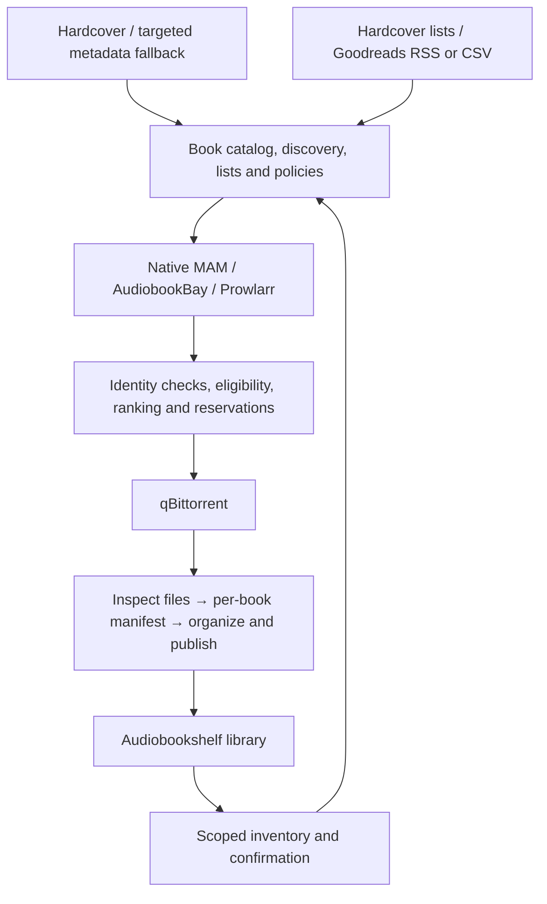

# Product and development handoff

September 19, 2026 · v1.9 product baseline · Planning handoff reviewed against committed revision `30db130`, including discovery, community-list subscriptions, series continuation, household curation/sharing and list pagination. Implementation is partial; no complete stage gate is accepted. Uncommitted work is not acceptance evidence.

Build a self-hosted book discovery, curation and acquisition app above Audiobookshelf. The experience should feel familiar to a Seerr user: browse attractive shelves, open one book page, see what is already owned, inspect available versions and sources, and request missing media. The app also owns organizing its newly downloaded files so that Audiobookshelf can serve them correctly.

This guide is the short entry point. The complete specification is in [PRD](PRD.md), the engineering backlog in [Implementation Plan](IMPLEMENTATION-PLAN.md), researched choices in [Implementation Decisions](IMPLEMENTATION-DECISIONS.md), and verification in [Acceptance Plan](ACCEPTANCE-PLAN.md). [Implementation Status](docs/IMPLEMENTATION-STATUS.md) records what has actually been built and tested.

The planning package contains **42 functional requirements, 12 nonfunctional requirements, 61 development work packages and 35 acceptance scenarios**. The core product ships through S09; S10 contains separately scoped extensions. Use the [backlog CSV](DEVELOPMENT-BACKLOG.csv) for issue import and [requirements traceability](REQUIREMENTS-TRACEABILITY.csv) to connect each requirement to its acceptance evidence.

| Development artifact | Use it to decide |
|---|---|
| [PRD](PRD.md) | Product scope, UX, defaults, identity/ownership semantics and required outcomes |
| [Architecture](PRODUCT-ARCHITECTURE.md) and [decisions](IMPLEMENTATION-DECISIONS.md) | Module boundaries, integration contracts, data authority and P0/P1 engineering choices |
| [Implementation plan](IMPLEMENTATION-PLAN.md) | Stage order, dependencies, role ownership, reviewable work packages and exit gates |
| [Backlog](DEVELOPMENT-BACKLOG.csv) | Import the 61 stable packages into issue tracking; assign people and estimates at stage start |
| [Acceptance plan](ACCEPTANCE-PLAN.md) and [traceability](REQUIREMENTS-TRACEABILITY.csv) | Required success/failure demonstrations and requirement coverage |
| [Implementation status](docs/IMPLEMENTATION-STATUS.md) | Distinguish implemented subsets, recorded evidence and remaining qualification |

The planning review also specifies the [community-list journey](PRD.md#community-discovery-to-automation-fr-02-fr-11fr-12-fr-31fr-34) and [seven S08 implementation packets](IMPLEMENTATION-PLAN.md#s08-delivery-packets-discovery-through-a-usable-subscription). The [community-list increment](docs/COMMUNITY-LISTS.md) now has bounded contract, subscription and acquisition evidence. Its documented search operation replaces the earlier unsupported query assumption; actual-account qualification and remaining S08 packets are still open.

Read this guide first, then the PRD's [detailed behavior contracts](PRD.md#13-detailed-behavior-contracts). Developers use the implementation plan's [stage packages](IMPLEMENTATION-PLAN.md#3-stage-work-packages-and-gates) and [release delivery contract](IMPLEMENTATION-PLAN.md#16-release-delivery-contract). The current code is partially implemented; an existing screen or passing subset does not establish completion of a stage.

The [stage closure plan](IMPLEMENTATION-PLAN.md#17-stage-closure-and-implementation-packets) lists obligations for every stage. The [backend handoff](IMPLEMENTATION-PLAN.md#18-current-development-handoff) retains shared-transfer, series, source and collection qualification work. Use section 9 for remaining workstreams and section 10 for the next implementation sequence. Earlier checkpoint descriptions are historical; they must not restart delivered subsets or remove unmet acceptance requirements.

## 1. Product boundary

| Concern | Owner |
|---|---|
| Browsing, recommendations, local lists and followed lists | This app |
| Work identity, catalog editions/recordings and metadata provenance | This app, using attributed provider evidence |
| Source search, selection policy and acquisition requests | This app |
| Download execution and original seeding paths | qBittorrent |
| New-download inspection, naming, hardlinks and import recovery | This app |
| Serving-library inventory, playback, reading and listening progress | Audiobookshelf |
| Visual references and eligible reusable presentation code | Seerr; no dependency on its film/TV domain |
| Rich native MAM behavior to reference or adapt with notices | MouseSearch |

Use a modular backend with isolated adapters, a separate durable worker, PostgreSQL and a React frontend. Do not require users to install another acquisition manager. Prowlarr is an optional source integration; native MAM remains first-class. BookOrbit is a later backend adapter and an architectural reference, subject to its separate license boundary.

The selected implementation stack is React/TypeScript/Vite with Tailwind and TanStack Query; FastAPI/Pydantic with a generated TypeScript API client; PostgreSQL/SQLAlchemy/Alembic; and Procrastinate for durable jobs. API and worker share domain services but run as separate processes. Docker Compose supplies the application and database; ABS, qBittorrent, Gluetun and optional Prowlarr remain external connections. This is the engineering choice for this project, not an upstream requirement.

Reuse is selective: Seerr supplies presentation references and eligible visual components; MouseSearch supplies native MAM search/session/detail references; Shelfmark supplies metadata-search-to-release-aggregation references. BookOrbit supplies metadata-policy ideas to implement independently under the selected project license. Each copied file or asset needs recorded upstream revision, license and notices. The checked repositories identify [Seerr](https://github.com/seerr-team/seerr), [MouseSearch](https://github.com/sevenlayercookie/MouseSearch) and [Shelfmark](https://github.com/calibrain/shelfmark) as MIT, while [BookOrbit](https://github.com/bookorbit/bookorbit#license-and-attribution) identifies AGPL-3.0-only and additional terms. See [D05](IMPLEMENTATION-DECISIONS.md#d05--license-and-reuse-boundary) for the reuse boundary.

## 2. The defining experience

1. Connect Audiobookshelf and select accessible libraries. Existing books become visible without acquiring anything.
2. Connect qBittorrent, MAM and its required proxy route; validate download/library paths and hardlink behavior. Additional sources are optional.
3. Optionally connect Hardcover; browse/search with straightforward metadata defaults and protected corrections.
4. Follow a Hardcover or Goodreads list. Choose Browse, Manual or Automatic, desired media, and a reusable profile. Automatic activation previews current entries versus future additions.
5. A newly observed member resolves to a work. Existing accessible media and compatible pending requests are checked before source selection and again before dispatch.
6. Select an eligible release or series pack. The UI explains the winner and preserves raw MAM detail. One failing source does not hide the others.
7. Download, inspect the actual files and organize each resolved book/version. Hold ambiguous children without blocking successful siblings.
8. Confirm the resulting items in Audiobookshelf. Only then show new acquisitions as available. Repeated list syncs do not repeat the acquisition.

The main navigation is **Discover · Search · My Library · Lists · Activity**. A book page separates **Overview · Editions/recordings · Sources · Lists · Activity**. Normal settings expose useful choices; advanced controls show their inherited values and a reset action.

## 3. Decisions to carry into implementation

These are the recommended baseline, not unanswered setup questions. Exact service/account/filesystem capabilities are verified when integrating.

| Priority | Decision | Required behavior | Gate |
|---|---|---|---|
| P0 | Work identity | Separate work, catalog version, encoding, source release and actual asset. Tracker results never inflate edition counts. | S01–S03 |
| P0 | Ownership | Either complete ebook or audiobook establishes overall ownership. A request for both still wants any missing medium. Exact-version requests stay independent. | S03, S05 |
| P0 | File integrity | Preserve original download paths and bytes. Validate real hardlinks, stage outside watched roots and publish without replacing unrelated files. | S04 |
| P0 | Side effects | Persist requests/reservations/jobs atomically; reconcile uncertain qBittorrent submissions before retrying. | S01, S05 |
| P0 | Privacy | Keep private lists/tokens private and enforce backend-library grants on the server. Shared infrastructure must not reveal private holdings. | S01, S03, S08 |
| P0 | Expansion authority | Keep catalog membership, user-authorized acquisition scope, actual pack contents and confirmed library coverage distinct. Never infer main-series membership from an integer position or featured-series flag. | S06–S07 |
| P1 | Metadata | Hardcover-first when connected; targeted fallback after identity validation. Preserve provenance, selected covers and manual edits. Unknown recording details remain unknown. | S02 |
| P1 | Ranking | Filter wrong work/language/version and blocked formats before comparing coverage, format, source and availability. Provide an explanation, not hidden scoring. | S05–S06 |
| P1 | Collections | Verify each child's coverage. Import missing qualifying children separately; represent an inseparable omnibus as one shared asset. | S04, S06 |
| P1 | Layout | Use separately identifiable version leaves. Enable book/version nesting only after actual ABS scanner certification. | S04 |
| P1 | List semantics | Inbound first; explicit backfill; persistent exclusions; RSS omission never means deletion. Optional Hardcover write-back requires supported account capabilities. | S07–S08 |
| P1 | Recovery | No automatic upgrades, deletion replacement or existing-library reorganization by default. Restore with dispatch paused until external state reconciles. | S09 |

Defaults: EPUB preferred; M4B then MP3; MAM preferred; eligible series packs preferred; upgrades off; hardlinks required unless copy behavior is explicitly selected. Select desired media during setup rather than assuming everyone wants both. Source preference and format preference are ordered criteria, so the chosen profile must explain how conflicts resolve.

“Prefer series packs” can expand a missing target to a suitable pack. It does not acquire a series merely because an already-owned title reappears in a list. “Complete series” is a separate deliberate scope. Size and expansion limits bound automatic acquisition.

## 4. End-to-end delivery stages

Detailed tickets, dependencies, role ownership and acceptance references are maintained in the [stage backlog](IMPLEMENTATION-PLAN.md#3-stage-work-packages-and-gates). There are 55 work packages through v1 and six later expansion packages; package counts are not duration estimates.

| Stage | Build | Demonstrable exit |
|---|---|---|
| S00 — Scaffold | Repository, contracts, Compose, migrations, fixtures, CI and reuse ledger | Reproducible clean startup and generated client; runtime and license checks recorded |
| S01 — Durable foundation | Identities, roles, grants, encrypted secrets, jobs, idempotency and correction history | Concurrent/restarted work retains one authorized compatible intent without lost state |
| S02 — Catalog and UI | Metadata adapters, provenance, protected edits, catalog/version views, Seerr-style presentation and local lists | Find a book, inspect versions, protect an edit and curate it without advanced setup |
| S03 — Connected library | ABS inventory, reconciliation, matching, grants and availability projections | Correct owned/media indicators; failed pages cannot erase inventory; private holdings stay private |
| S04 — Certified import | Inspect/group files, manifests, naming preview, hardlinks, safe publication, sidecars and scan confirmation | A synthetic pack produces correct ABS items; sources remain unchanged; interrupted children resume |
| S05 — Manual acquisition | Native MAM, proxy/session handling, qBittorrent and full request lifecycle | Search → download → import → ABS confirmation, including lost submission response recovery |
| S06 — Aggregation and series | ABB, Prowlarr, incremental results, ranking profiles, coverage and series policies | Compare sources, explain selection and import a partially owned pack correctly |
| S07 — List automation | Hardcover lists, Goodreads RSS/CSV, subscriptions, exclusions, backlog and scheduling | Adding a list member acquires missing requested media once, including retries/overlapping lists |
| S08 — Discovery and curation | Attributed shelves, related titles, supported community lists, sharing, optional write-back and usability | Browse/follow/curate/share with clear recommendations and simple defaults |
| S09 — Production release | Recovery, backup/restore, compatibility, performance, accessibility, packaging and operator guides | Fresh install, upgrade, restore and all mandatory journeys pass with recorded evidence |
| S10 — Expansion releases | Upgrades, existing-library reorganization, other backends, richer recommendations, other download clients and SSO | Each feature passes its own compatibility and recovery gate |

**Private alpha:** S05. **Automated-list beta:** S07. **Complete discovery beta:** S08. **Production v1:** S09. S10 remains on the roadmap; it cannot absorb unfinished v1 requirements.

The dependency order matters: importing is proven on synthetic completed downloads before automatic downloading is enabled. List automation uses the same acquisition path as manual requests. It must not become a second downloader implementation.

Dependency path: **S00 → S01 → S02 + S03 → S04 → S05 → S06 → S07 → S08 → S09**. S02 and S03 can develop independently against the agreed identity contract; their integration is required before import qualification. Discovery UI and provider contract research can begin earlier, while dependent acquisition capabilities remain gated. Security, accessibility, migrations and recovery are part of every affected stage.

## 5. What must remain simple in the UI

| User action | Default experience | Advanced control |
|---|---|---|
| Choose metadata | Automatic provider resolution | Group/field preference and per-book locks |
| Request a title | Clearly labelled ebook/audio/both/either actions and ownership | Exact recording/edition constraints |
| Select a download | Best eligible result with a short explanation | Source/format ordering, most-seeded preference and manual selection |
| Follow a list | Three modes, desired media, profile and activation preview | Exclusions, bounded backlog and supported write-back |
| Organize files | Preset and before/after preview with expected ABS item count | Metadata token picker and conditional naming |
| Resolve a problem | Stage, reason and next action | Manifest, raw source detail and redacted diagnostics |

Never require numerical matching weights, per-field metadata rules or naming-template syntax to complete onboarding. Separate catalog versions from download options visually. A green ownership check remains visible when the user inspects alternative versions; progress for a missing requested medium appears alongside it.

## 6. Release evidence and immediate handoff

The plan defines **42 functional requirements**: 36 for v1 and six later capabilities, plus **12 nonfunctional requirements** and **35 acceptance scenarios**. Production v1 requires the full relevant scenarios, not only their foundation subsets. Evidence includes API/browser behavior, concurrency and crash recovery, source-file integrity, actual ABS item boundaries, provider capability checks, migration/restore and accessibility.

Code existence, fixture success, live compatibility and stage acceptance are separate statuses. Missing service credentials or container/runtime certification must remain visible as unverified gates. No P0/P1 integrity, privacy, wrong-book acquisition, false-ownership or mandatory-workflow failure is acceptable for production v1.

For this workspace, first compare the current revision and uncommitted work with [verified implementation status](docs/IMPLEMENTATION-STATUS.md). Reuse the existing catalog, inventory, selection, list, shared-transfer and import services. The next feature packet is optional Hardcover list write-back, followed by complete usability review. Qualify actual services, series/version behavior and list automation alongside that work, then close production gates. Section 9 groups the remaining obligations; section 10 gives the current packet order.

At each stage start, split its packages into reviewable tickets with an owner, affected FR/AT IDs, input/output contract, success/failure fixtures and demo. Estimate remaining implementation, verification, integration access and contingency separately after inspecting the code and measuring throughput. At stage end, attach the revision and actual results, update coverage, and resolve blockers before enabling the dependent capability. Calendar estimates are forecasts; acceptance gates remain mandatory.

Use the [capability readiness matrix](IMPLEMENTATION-PLAN.md#10-capability-activation-and-integration-readiness) to decide which workflows an installation can enable. Apply the [P0/P1 release-blocker policy](IMPLEMENTATION-PLAN.md#11-release-blockers-and-stage-review) when reviewing defects. Missing compatibility evidence is recorded explicitly, not counted as a passed test.

Use the [common trilogy/list/pack walkthrough](PRD.md#15-end-to-end-product-acceptance-walkthrough) throughout development. Early stages prove their [scoped assertions](ACCEPTANCE-PLAN.md#7-stage-evidence-scopes); production v1 proves the complete integrated journey. In particular, a supported automatic-list acquisition must reach confirmed ABS availability without routine per-title approval, while an ambiguous pack child alone enters review.

## 7. Your requirements mapped to delivery

This table is the product review checklist. Requirement and acceptance IDs refer to the PRD and acceptance plan; they describe required outcomes, not implementation status.

| Requested experience | Implementation boundary | Requirements | Delivery and proof |
|---|---|---|---|
| Familiar Seerr visual experience | Adapt navigation, cover shelves, detail pages and request dialogs to the book domain; no film/TV service dependency | FR-09–FR-12; NFR-07 | S02, S08; AT-04–AT-05, AT-28 |
| Keep Audiobookshelf as the player | Inventory adapter and deep links; no reading, audio playback or listening-progress engine in this app | FR-13–FR-15 | S03; AT-06–AT-07 |
| One title with ebook editions and audiobook narrators | App-owned work/version/representation model; separate catalog identity from tracker releases | FR-05–FR-06, FR-10 | S01–S03; AT-02, AT-04 |
| A green check when either complete medium exists | Overall ownership separate from desired-media satisfaction; companion documents cannot establish ebook ownership | FR-14, FR-21–FR-22 | S03, S05; AT-06, AT-13 |
| Accurate, detailed MAM search | Native adapter preserves raw titles, descriptions, narrators, genres and release evidence; direct search remains available | FR-09, FR-16 | S05; AT-04, AT-08 |
| qBittorrent, mam_id and Gluetun settings | Direct downloader integration; encrypted MAM session and explicit integration proxy route; torrent VPN routing remains deployment configuration | FR-03–FR-04, FR-16, FR-23 | S05; AT-01, AT-08, AT-13 |
| Compare MAM, AudiobookBay and Prowlarr results | Independent source adapters, partial results and origin-aware deduplication; native and Prowlarr MAM paths do not duplicate queries | FR-17–FR-20 | S06; AT-09–AT-12 |
| Prefer sources, seed counts and file formats | Eligibility first, then ordered profile preferences with explanations; EPUB and M4B/MP3 defaults, editable without numerical weights | FR-20–FR-21 | S05 baseline, S06 complete; AT-12 |
| Prefer series packs and account for each book | Explicit series scope, bounded expansion, actual-file inspection and independent child imports; shared omnibus assets stay truthful | FR-24–FR-26 | S04, S06; AT-14–AT-15 |
| Author/series/book/version naming and hardlinks | Presets, token picker, frozen preview, separate version leaves, source preservation and actual ABS layout certification | FR-27–FR-30 | S04–S05; AT-16–AT-19 |
| Multiple metadata providers without configuration overload | Automatic provider resolution, provenance and protected edits; advanced rules are optional | FR-07–FR-08 | S02–S04; AT-03 |
| Hardcover and Goodreads lists trigger missing downloads | Durable observations, future-only or reviewed backfill, per-list media/profile, exclusions and one shared acquisition engine | FR-31–FR-33 | S07; AT-20–AT-22 |
| Useful native list synchronization | Hardcover inbound and capability-gated optional list write-back; Goodreads RSS/CSV inbound, without promising RSS write-back | FR-31–FR-34 | S07–S08; AT-20–AT-23 |
| Bookstore browsing, related titles and community lists | Attributed provider-supported shelves, explainable local recommendations, accessible list following and local sharing | FR-11–FR-12 | S08; AT-05, AT-28 |
| Never redownload merely because lists overlap or workers restart | Independent request reasons, compatible reservations, submission reconciliation and final accessible-library confirmation | FR-22–FR-23, FR-30, FR-33 | S01, S05–S07; AT-13, AT-19, AT-22, AT-30 |
| Recover and operate the finished app | Stage-specific repair, redacted diagnostics, migrations, backups, restore reconciliation and a supported deployment matrix | FR-35–FR-36; NFR-01–NFR-12 | Continuous work; S09 release; AT-24–AT-30 |

The core requested product is delivered through S09. Additional backends such as BookOrbit, more advanced recommendations, other download clients and deliberate existing-library reorganization are explicit S10 expansions. Basic related-title recommendations, useful customization and organization of new downloads are already v1 requirements; they must not be deferred under those expansion headings.

## 8. Development execution contract

Develop complete user journeys across API, worker and UI. Reuse one acquisition pipeline for manual requests, bulk actions and list automation. Source adapters supply observations and acquisition artifacts; they do not each implement their own downloader or importer.

Every development ticket records:

1. **Scope:** parent stage/package, FR IDs, user outcome and exclusions.
2. **Contract:** API/schema changes, identity, authority, durable transitions and integration capabilities.
3. **Failure behavior:** retries, cancellation, stale settings, uncertain external effects and recovery.
4. **Delivery:** backend, worker, UI, generated client and migrations needed for that outcome.
5. **Proof:** applicable AT assertions, default/advanced/error-state demonstration, revision and environment.
6. **Operations:** capability activation, upgrade/repair path, documentation and remaining limitations.

Settings resolve field by field: request override → list override → selected profile → personal defaults → installation defaults → built-in defaults. Administrator restrictions and grants apply independently. Show effective values and their origins, distinguish clearing from inheritance, and freeze submitted choices and import manifests. Applying changed settings to existing unsatisfied work requires a reviewed revision; it cannot rewrite an external transfer.

Assign an implementation owner and acceptance reviewer at ticket start; one developer may perform both with separate review steps. Estimate implementation, verification, external-service access and contingency separately. Record a range and confidence, then reforecast after the demonstration. Package count is not a duration estimate, and waiting for credentials is not engineering progress. No unsupported calendar commitment is part of this plan.

A ticket is complete when its full outcome and failure paths are demonstrated, documentation and migrations are ready, and remaining limitations are explicit. A release milestone also requires all of its dependency gates. A fixture-backed connector, a connector qualified against an actual service, and an accepted product stage are separate statuses.

## 9. Remaining development batches from the current checkpoint

Starting point for this handoff: committed revision `30db130`. Existing evidence covers bounded catalog/inventory, MAM/Prowlarr acquisition, preferences/routes, external-list observations, automatic selection/import, reviewed series, shared transfers/reuse, automatic/manual reviewed pack children, native ABB, reviewed collection contents/import, discovery/community-list subscriptions, series continuation, curation/sharing and list pagination. Exact scopes are in [Implementation Status](docs/IMPLEMENTATION-STATUS.md). No complete S00–S09 gate is accepted. Fixture-backed acquisition does not establish actual-account, public-host or real qBittorrent metadata compatibility.

These are remaining workstreams for the existing workspace; their numbers group obligations rather than impose a serial schedule. Section 10 selects the next packets. Any unmet prerequisite discovered in a workstream must be closed before activating its dependent behavior. The S00–S10 dependency graph and release gates still apply.

[Initial discovery shelves](docs/DISCOVERY.md), community-list following and [series continuation](docs/SERIES-DISCOVERY.md) connect catalog discovery to scoped inventory and existing list/acquisition services. [Local curation](docs/LIST-CURATION.md) and [pagination](docs/LIST-PAGINATION.md) add bulk editing, household sharing and bounded selectors. Workstream 5 retains optional write-back, complete usability and provider qualification; these bounded checkpoints do not establish full S08 acceptance.

| Batch | Parent scope | Complete outcome | Acceptance demonstration |
|---|---|---|---|
| 1. Source integration qualification | S06-01–S06-03, S06-06; S05 lifecycle | Qualify the implemented ABB/shared acquisition path against actual supported hosts and clients; finish release equivalence and broader source combinations | Repeat the fixture-backed metadata → single transfer → import → ABS journey against the declared service matrix. Verify source/proxy failures and source overlap without duplicate dispatch. |
| 2. Versions, series and shared coverage | S03–S04 remaining assertions; S06-04–S06-06 | Finish recording/edition identity, mixed-media/route rules, finite series policies, pack children and truthful omnibus coverage | Partly owned trilogy, two narrations and one ambiguous child: correct targets, no duplicate owned import, independent recovery and stable seeded files. |
| 3. Policy changes and reason lifecycle | S06-04; S07-03–S07-06 | Reviewed changes to unsatisfied requests; consistent inherited settings; overlapping list/manual reasons; revocation and resume behavior | Change a list profile during acquisition: preserve submitted choices, preview pending changes and retain independently authorized work. |
| 4. External-list automation and actual-service qualification | S05–S07 remaining gates | Hardcover/RSS/CSV observations, baseline/backfill/catch-up, quotas, exclusions and bounded unattended scheduling through certified connectors | Add a book upstream; acquire its missing medium without routine per-title approval. Repeat sync, overlap lists, interrupt the worker and delay ABS; no repeat transfer or false ownership. |
| 5. Discovery and curation | S08; remaining S02 experience | Bookstore shelves, explained related books, community-list following, local sharing, supported optional Hardcover list writes and straightforward settings | Browse → related title → list → selective or automatic request; private data remains private; provider failure leaves useful local/cached views. |
| 6. Production qualification | S09 and all earlier unmet gates | Supported Compose deployment, full compatibility matrix, migrations, backup/restore, performance, accessibility and operator documentation | Fresh install, populated upgrade and restore with an existing external transfer; all mandatory launch journeys pass on the declared environment. |
| 7. Separate expansion releases | S10 | Additional library backends/clients, advanced recommendations, opt-in upgrades/reorganization and SSO | Each extension passes its own identity, authorization, compatibility and recovery contract. |

Actual-service and filesystem qualification can start as soon as the relevant contracts stabilize; it should not wait until the final week of release work. Discovery design can proceed against the catalog contract while acquisition gaps close. Neither parallel activity bypasses the dependent release gates.

Two documentation constraints deserve explicit qualification. Audiobookshelf's [API reference](https://api.audiobookshelf.org/) identifies itself as unmaintained: verify contracts and scanner boundaries against the selected server revision. Hardcover's [API guidance](https://docs.hardcover.app/api/getting-started/) restricts query operators, nesting and data access: schema validation alone cannot certify community search or list hydration. These checks belong to the relevant implementation packets, not a final release-day discovery.

The [current implementation handoff](IMPLEMENTATION-PLAN.md#18-current-development-handoff) defines the first packet and the remaining series subpackages. Use existing stable ticket IDs in the [61-package backlog](DEVELOPMENT-BACKLOG.csv); smaller packets do not create a second competing backlog.

## 10. Development start and release handoff

The current committed starting point is `30db130`. Preserve the bounded evidence for discovery, community subscriptions, series continuation, [local curation/sharing](docs/LIST-CURATION.md) and [list pagination](docs/LIST-PAGINATION.md). Supported optional Hardcover write-back is the next product packet; use its [implementation breakdown](IMPLEMENTATION-PLAN.md#hardcover-write-back-implementation-breakdown). Reference-load, full usability and all remaining integration gates stay open.

Use the following packets to turn the full stage plan into reviewable development increments. These are subdivisions of existing packages, not additional requirements. Assign a named owner and reviewer at packet start. Deliver backend behavior, UI, failure states and evidence together; a screen alone does not complete a packet.

| Next packet / parent | Concrete implementation scope | Completion demonstration |
|---|---|---|
| Local curation checkpoint / S08-02, S08-05 | Review bulk add/remove, detail editing, ordering, optimistic revisions, replay receipts and household sharing. Keep books and ordinary actions prominent; disclose connection/policy controls when needed. Recorded API, real-file acquisition and desktop/mobile browser evidence establishes the bounded checkpoint; preserve it during subsequent changes. | Two users edit concurrently; stale edits are rejected without losing drafts. Revoking sharing removes cached content. Removing a membership preserves files and independently authorized requests. Retain these assertions during pagination work. |
| Large-list consistency checkpoint / S02-05, S08-02; benchmark pending S09-03 | Bounded server pagination, stable ordering and membership revisions replace index/detail truncation. Define selection across pages, selected-count accuracy, bounded bulk commands and behavior when membership/access changes mid-selection. Use authoritative membership checks for catalog add controls. | A list larger than one response/page exposes every authorized member exactly once in a stable observation. Concurrent edits and hidden members cannot corrupt ordering or trigger unintended removals; memory/query bounds and response budgets are measured. |
| Deliberate Hardcover writes / S08-03 | Verify account mutation capabilities; implement explicit per-list enablement, durable outbound intent, lost-response reconciliation, conflict/echo handling and capability-aware controls. Keep Goodreads inbound-only and reading status independent. | Add/remove through the supported outbound operation; lose its response, retry and receive the echoed inbound snapshot. Membership converges without duplicate writes, loops or a download changing reading status. Unsupported accounts remain clear and usable. |
| Simple complete experience / S08-04–05 | Review onboarding, defaults, bookstore browsing, book/version/source details, list activation, collection review and repair. Finish keyboard, mobile, loading, empty, stale and error states. | A user connects services, finds a book, follows a list and resolves a held child without editing numeric scoring weights, per-field metadata rules or path-template syntax. Advanced settings expose their effective inherited values. |
| Close acquisition and integration gaps / S03–S07 remaining assertions | Qualify real source/account/client behavior, exact versions, mixed collections, scoped series expansion, shared reasons, policy changes and bounded list automation using the same acquisition/import services. Track each unmet assertion against its original package. | The common trilogy/overlapping-list story below passes through actual supported services and filesystem layouts, with no wrong-version fulfillment, repeat transfer, changed seeded bytes or premature ownership. Fixture coverage alone cannot close compatibility obligations. |
| Release candidate / S09-01–06 | Finish the full stage evidence matrix; verify clean Compose install, upgrades, restore, retained notices, security/accessibility and reference-load budgets. Produce versioned images and operator/user guides. | Fresh install and populated restore both complete the mandatory launch journeys. Restored in-flight work is reconciled before dispatch resumes. All required FR/NFR evidence passes and no release-blocking P0/P1 remains. |

The table describes the current product-work sequence. Qualification of already implemented integrations should proceed as access and test environments permit; it need not wait for discovery polish. Required prerequisite failures block activation of dependent automation even when its UI has been implemented. Complete S10 extensions as separate releases after the v1 gate, under the six existing expansion packages.

For each packet, record its parent package, FR/AT IDs, owner, reviewer, contract, migration/compatibility impact, success and failure fixtures, measured evidence, revision and remaining limitations. Estimate implementation and qualification separately after inspecting the affected code; account access and external-service uncertainty must remain visible. Do not turn the 61-package count into a calendar estimate.

Use one shared acceptance story through the entire plan: two overlapping lists, a trilogy with an ebook already owned, two audiobook narrations, a pack containing an uncertain child and a delayed ABS scan.

| Situation | Required result |
|---|---|
| Ebook owned; policy requests Both | Keep the green work check; acquire only qualifying missing audio. |
| Several trackers offer one recording | Show several releases under the same catalog recording. |
| Exact narration requested | Wrong or unknown narration cannot silently satisfy it. |
| Pack includes an owned title | Keep the original torrent intact; skip duplicate publication of the owned book. |
| One pack child is ambiguous | Hold that child and complete independently resolved siblings. |
| Complete series has no suitable pack | Use eligible individual releases; retain visible gaps. |
| List membership disappears or returns | Preserve files and other active reasons; recheck a new membership episode. RSS omission alone proves no removal. |
| New sequel appears in catalog | Do not enlarge a frozen request; future acquisition requires an active follow/list policy. |
| Source, proxy or ABS fails | Show partial/stale state and a valid repair action; no route bypass or duplicate download. |
| Worker restarts or app backup is restored | Reconcile saved transfers and publications before resuming effects. |

The release candidate must include a versioned build, supported service/filesystem matrix, schema migrations, upgrade/restore instructions, retained dependency notices, administrator guide, user guide and evidence for every mandatory FR/NFR. Demonstrate all eight [launch journeys](PRD.md#20-launch-journey-checklist), including keyboard/mobile operation and actionable failure states.

Core v1 is accepted at S09 after FR-01–FR-36, NFR-01–NFR-12 and the full relevant AT-01–AT-30 scope pass. S10 has six separately scoped capabilities and five associated acceptance scenarios. Optional capabilities can remain disabled only where the PRD explicitly allows that; required sources, list automation and discovery cannot be relabeled optional to pass release review.

The plan is ready for staged development without another product-preference decision. Compatibility, provider access and layout support remain evidence gates to resolve during implementation. This planning handoff does not mark the application complete.

For collection work in batch 2, follow the [collection qualification packet](IMPLEMENTATION-PLAN.md#collection-qualification-packet). Separate-file packs produce independently recoverable books; an inseparable omnibus remains one physical item. Reviewed import now has its own bounded contract, while automatic contents evidence, constrained child versions and native backend qualification remain explicit development gates.
