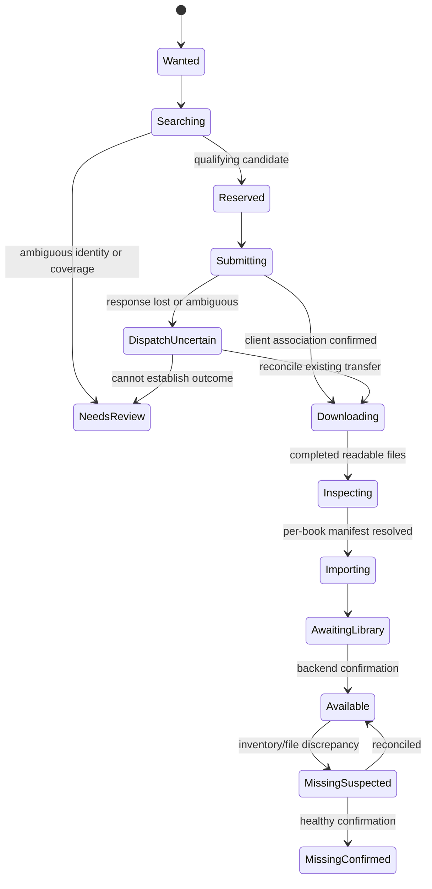

# Implementation decisions and readiness plan

Research date: September 17, 2026. This is the selected implementation baseline following the user's request to research and determine the P0/P1 decisions. It complements [the product architecture](PRODUCT-ARCHITECTURE.md), [metadata and collections](research/metadata-and-collections.md), and [ABS import layouts](research/audiobookshelf-import-layout.md). Where earlier documents leave a decision open, this baseline supplies the choice. Implementation has started; [Implementation Status](docs/IMPLEMENTATION-STATUS.md) records verified coverage. Research alone establishes neither runtime compatibility nor changes to a live user library.

**Evidence boundary:** official documentation, released source, and recorded source snapshots were inspected. Design choices below are our engineering conclusions, not claims that upstream projects prescribe this architecture. Runtime compatibility and account-specific source behavior require the acceptance checks listed here. Research has resolved the direction; those checks are implementation work, not unanswered product questions.

September 18 planning refresh: the five requested upstream repositories and official API references were revisited. Hardcover's current documentation describes scoped personal tokens and distinct scope/operation/quota failures; connect only the capabilities needed for catalog, inbound lists and separately enabled writes. Its API remains changeable, so account-level certification is still required. [Hardcover API contract](https://github.com/hardcoverapp/hardcover-docs/blob/main/src/content/docs/api/Getting-Started.mdx). ABS inventory and library operations remain the integration boundary rather than replacing its player. [ABS API reference](https://api.audiobookshelf.org/). This refresh does not certify any live account or alter the pinned compatibility baseline.

## Decision register

| ID | Priority | Selected handling | Implementation gate |
|---|---|---|---|
| D01 | P0 | App-owned identities; catalog editions separate from source releases and assets | Identity/merge fixtures before schema freeze |
| D02 | P0 | Catalog updates stay in app; new-import sidecars; existing media and ABS edits protected | Metadata authority and drift tests |
| D03 | P0 | Conventional ABS item layout first; nested versions behind compatibility validation | Import fixture matrix |
| D04 | P0 | PostgreSQL + durable jobs + resumable per-book manifests | Crash, concurrency and uncertain-submission tests |
| D05 | P0 | MIT project baseline; attributed compatible reuse; independent implementation of AGPL references | File/dependency reuse ledger before copying and distributing |
| D06 | P1 | One self-hosted household instance, per-user lists, administrator-managed integrations | Server-side access-control tests |
| D07 | P1 | Automatic Hardcover-first metadata, conservative fallback, visible provenance | Identity-conflict and provider-outage fixtures |
| D08 | P1 | Collection contents mapped individually; ambiguous groups held separately | Partial/mixed/omnibus import fixtures |
| D09 | P1 | Inherited acquisition profiles, explicit expansion scope, upgrades off | Policy explanation and deduplication fixtures |
| D10 | P1 | Typed integration errors, bounded retry, required proxy fails closed | Outage and routing tests |
| D11 | P1 | Inbound subscriptions first; deliberate Hardcover write-back; no RSS removal inference | Partial-feed and sync-loop tests |
| D12 | P1 | React/TypeScript + Python/FastAPI + PostgreSQL + Procrastinate | Atomic enqueue, migration and restore checks |
| D13 | P1 | Missing assets are reconciled, not automatically reacquired | Missing mount, external deletion, move and restore fixtures |

## D01 — Identity and ownership

Use internal UUIDs that never depend on provider availability. External object references use provider namespace, resource kind and opaque ID. Keep bibliographic identifiers such as ISBN as attributed assertions; do not assume bad upstream data can never reuse or misassign an identifier. Open Library explicitly separates work-level information from edition-level publisher/ISBN data, supporting this distinction. [Open Library work/edition model](https://openlibrary.org/dev/docs/api/books).

Minimum logical entities:

| Entity | Meaning |
|---|---|
| Work | The book users browse and add to lists |
| Edition / Recording | Language, revision/translation, narrator, abridgment, edition-specific identifiers |
| Representation | EPUB/PDF or M4B/MP3 encoding of a particular version; technical quality belongs here |
| Series + Membership | Provider-backed series relationship, order and main/related membership |
| ProviderObject + IdentityLink | Original reference, snapshots, confidence, accepted/rejected mapping and mapping history |
| SourceRelease + Coverage | Tracker posting and its claimed/corroborated/verified included works and versions |
| AcquisitionIntent + Reason | Desired work/medium/constraints, plus all users/lists that requested it |
| DownloadJob | One client transfer, possibly covering many intents |
| ImportManifest + Entry | Per-item/per-file source-to-destination mapping and progress |
| LibraryAsset + AssetContains | ABS item/file evidence and work/version membership, including omnibus contents |
| Suppression | Explicit no-reacquire/ignore policy independent of list membership |

An exact external ID is strong evidence, not permission to merge contradictory records blindly. Resolve work identity before edition identity. A reliable work match can coexist with unknown recording identity; label unknown details rather than inventing a narrator. Exact recording requests cannot be satisfied by an unidentified recording.

Matching order: existing verified link → corroborated exact identifier → normalized title/author plus language/edition/series evidence → unresolved candidates. Similarity retrieves candidates; it is not proof. Preserve original strings, aliases, diacritics and evidence. Conflicting strong signals go to correction. No arbitrary confidence percentage becomes an auto-acquire threshold without fixture calibration.

Merge operations retain redirect IDs and an audit of moved relationships. Splitting a mistaken merge must be possible through recorded provenance; do not destructively discard original identities. Provider merges or changed canonical URLs must not create a second owned work. Manual decisions remain protected until explicitly changed.

Ownership is derived from at least one confirmed, accessible asset containing the actual work in either medium. A companion PDF is not a full ebook. Separate acquisition satisfaction checks language, requested medium and recording constraints. In-flight reservations and imports awaiting scan count as pending, never absent. A source release or encoding does not increase the catalog edition count.

## D02 — Metadata and filesystem authority

Use an explicit ownership table:

| Data | Authority | Automatic writes |
|---|---|---|
| App catalog fields | Resolved providers plus protected app edits | Refresh the app record |
| Actual file format/layout | Inspected files | Update technical facts |
| Source posting detail | Source snapshot | Refresh source-specific fields |
| Physical library presence | ABS inventory, checked against import/file evidence | Update observed availability |
| Existing ABS display metadata | ABS/user | Read and display; no background overwrite |
| New item's initial sidecars | Import manifest and resolved version metadata | Generate once at import |
| Seeded media bytes and source paths | Download client | No rewriting, moving or deleting by our importer |
| Existing library organization | Current library | No implicit migration |

Store the naming-policy version and resolved metadata snapshot with every import. Later provider changes do not rename published items. Template changes affect future imports. A future “Reorganize” action must preview path changes, verify collisions and explicitly preserve/reconcile ABS identity and progress; it is outside first-release automation.

ABS currently processes metadata sources in a configured order; its default places `absMetadata` after OPF. Its metadata-file scanner may read saved item metadata outside the library folder as well. Therefore replacing OPF does not reliably replace later ABS edits. [ABS library defaults](https://github.com/advplyr/audiobookshelf/blob/v2.36.1/server/models/Library.js), [saved metadata reader](https://github.com/advplyr/audiobookshelf/blob/v2.36.1/server/scanner/AbsMetadataFileScanner.js).

Select initial OPF export plus independently generated cover files. Do not carry a torrent's stale ABS metadata.json into a new item. After import, record the exported sidecar hash and backend metadata snapshot. If either changes externally, record drift and offer an explicit “Use ABS metadata” or “Apply selected app fields” workflow later. Do not create a two-way overwrite loop. File byte tagging requires an independent output, never a write through a seeded hardlink.

## D03 — ABS contract and compatibility

Use ABS 2.36.1 as the initial certification target, not an untested claim of support for all earlier/later versions. It is the latest release returned by the official release endpoint on the research date. New supported versions enter a compatibility matrix after tests. An older server may remain useful for inventory if capability checks succeed; import automation is enabled only for certified behavior. [ABS release](https://github.com/advplyr/audiobookshelf/releases/tag/v2.36.1).

Connection setup reads version and libraries, selects explicit library roots, verifies inventory access and reports scan capability. The inspected scan handler requires `isAdminOrUp` and responds before scanning completes. Inventory and scan permissions are distinct. Offer inventory-only integration with watcher-driven confirmation if scan permission is unavailable; explicit scans require a dedicated appropriately privileged credential kept server-side. [ABS controller](https://github.com/advplyr/audiobookshelf/blob/v2.36.1/server/controllers/LibraryController.js).

The default layout remains author / optional series / book-and-version. Different complete narrations and distinct ebook editions get separate leaf items; our app aggregates them under the work. Multiple equivalent ebook formats may share one item, with ABS's primary/supplementary distinction. Nested work / version folders are a gated second preset requiring generated leaf metadata, compatible precedence, empty structural ancestors and successful watcher/full-scan fixtures. See the [detailed import contract](research/audiobookshelf-import-layout.md).

Inventory reconciliation uses paginated uncollapsed item listings, no user-facing series grouping filters, and item detail/file data as necessary. Track scan generation, pages received, connection scope and completion. Only a complete healthy inventory pass can establish that a formerly known item is absent. Events accelerate updates but never replace periodic full reconciliation. Page-based APIs are not necessarily snapshots: concurrent library changes require overlap/deduplication and confirmation before concluding removal.

Map our assets by backend instance + library + item ID, with paths and file signatures as additional evidence. Never equate an ABS item ID with the work ID. Inspect missing/invalid flags and relevant media files rather than counting every returned record as playable. An ebook primary/supplement status is evidence, not sufficient proof that a companion file contains the full book.

Coalesce scan requests per library. Confirm imported paths, expected media and item boundaries after the scan; a timeout becomes “Imported, awaiting library confirmation,” not a new acquisition. Retry scanning/reconciliation without repeating import or download.

## D04 — Durable acquisition and import

Use a persistent state machine. Store typed reasons alongside states, not a single catch-all error string.

Unavailable releases return to scheduled search under policy; operational failures also support paused/retryable/failed/cancelled outcomes. Job state is per transfer/import entry, while work ownership is derived separately. There is no global “book failed” because one audio target failed while its ebook exists.

Commit intent, acquisition reasons, coverage reservations and job enqueue atomically. Use database constraints for exact duplicate identities and active equivalent requests; serialize compatibility evaluation for overlapping constraints under a work/medium lock. Lock known pack-covered targets in deterministic order. Recheck inventory, exclusions and compatible pending requests immediately before dispatch. One compatible intent can have many list reasons; removing one reason does not cancel all others.

**qBittorrent dispatch:** persist the release descriptor/hash where available, attempt ID, client instance, selected category, tag and expected save path before adding. Submit one artifact per attempt. Use a dedicated tag such as `app:<job-id>` and record actual client hash/path. The API supports categories, tags, paths and automatic torrent-management controls; these must be normalized by the adapter for the supported client version. [qBittorrent add implementation](https://github.com/qbittorrent/qBittorrent/blob/release-5.2.3/src/webui/api/torrentscontroller.cpp), [Python client interface](https://qbittorrent-api.readthedocs.io/en/latest/apidoc/torrents.html).

Do not assume add returns a durable job ID or exposes an application idempotency key. After a timeout, search by known hash and attempt tag, inspect existing transfers, and reconcile before resubmitting. If outcome stays uncertain, require resolution. Queue redelivery is expected; external side effects are not magically exactly-once. Worker leases/generations prevent stale state commits but cannot revoke an HTTP request already received by qBittorrent.

More specifically, once the durable submission boundary says an add may have happened, automatic recovery observes that attempt and never issues another add. A missing lookup result alone does not prove that submission failed. Any deliberate replacement requires a separate reviewed resolution and fresh authorization. Confirmed request fulfillment retires its active reservation, not the independent external-transfer evidence. The [PRD closure contract](PRD.md#17-closing-the-acquisition-loop) defines user-visible behavior and the [next-slice handoff](IMPLEMENTATION-PLAN.md#13-next-development-slices-from-the-current-checkpoint) defines reconciliation work.

Do not adopt, retag, rename or delete an unrelated pre-existing torrent merely because its hash matches; link to it only under the explicit existing-transfer policy. Preserve source-specific credentials and tracker obligations. Use a tested bittorrent parser for v1/v2/hybrid identity rather than treating every 64-character value as a v1 hash. Download the whole selected private-tracker pack by default; skip duplicate library imports rather than introducing partial-download/seeding behavior implicitly.

**File publication:** stage complete item directories on the destination filesystem outside every scanned root. Reserve destination paths in the database and verify local collisions. Publish with a no-replace operation; Linux `renameat2` provides `RENAME_NOREPLACE`. Atomic rename is not equivalent to power-loss durability, so flush generated files and relevant directories where supported. Fail clearly if the filesystem cannot meet the configured import contract. [Linux rename semantics](https://man7.org/linux/man-pages/man2/rename.2.html), [Python filesystem operations](https://docs.python.org/3/library/os.html).

Default hardlink-required; explicit copy mode/fallback only. A setup probe must attempt an actual link across the configured mount paths, not infer success from path appearance or device ID alone. Record source/destination identity and verify existing links on retry. Never use plain filename existence as success. Handle permissions and case-sensitive/case-insensitive collisions without chmod/chown of shared media inodes. Confine paths to selected roots and refuse symlink/archive escapes.

Persist per-file manifest entries before publication. A crash after rename but before database acknowledgement is repaired by validating the published manifest. Never remove files not recorded as created by that import. Per-book publication allows a collection to complete partially and resume. Revalidate worker ownership before publish; use a filesystem no-replace operation as the final concurrent-writer barrier. Do not expose incomplete parent folders to ABS.

## D05 — License and reuse boundary

Select MIT as the intended project license. This is a planning decision; no license file or copyright grant is being fabricated during research. Reuse selected Seerr presentation components and compatible MouseSearch/Shelfmark modules, retain notices, and inspect their actual dependencies/assets individually. Their repository licenses are MIT: [Seerr](https://github.com/seerr-team/seerr/blob/develop/LICENSE), [MouseSearch](https://github.com/sevenlayercookie/MouseSearch/blob/main/LICENSE), [Shelfmark](https://github.com/calibrain/shelfmark/blob/main/LICENSE). The [MIT text](https://opensource.org/license/mit) requires preservation of its copyright/permission notice.

BookOrbit is an AGPL reference. Independently implement the agreed provider-resolution behavior rather than translating or copying its implementation into an MIT-only codebase. If AGPL source is deliberately incorporated later, reconsider the licensing/distribution approach before doing so. Do not claim a cosmetic rewrite removes license obligations. [BookOrbit license](https://github.com/bookorbit/bookorbit/blob/main/LICENSE).

Maintain a reuse ledger containing upstream repository, exact commit, copied file/component, license, retained notice and local changes. Include dependencies and bundled fonts/icons separately; a repository's top-level license is not proof about every asset. Communicating with external ABS/qBittorrent APIs does not require copying their server code. Keep code licensing separate from metadata-provider usage conditions.

## D06 — Deployment, accounts and credentials

Target one self-hosted household instance with one shared acquisition system. Support multiple users in the schema immediately; do not build hosted multi-tenancy. Initial roles: administrator, member, viewer. Members manage their own lists and requests; administrators grant automatic-acquisition capability and control source credentials, library access, paths and global limits. Every API authorization check is server-side. A shared ABS service credential must not expose libraries outside a user's app grants. [OWASP authorization guidance](https://cheatsheetseries.owasp.org/cheatsheets/Authorization_Cheat_Sheet.html).

Use local accounts initially with Argon2id password hashing through a maintained library. Sessions are opaque, revocable server-side records with HttpOnly/SameSite cookies and Secure cookies under HTTPS; protect state-changing requests against CSRF. No upstream API tokens in browser storage. Provide a one-time bootstrap mechanism and disable it after the first administrator. Support TLS at a reverse proxy; trust forwarded headers only from configured proxies. OIDC is a later adapter, not a prerequisite for setup. [Password storage](https://cheatsheetseries.owasp.org/cheatsheets/Password_Storage_Cheat_Sheet.html), [session handling](https://cheatsheetseries.owasp.org/cheatsheets/Session_Management_Cheat_Sheet.html).

Keep per-user Hardcover tokens/list data private by default, with deliberate list sharing. MAM/qBittorrent/ABS credentials are integration secrets, never member-visible. Encrypt stored tokens with a maintained authenticated-encryption library using an installation key outside the database; support key rotation and backup. This protects a database-only leak, not a compromised host. Scrub credentials, passkey URLs, cookies and raw private feed URLs from logs and exported fixtures. [Secrets lifecycle guidance](https://cheatsheetseries.owasp.org/cheatsheets/Secrets_Management_Cheat_Sheet.html).

Connections to local ABS/qBittorrent/Prowlarr addresses are intentional administrator configuration. Remote feed, image and source-result URLs must not become arbitrary access to internal services: separate trusted configured endpoints from provider-fetched URLs, validate redirects, and keep credentials scoped to the intended host. Sanitize tracker HTML before rendering. This protects the actual source-detail and list-import flows without adding user-facing security configuration.

## D07 — Metadata defaults and provider behavior

Select Automatic mode: Hardcover primary when connected, Open Library as a conservative work/ebook fallback, and release/file evidence for technical fields. Recording enrichment accepts only a matched recording from a capable provider; Open Library is not assumed to be a complete audiobook recording catalog. Add additional recording providers through the adapter interface as coverage warrants. Do not make a Hardcover match or ASIN mandatory for a MAM discovery to enter the local catalog.

Use field groups with shipped rules: work details, edition/recording details, covers, technical data. Preserve source attribution, raw values, chosen value, selection reason and manual-lock status. Default secondary providers fill missing fields after identity validation; they do not constantly replace valid primary values. Store provider ratings separately with sample counts. Edition conflicts are never resolved by taking the longest description or fastest response.

Fetch the primary search first, then enrich selected detail pages and missing data. Cache canonical public catalog data separately from account-scoped lists. Use shared provider/credential rate budgets across API and workers, not a limiter per process. Negative results have shorter caches than stable identity data. Preserve the last good response during provider outages and expose its age.

Hardcover's current repository documentation describes scoped tokens, quota headers and Retry-After; the rendered documentation fetched during research was older. Treat the adapter's contract tests and actual capability responses as authoritative for the connected account, and never bake a plan-dependent daily quota into the UI. Keep queries backend-only and use an application User-Agent. [Current Hardcover API documentation source](https://github.com/hardcoverapp/hardcover-docs/blob/main/src/content/docs/api/Getting-Started.mdx).

Open Library asks applications to cache, identify themselves and avoid using the API for bulk harvesting. Use it for targeted fallback lookups, not eager enrichment of every known title. [Open Library API guidelines](https://openlibrary.org/developers/api).

Normal UI: automatic mode, primary catalog, language, and an Advanced expander. Per-book actions: Fix match, Choose cover, Edit details. Changes to provider order never erase inventory or trigger downloads by themselves. Recommendation shelves initially use attributed provider discovery, local series continuation and explicit related-book signals; downloading popularity does not become a taste score. No central mirror of other users' reading data is required.

## D08 — Collections and uncertain files

Maintain separate claimed, corroborated and verified coverage. Before automatic pack selection, establish that it contains the requested work and satisfies required medium/language/recording constraints using available source detail and file-list evidence. If those facts cannot be established, hold that candidate for review and try a sufficiently identified alternative. Do not require catalogue edition IDs when independent evidence is adequate for an “any recording” request.

On completion, inspect actual files. Group chapters/discs into recordings; match separate book folders or flat ebook files to works. Pack-level metadata is not inherited as truth for every child. A companion PDF or cover is not another book. Preserve ordering clues and original paths. Isolate uncertain child groups while publishing confidently mapped items. A failed child does not roll back already confirmed sibling books.

One transfer can satisfy multiple intents. Skip library duplication for already-owned qualifying books; reserve missing covered targets against concurrent single-book jobs. A missing claimed book releases its reservation and resumes search. Full-transfer completion does not prove all claimed works were present.

Indivisible omnibuses remain one asset with verified constituent-work mappings. The app can count those works as owned and link to the actual ABS item. Standalone-copy requirements remain separate. Automatic book splitting, audiobook conversion and embedded retagging are deferred; naming and hardlinks alone cannot create book boundaries.

## D09 — Automation profiles and ranking

Default profile for this user's requested workflow: EPUB preferred; M4B then MP3; MAM preferred; series packs preferred; existing acceptable copies kept; upgrades off. Choose media explicitly per list, with inherited user defaults. “Either” requires a preferred medium for the first acquisition but is satisfied by either owned format. “Both” creates independent missing-medium intents while keeping the overall ownership check.

Resolve policy: request override → list override → user profile → instance defaults, with administrative restrictions always applied. Persist the effective policy version and explanation with each selection. Policy edits do not retroactively replace owned media; queued work is reevaluated before dispatch, and changed scope is recorded.

Eligibility first: correct work, acceptable medium/language/recording, allowed format, sufficient identity/coverage evidence, exclusions and downloadability. Then use a deterministic ordered comparison. Balanced uses qualifying coverage → format preference → source preference → fresh availability → source-local popularity. “Most seeded” changes the preference order, not identity requirements. Unknown seeds remain unknown; stale counts carry age. An unavailable preferred source does not block healthy alternatives. Manual source browsing remains available.

Prefer-series-pack mode expands a missing target to suitable same-series pack contents. It does not expand a fully satisfied target during ordinary list polling. Complete-series mode intentionally creates targets for missing published main-series works even when the triggering title is owned. Future installments, related series, novellas and alternate recordings are separately enabled scope. Recheck completeness against a dated series snapshot.

List activation previews owned, pending, missing and unresolved targets plus estimated pack expansion. Default first activation to future additions; allow an explicit “Include current entries” choice, so bulk acquisition is predictable. New memberships observed after activation are queued; RSS cannot prove the exact addition time for every entry, so the UI must describe this as newly observed entries. Persistent exclusions survive repeat sync and list re-addition.

Ship modest concurrency with separate search, network and import queues. Check destination free space and configured byte/book limits before dispatch and copy/extraction. A later low-space condition pauses import, preserving completed downloads. Do not require users to configure every limit to get sensible behavior.

## D10 — Source adapters, routing and failures

Native MAM remains first-class. Adapt search fields and rich source detail from [MouseSearch](https://github.com/sevenlayercookie/MouseSearch/blob/main/app.py), including author/narrator/series fields and session rotation. Serialize session-sensitive work per credential across workers and persist rotated cookies with a generation check. An asyncio lock alone does not coordinate separate processes. Distinguish login HTML, expired credentials, parser errors and genuine zero results. Never dump a raw response containing private credentials into logs.

Native ABB uses isolated search/detail/file-list/magnet parsing based on [Shelfmark's adapter](https://github.com/calibrain/shelfmark/tree/main/shelfmark/release_sources/audiobookbay). Keep host configuration and captured sanitized HTML fixtures; site markup is a changeable dependency, not a stable official API. Do not advertise seed counts when no reliable source provides them. Preserve raw detail and normalized fields.

Prowlarr adds configured indexers through its [documented API](https://prowlarr.com/docs/api/) and per-indexer capabilities. Keep originating indexer identity and supported categories/fields. Native MAM plus Prowlarr's MAM instance should not automatically produce duplicate searches. qBittorrent is the first downloader; show NZB results as unsupported for acquisition unless a Usenet client adapter is actually enabled. Do not promise every Prowlarr result is downloadable through qBittorrent.

Set a route policy per adapter: Direct or Required proxy. Default Required proxy when a Gluetun proxy is configured. Use explicit HTTPX clients and `trust_env=False` so environment proxy variables do not silently change routes; configure custom CA trust explicitly if needed. Validate routing separately from source authentication. [HTTPX proxies](https://www.python-httpx.org/advanced/proxies/), [environment behavior](https://www.python-httpx.org/environment_variables/).

Gluetun's HTTP proxy and qBittorrent's network namespace are separate connections. Proxying app HTTP requests does not automatically proxy torrent traffic. Keep local control APIs on their configured reachable network. [Gluetun HTTP proxy](https://github.com/qdm12/gluetun-wiki/blob/main/setup/options/http-proxy.md), [container routing](https://github.com/qdm12/gluetun-wiki/blob/main/setup/connect-a-container-to-gluetun.md).

| Failure | Handling |
|---|---|
| Rate limit | Honor Retry-After/quota headers, shared backoff and jitter; retain pending work |
| Timeout or transient 5xx on reads | Bounded exponential retry, then provider cooldown; return other sources |
| Authentication/permission failure | Pause affected integration with reconnect/scope action; do not retry endlessly |
| Parser/schema change | Capture redacted diagnostics; mark adapter degraded, never pretend zero results |
| Required proxy down | Pause affected source; never fall back to direct |
| qBittorrent add outcome unknown | Reconcile existing transfer before another add |
| ABS unreachable/inventory incomplete | Keep last known ownership with stale state; hold automatic dispatch needing dedupe |
| Import permission/path/link failure | Keep downloaded originals; repair configuration and retry import only |
| Low space | Pause affected work; no deletion or hidden copy fallback |
| Scan delayed | Keep pending confirmation and retry reconciliation |

New workers do not reset source cooldowns or quota budgets. Error classes drive the UI's repair action and job policy. Correlation IDs connect request → source query → download → per-book import → backend confirmation without exposing secrets.

## D11 — List synchronization and write-back

Use provider-owned inbound memberships and app-owned local lists. Every subscription has owner, provider account, external list ID, cursor/validator, last successful sync, completeness status, policy and exclusions. Upsert memberships by stable source identity; title text is not a membership key. A provider identity merge rebinds the membership instead of requesting the book again.

Hardcover uses paginated authorized queries and scope discovery. Store a complete sync generation before applying removals. Removing a membership removes that acquisition reason only; it never deletes library files, marks books read or cancels independent requests. A changed list name does not create a new subscription.

Goodreads RSS is inbound and best-effort. Use conditional ETag/Last-Modified fetches when provided; a 304 preserves existing data. Record observed entries and do not infer removals from feed omissions, parse failures, private-feed errors or a truncated window. CSV supplies initial/backfill snapshots; it is not continuous sync. No new Goodreads API integration is assumed. [Feed conditional requests](https://pythonhosted.org/feedparser/http-etag.html), [Goodreads developer notice](https://www.goodreads.com/group/show/8095-goodreads-developers).

Start with polling around 30 minutes with jitter as an adjustable product default, not a provider guarantee. Use adaptive backoff and shared budgets. No webhook support is assumed. First sync establishes a baseline; imports added to that baseline do not silently launch a backlog when future-only mode was selected.

Hardcover write-back is opt-in and uses a mutation outbox with desired state, prior observed state, operation ID and status. Apply only explicit supported actions, such as adding to a dedicated available list. Reconcile current membership before retrying a timeout; local operation IDs are not assumed to be upstream idempotency keys. Detect conflicts instead of overwriting external edits. A successful download never becomes a reading-progress mutation. [Hardcover mutation capabilities](https://github.com/hardcoverapp/hardcover-docs/blob/main/src/content/docs/api/GraphQL/Actions.mdx).

Cache private list data under its account scope. Accessible community lists may be followed where the provider permits; do not interpret API visibility as permission to mirror all users' data into a public service. This design operates on connected users' behalf in their self-hosted instance.

## D12 — Concrete technical foundation

| Layer | Selection | Reason |
|---|---|---|
| Frontend | React + TypeScript + Vite, Tailwind styling, client routing, TanStack Query | Adapt Seerr presentation components; static build and one API origin |
| API | Python + FastAPI + Pydantic | Typed integration contracts and useful Python reuse from MouseSearch/Shelfmark |
| Persistence | PostgreSQL, SQLAlchemy 2, psycopg 3, Alembic | Relational identities, transactions, migrations and shared durable-job storage |
| Background work | Procrastinate, separate worker process from the same application image | PostgreSQL-backed task execution, locks, periodic jobs and retries |
| Network clients | HTTPX async adapters; supported qBittorrent client wrapper where useful | Explicit timeouts, routing, normalized failures and adapter tests |
| Local search | PostgreSQL text search and pg_trgm | No separate search server for the initial local catalog |
| Updates | Server-sent UI notifications plus query invalidation/refetch | Database remains authoritative; reconnect repairs missed notifications |
| Packaging | Docker Compose: API/static UI, worker, PostgreSQL | One application codebase with separate process responsibilities |

These choices are specific to this app, not a universal assertion that this stack is best. Vite produces static assets; TanStack Query supports targeted invalidation; PostgreSQL provides indexed trigram matching. [Vite deployment](https://vite.dev/guide/static-deploy.html), [query invalidation](https://tanstack.com/query/latest/docs/framework/react/guides/query-invalidation), [pg_trgm](https://www.postgresql.org/docs/current/pgtrgm.html).

Use same-origin browser/API deployment and an OpenAPI-generated TypeScript client. Adapt Seerr components' rendering and layout without carrying its movie/TV API models. Keep provider credentials, acquisition decisions and filesystem operations entirely in Python. Blocking file probing runs in bounded worker subprocesses, not the async HTTP request loop. No dedicated Node server is needed for the initial static frontend.

Choose PostgreSQL rather than supporting two databases initially. SQLite is viable for many small applications but serializes writers; our API, scheduler, reconciler and importer share transactional work and a PostgreSQL queue. The extra database service is an explicit tradeoff for simpler shared concurrency. Do not claim that household library size alone requires PostgreSQL. [SQLite concurrency](https://sqlite.org/isolation.html), [PostgreSQL row locking](https://www.postgresql.org/docs/current/sql-select.html).

Use Procrastinate rather than building a queue or introducing Redis/Celery for v1. Its [documentation](https://procrastinate.readthedocs.io/en/stable/) provides persisted tasks, locks, retries and schedules. The inspected release is [3.9.0](https://github.com/procrastinate-org/procrastinate/releases/tag/3.9.0); the project also advertises a need for additional maintainers, so isolate it behind a small job-enqueue interface and retain domain state independently of queue internals. Pin reviewed releases, including transitive dependencies.

Use atomic enqueue on the existing psycopg transaction. Procrastinate explicitly supports passing an external connection, so the domain change and job insert commit together. In the SQLAlchemy unit of work, obtain the underlying supported psycopg connection through a small tested adapter; flush domain writes, enqueue sequentially, and let the unit of work own commit/rollback. Never hand a SQLAlchemy connection to the plain PsycopgConnector or accidentally open a second transaction. [External-connection enqueue](https://procrastinate.readthedocs.io/en/stable/howto/production/external_connection.html), [SQLAlchemy async connection access](https://docs.sqlalchemy.org/en/20/orm/extensions/asyncio.html).

Treat delivery as at-least-once. Queue locks supplement database domain constraints rather than replacing them. Enable stalled-worker detection/recovery explicitly: the library documents that jobs can otherwise remain stuck after an abrupt worker termination. Retry only after reconciling the domain state and external side effects. [Stalled-job handling](https://procrastinate.readthedocs.io/en/stable/howto/production/retry_stalled_jobs.html). FastAPI request-background tasks are not the acquisition engine. [FastAPI background-task scope](https://fastapi.tiangolo.com/tutorial/background-tasks/).

Use one database session per request/task, bounded pools, short transactions and no database transaction held across slow external HTTP/filesystem work. SQLAlchemy sessions are not shared across concurrent tasks. Database migrations are explicit and versioned; CI must check upgrade paths. [SQLAlchemy concurrency guidance](https://docs.sqlalchemy.org/en/20/orm/extensions/asyncio.html), [Alembic](https://alembic.sqlalchemy.org/en/latest/tutorial.html).

Production target is Linux containers with configurable UID/GID and explicit download/library mounts. API needs no media-write mount; the import worker gets only configured roots. Avoid mounting the Docker socket. Keep PostgreSQL data in supported local storage rather than assuming the media NAS share is appropriate for database files. Check actual hardlink/rename behavior on the chosen mounts, especially separate mounts, network shares and pooled filesystems. Existing qBittorrent/Gluetun/ABS services remain external integrations.

Initial dependency certification targets: ABS 2.36.1, qBittorrent 5.2.3, Procrastinate 3.9.0, PostgreSQL 18.x. These are research-date targets, not instructions to upgrade the user's running stack. Record actual installed versions during connection setup, use capability checks, and add compatibility entries through tests. Pin the final dependency/image versions during scaffold creation; do not deploy floating `latest` as the reproducibility mechanism.

Back up database domain data, queue state, configuration, credential encryption key and managed sidecar manifests. Media and qBittorrent configuration have separate backups. Use PostgreSQL-supported logical backups, for example custom-format pg_dump; it supplies a consistent database snapshot, not a snapshot of filesystem or remote-client state. [PostgreSQL backup documentation](https://www.postgresql.org/docs/current/backup-dump.html).

Restore into recovery mode with dispatch and mutation workers paused. Reconcile existing client transfers, completed manifests, physical destinations, ABS inventory and list checkpoints before resuming. Restoring an old database must not replay every historical download or write-back. Verify a restore in an isolated environment before release. Keep structured redacted logs, last successful sync times, queue age and import stage metrics; a human-readable activity timeline is the first diagnostic tool.

## D13 — Missing files, deletions and reacquisition

Use asset-level states: present, stale, missing-suspected, missing-confirmed and intentionally-removed. Track last seen, last complete inventory generation and source of the observation. A failed request or incomplete listing can only make information stale, never prove deletion.

On first absence, reconcile the item directly, check relevant root/mount health where observable, search for moved/reidentified files using stored evidence, and repeat after a healthy inventory pass. An ABS missing/invalid flag is a diagnostic, not a command to reacquire. For imports we own, inspect known filesystem paths too; do not assume full physical access to an unrelated remote library.

Default automatic replacement off. Confirmed absence produces an actionable item with Restore/relink, Find replacement, and Ignore choices. An app-originated removal can create an intentional-removal suppression. An external deletion has unknown intent, so hold reacquisition until a replacement policy/action authorizes it. Suppression is per work/medium/edition scope, preserving the ownership check if another version remains available.

If auto-replacement is enabled later, require confirmed healthy storage, a grace interval, no suppression and no compatible pending import. Reuse an existing completed torrent file before obtaining it again where explicitly allowed. Missing storage should cause an integration-level pause rather than thousands of independent download requests. A title previously owned remains in history but is not shown as currently available after confirmed loss of every asset.

## Implementation sequence and acceptance gates

Start coding against the resolved baseline. The following are engineering gates; they do not require the user to choose another application or manually test competitors.

| Stage | Deliverable | Required evidence |
|---|---|---|
| 1. Foundation | Schema, migrations, local auth, job adapter, typed integration interfaces | Identity correction preserves references; enqueue rollback is atomic; permissions isolate private lists |
| 2. Inventory + import contract | ABS adapter, source fixture importer, naming previews and per-book manifests | Series pack, two narrators, ebook editions and companion files produce correct backend items |
| 3. MAM acquisition | Native rich search, qBittorrent dispatch, hardlinks and confirmation | Restart and lost-response recovery produce no duplicate transfer/import |
| 4. Aggregation | ABB/Prowlarr adapters and explainable release ranking | Partial source failure, duplicate origin, unsupported protocol and ranking fixtures |
| 5. Automation | Hardcover/RSS subscriptions, policies and collection reservations | Repeat sync, overlapping lists, full backlog, truncated feed and missing inventory are idempotent |
| 6. Curation + optional writes | Discovery shelves, list browsing and scoped Hardcover outbox | Attribution, privacy, mutation retry/conflict and full restore checks |

Test against real disposable PostgreSQL, ABS and qBittorrent services with synthetic or public-domain media and sanitized provider fixtures. This validates our code against its backends. Unit tests alone cannot establish scanner layout or filesystem behavior. Credentialed MAM/Hardcover/ABB contract checks remain a narrowly scoped integration gate when an appropriate connection is supplied; public source inspection cannot prove a user's account permissions or tracker behavior.

Critical failure fixtures:

- Kill a worker before submission, after qBittorrent acceptance, after link creation, after publication and before ABS confirmation.
- Submit the same title from two lists while a series pack is being reserved.
- Return an ebook companion PDF, unknown recording, mixed-narrator pack, missing final book and an indivisible omnibus.
- Change or remove a provider ID, then merge/split a work mapping without losing ownership.
- Disconnect ABS, hide a library through changed permissions, unmount storage and return partial inventory pages.
- Rotate the MAM cookie under concurrent requests; interrupt the configured proxy and verify no direct fallback.
- Hit provider quotas, return login HTML, change ABB markup and time out Hardcover write-back after it may have succeeded.
- Import to an existing conflicting path, a different filesystem, a low-space destination and a symlink-escape path.
- Restore an older backup while qBittorrent and ABS contain newer completed work.
- Update naming/provider priorities without moving existing files or triggering upgrades.

Release criteria are no unintended duplicate acquisitions under these fixtures, no alteration of seeded originals, correct per-book/version ABS boundaries, preserved ownership semantics and clear recovery actions. Matching thresholds, timeouts and concurrency can be tuned from these tests; their numeric values are not product-level blockers.

## Evidence and remaining uncertainty

Repository snapshots for the initial app comparison remain in [source-snapshot.json](research/source-snapshot.json). Versioned upstream links above document the additional inspected behavior. All timing/concurrency/profile defaults in this document are our selections and can be adjusted; upstream API quotas and permissions remain provider-controlled.

Research cannot establish the user's actual ABS/qBittorrent versions, mount topology, available disk space, account scopes or permitted MAM query rate. Connection diagnostics and compatibility fixtures resolve those during implementation/setup. We do not need those answers to build the schema, UI and adapters. Nested version layouts stay gated until proven. Public/commercial metadata redistribution is not assumed to be covered by personal API access; the current scope is user-authorized self-hosted discovery and acquisition.

### Planning refresh: upstream evidence and capability drift

The September 17 planning refresh rechecked the named upstream project pages. This confirms reference boundaries, not compatibility:

- [Seerr](https://github.com/seerr-team/seerr) supplies familiar discovery/request presentation patterns. The plan reuses selected visual components, with book-native models and API contracts.
- [MouseSearch](https://github.com/sevenlayercookie/MouseSearch) documents organization of its acquired torrents through hardlinks or copies and remote/local path mapping. Those behaviors inform our importer; per-book manifests, inventory confirmation and restart guarantees remain our implementation responsibilities.
- [Shelfmark](https://github.com/calibrain/shelfmark) documents multi-source search and provider/client configuration, while explicitly placing library ownership tracking and background monitoring outside its scope. Its adapters are bounded references; our inventory and list automation belong in our own domain.
- [BookOrbit](https://github.com/bookorbit/bookorbit) documents multiple metadata providers and an AGPL license with additional attribution terms. Provider orchestration remains a design reference; any actual code reuse requires inspecting the exact source and associated terms under D05.
- The [Hardcover getting-started page](https://docs.hardcover.app/api/getting-started/) is dated July 2025 and describes a changing API. Treat token formats, expiry, scopes, quotas and supported queries as capability checks, not timeless constants. Keep tokens opaque; handle GraphQL `errors` and partial `data` even on HTTP 200. Do not interpret a permission-limited or partial list response as authoritative removal. Freeze tested operation fixtures in S02/S07 and require write capability separately in S08.

These observations reinforce the architecture rather than expanding first-release scope. Runtime capability checks and recorded acceptance evidence take precedence over a README's generalized feature claims.

### v1.3 implementation clarifications

The PRD now defines effective preference precedence, immutable submitted choices, versioned import plans and explicit revalidation of current permissions. These are application design decisions, not guarantees supplied by upstream APIs. Implement them in shared domain services used by both manual requests and list automation.

The current [ABS directory documentation](https://audiobookshelf.org/docs/documentation/libraries/book-library/directory-structure/) defines book folders and warns that media in structural ancestors can combine items unexpectedly. It documents narrator braces and disc/track parsing. Therefore a visually plausible path is only a prediction: the import gate must inspect actual item boundaries and metadata under the selected scanner settings. Custom names require supported sidecar metadata where filename parsing is insufficient.

The [ABS ebook documentation](https://audiobookshelf.org/docs/documentation/libraries/book-library/ebooks/) distinguishes one primary ebook from supplementary files, gives EPUB primary priority and describes format-dependent progress support. Keep distinct editions in distinct item leaves when independent identity/progress is required. Multiple file formats alone do not establish different editions. Generic archive extraction remains a separate optional capability; no successful sample naming preview establishes file, format or scanner compatibility.

### v1.7 planning verification

Rechecked primary documentation on September 18, 2026: [ABS folder/item boundaries](https://audiobookshelf.org/docs/documentation/libraries/book-library/directory-structure/), [primary versus supplementary ebooks](https://audiobookshelf.org/docs/documentation/libraries/book-library/ebooks/), [Hardcover API onboarding](https://docs.hardcover.app/api/getting-started/) and [Seerr's project](https://github.com/seerr-team/seerr). These retain the plan's separation of catalog versions, download releases and backend items. API documentation and repository availability do not prove a specific user's permissions or deployment compatibility. The new finite values in PRD section 19 are proposed application defaults; they are not limits claimed by those upstream projects.
