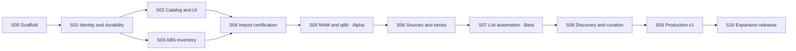

# End-to-end development plan

Planning baseline v1.9 · September 18, 2026 · Implementation has started; see [current status and evidence](docs/IMPLEMENTATION-STATUS.md). No full stage gate is yet complete.

This plan implements [the PRD](PRD.md) using [the researched decisions](IMPLEMENTATION-DECISIONS.md). [Acceptance Plan](ACCEPTANCE-PLAN.md) specifies the evidence required at each gate. A stage is complete only when its exit gate passes; this document does not report completed engineering or tested compatibility.

The [Product and Development Roadmap](DEVELOPMENT-ROADMAP.md) provides a concise handoff across these documents, including the product boundary, P0/P1 decisions and milestone demonstrations.

For the existing workspace, use its [remaining development batches](DEVELOPMENT-ROADMAP.md#9-remaining-development-batches-from-the-current-checkpoint) alongside section 16. These batches map outstanding work to the stable packages below; they do not add scope or supersede stage acceptance gates.

The [stage closure plan](#17-stage-closure-and-implementation-packets) defines the stage obligations. Its checkpoint narratives and sections 7–17 retain historical implementation guidance; the [backend handoff](#18-current-development-handoff), including collection qualification, retains the remaining source, series and import obligations. Use these with the complete S00–S10 backlog and current implementation evidence; neither marks partially implemented stages complete.

For the latest execution starting point, use the roadmap's [development start and release handoff](DEVELOPMENT-ROADMAP.md#10-development-start-and-release-handoff), reviewed September 19, 2026 against `30db130`. It records local curation and bounded list browsing alongside discovery/community-list/series behavior, and specifies the remaining supported write-back, usability, integration-qualification and release packets. Section 18 retains source/collection qualification obligations; historical descriptions of a first packet must not restart already delivered subsets. Stable package IDs and stage exit gates below remain authoritative.

## 1. Delivery strategy

Deliver a working vertical slice early, then expand source coverage and automation. Build durable domain state, identity and inventory before dispatch; certify importing before connecting automatic acquisition. Hardening, accessibility, authorization and migration testing start with their first affected feature rather than waiting for the final stage.

| Stage | Outcome | Depends on | Release milestone |
|---|---|---|---|
| S00 | Repository, contracts, CI and reproducible local stack | Planning baseline | Engineering scaffold |
| S01 | Durable domain, authentication, permissions and jobs | S00 | Internal foundation |
| S02 | Catalog, metadata, familiar browsing and local lists | S01 | Catalog preview |
| S03 | ABS inventory, ownership and reconciliation | S01; integrates with S02 | Connected library preview |
| S04 | Safe, collection-aware importer and ABS confirmation | S01, S03; catalog contracts from S02 | Import certification |
| S05 | Native MAM → qBittorrent → imported book | S02, S03, S04 | Private alpha |
| S06 | ABB/Prowlarr aggregation, ranking and series policies | S05 | Acquisition feature alpha |
| S07 | Hardcover/Goodreads subscriptions and automation | S06; connectors can start after S02 | Automation beta |
| S08 | Discovery, shared curation and optional list write-back | S02, S03, S07 | Feature-complete beta |
| S09 | Recovery, compatibility, accessibility and release operations | S00–S08 gates | Production v1.0 |
| S10 | Independently scoped expansion releases | Stable v1 and relevant module gates | Post-v1 |

S02 and S03 can run as parallel workstreams once S01 contracts stabilize. Source parsing fixtures, discovery layouts and list adapters can be developed early against contracts, but cannot bypass import or automation gates. The dependency table describes integration gates, not a requirement to keep all contributors sequential.

Do not commit to calendar dates before S01 exposes actual integration effort and team throughput. After S01, estimate remaining work packages using observed velocity; track provider/parser uncertainty separately from normal UI work. A date forecast never replaces a gate.

There are **61 work packages**: 55 through v1.0 (S00–S09) and six independently scoped expansion packages (S10). These are planning units, not equal-sized tickets or estimates. The first valuable release is the S05 manual acquisition path; the defining list-to-library product journey is complete at S07; the full v1 experience includes S08 and S09.



## 2. Engineering boundaries

### Selected stack and intended repository structure

- Frontend: React, TypeScript, Vite, Tailwind and TanStack Query; adapt selected Seerr visual components to book-specific view models.
- API: Python, FastAPI and Pydantic; generated TypeScript client from a versioned OpenAPI contract.
- Persistence: PostgreSQL, SQLAlchemy 2, psycopg 3 and Alembic.
- Workers: Procrastinate, initially the researched 3.9.0 baseline, with atomic enqueue and explicit stalled-job recovery.
- Distribution: Docker Compose with API/static UI, worker and PostgreSQL. No Redis requirement. External services stay separately administered.

The structure below defines module responsibilities. Several paths already exist; consult the implementation status for actual coverage rather than inferring completion from a directory:

```text
apps/web/                     UI routes, components, generated API client
services/app/api/             HTTP, sessions, authorization, serializers
services/app/domain/          catalog, inventory, lists, policies, acquisition
services/app/adapters/        metadata, sources, downloader, library backend
services/app/jobs/            persistent workflows and reconciliation
services/app/importing/       inspection, manifests, naming, safe publication
services/app/db/              models, migrations, transactions
tests/unit/                   pure identity, policy and path rules
tests/contracts/              provider schemas, parsers, compatibility
tests/integration/            real PostgreSQL, qBittorrent and ABS fixtures
tests/e2e/                    user journeys and authorization
tests/fixtures/               synthetic/redacted media and provider records
deploy/                       Compose, image build, example configuration
docs/                         API, operator guides, compatibility, reuse ledger
```

Use a modular monolith and a separate worker process from the same backend codebase. Adapters return typed results and errors; they do not directly modify arbitrary domain tables. Domain services own state transitions. Workflow jobs orchestrate short transactions around external operations; they never hold a database transaction open for a network request or file copy.

### Minimum adapter contracts

| Contract | Operations | Required result properties |
|---|---|---|
| Metadata provider | Search, work/version/series fetch, supported discovery | Namespaced IDs, provenance, language, unknown values, capability flags |
| List provider | Fetch pages/snapshot; optional mutate | Account/scope, cursor, completeness, observation time, supported mutations |
| Release source | Search, detail, resolve acquisition | Original source/indexer IDs, raw fields, coverage evidence, transport, auth/route errors |
| Download client | Capabilities, submit, find/reconcile, status, files | Stable association, uncertain outcome, source paths, completion and seeding state |
| Library backend | Libraries, inventory, item, events, optional scan, deep link | Accessible scope, complete-generation marker, backend item IDs, file evidence |
| Import publisher | Validate, inspect, plan, stage, publish, reconcile | Confined paths, manifest, no-replace behavior, filesystem evidence |

Each adapter has timeout, rate-budget, retry classification, cancellation and redaction behavior. Capabilities control UI actions; missing fields remain unknown. MAM-specific data survives normalization. Gluetun HTTP routing is configured per applicable integration; qBittorrent torrent egress is not changed by this setting.

### Persistence and concurrency responsibilities

| Domain | Records and constraints to establish |
|---|---|
| Identity | Work/version/representation UUIDs; provider namespace/kind/ID references; attributed identifier assertions; reversible link/merge history |
| Inventory | Backend/library/item/file IDs; scan generation and completeness; verified work coverage; per-user library grants; stale/missing state |
| Lists | Local list/membership; external subscription and observation; source membership distinct from local curation; policy version; baseline/backfill marker |
| Acquisition | Intent, target constraints, request reasons, active reservation, source release/coverage, shared download job, cancellation/suppression history |
| Import | Immutable planned mapping plus revision history, per-child entries, publish journal, source fingerprints, destination ownership and ABS bindings |
| Operations | Encrypted connection secrets, redacted audit events, durable outbox, locks/leases, migration version and backup metadata |

Do not create a blanket unique constraint on work+medium: a user may deliberately request another narrator or edition. Define normalized target constraints and reservation keys; serialize competing fulfillment checks for a work/medium, then evaluate whether an existing asset or in-flight transfer actually satisfies each target. One shared transfer can satisfy several compatible intents. Database constraints protect the resulting associations, while domain rules protect semantic compatibility.

Inventory visibility and transfer deduplication have different scopes. Check user-visible ownership only against granted libraries. Privileged orchestration may avoid duplicate transfers across the installation, but must not expose another user's private library, list title, reason or credentials. Define a generic pending outcome when shared infrastructure is reused without granting visibility. An asset in an inaccessible library cannot satisfy that user's request merely because it exists elsewhere; any shared transfer must still deliver to an authorized destination and gain accessible backend confirmation.

### API and UI boundaries

Publish contracts for catalog/search, works/versions, availability, lists/subscriptions, profiles, source searches, requests, activity, integrations, import previews and corrections. Mutating calls accept idempotency keys where replay can cause work. Long-running commands return operation IDs, not a connection held open until a download finishes. Incremental search/activity updates may use server-sent events with resumable polling fallback; reconnecting must not resubmit a request.

Paginate potentially large collections. Use typed errors with safe user messages and correlation IDs. Reject unauthorized operations server-side. Use secure server-managed sessions, CSRF protection for cookie-authenticated mutations, bounded request bodies and validated outbound destinations. Administrator-configured local service URLs are supported deliberately; provider-supplied redirects and feed entries do not gain unrestricted access to the local network.

## 3. Stage work packages and gates

Ticket IDs below are stable planning references. Each ticket should acquire a concrete owner and implementation estimate when its stage starts. Responsibility names describe roles, not a staffing requirement; one developer can own several roles.

Acceptance scenarios often span several stages. The [stage evidence scopes](ACCEPTANCE-PLAN.md#7-stage-evidence-scopes) define which assertions apply at each gate. Referencing an AT ID at an early gate never makes its later-source, list or recovery assertions prerequisites for that earlier stage; those remain explicitly pending until their delivery stage and the S09 full regression.

### S00 — Repository, contracts and scaffold

**Entry:** PRD and implementation decisions accepted as the working baseline. **Responsible:** technical lead/platform, with frontend and backend input. **Requirements:** FR-01, FR-36 foundations; NFR-09, NFR-12.

| Ticket | Deliverable |
|---|---|
| S00-01 | Initialize frontend/backend structure, formatting/type checks, dependency lockfiles, MIT project license and file/dependency reuse ledger. Record upstream revision and retained notices before adapting code/assets. |
| S00-02 | Add Compose development/test configuration, non-root identities, secret-file support, health/readiness and migration entrypoint. Pin researched integration test images; do not assume the user's versions. |
| S00-03 | Define adapter interfaces, error taxonomy, operation envelope, OpenAPI generation and architecture boundaries. Record identity/authority decisions as ADRs linked to D01–D13. |
| S00-04 | Create synthetic catalog/media/provider fixture sets and isolated ABS/qBittorrent/PostgreSQL harness. Document how fixtures are generated without distributing private tracker data. |
| S00-05 | Configure CI for contracts, backend/frontend checks, migration smoke tests, image build and secret/license/dependency checks. Establish local backup/restore skeleton. |

**Demo:** clean checkout starts the stack and displays a health-aware shell; API client generation is reproducible.

**Exit:** AT-01 installation subset and AT-29 scaffold subset pass. No required runtime service is omitted from Compose. No copied component lacks a recorded provenance/license decision. Establish baseline test reports without claiming integrations are certified.

### S01 — Durable domain, permissions and jobs

**Entry:** S00 contracts and test harness. **Responsible:** backend/platform; frontend for session/activity shell. **Requirements:** FR-01, FR-02, FR-05, FR-06, FR-22, FR-35 foundations; NFR-02, NFR-05, NFR-08, NFR-09.

| Ticket | Deliverable |
|---|---|
| S01-01 | Alembic schema for catalog, provenance, inventory bindings, lists, intents/reasons, jobs, manifests and audit. Define constraints, indexes and transactional service boundaries. |
| S01-02 | Bootstrap admin; administrator/member/viewer permissions; encrypted per-user credentials; library grants; secure sessions and recovery procedure. |
| S01-03 | Wire Procrastinate enqueue through the same underlying psycopg transaction as domain changes. Prove rollback/no-enqueue and commit/one-job behavior through SQLAlchemy integration; document the supported adapter path. |
| S01-04 | Implement idempotent command handling, leases, serialized reservation checks, worker restart/stalled-job handling, and a durable external-operation ledger/outbox. |
| S01-05 | Implement identity assertions, protected manual matches, reversible association corrections and merge redirects. Add audit and activity APIs with redacted structured events. |

**Demo:** concurrent duplicate fixture requests create one compatible acquisition, survive worker termination and remain correctly scoped to each account.

**Exit:** AT-01 authorization baseline, AT-02 foundation, AT-13 reservation subset, AT-24 event subset and AT-30 transaction/redelivery subset pass using real PostgreSQL. Failure to achieve atomic enqueue blocks this stage; choose and document a supported transactional outbox adaptation before progressing, rather than silently accepting dual writes.

### S02 — Catalog, metadata and familiar browsing

**Entry:** S01 identity and authorization contracts. **Responsible:** catalog/backend and frontend. **Requirements:** FR-05–FR-10, FR-12 initial local lists; NFR-03, NFR-07, NFR-10.

| Ticket | Deliverable |
|---|---|
| S02-01 | Hardcover catalog adapter and independent provider contract; Open Library for targeted conservative work/ebook fallback, caching, budgets and version/series normalization. Explicitly document which fields each adapter supplies; do not treat Open Library as a complete recording catalog or bulk-harvest it. |
| S02-02 | Metadata resolver with Automatic defaults, provenance, protected edits, cover selection and advanced group/field preferences. Keep contradictory editions separate. |
| S02-03 | Implement Seerr-style navigation, cover cards, shelves, detail layout, dialogs and settings visuals against book-native contracts. Adapt eligible presentation components where useful; avoid carrying framework/server dependencies solely to reuse markup. Record copied components and notices. Implement responsive keyboard-accessible states. |
| S02-04 | Local/catalog search, work/edition/recording/series views, provisional works and correction flow. Add paginated endpoints and local search indexes. |
| S02-05 | Local list CRUD, ordering and bulk selection; own/private access; placeholder ownership fields use explicit unknown state until inventory exists. |

**Demo:** find a book, inspect its editions/recordings and provenance, protect a title edit and add it to a local list without advanced setup.

**Exit:** AT-02 catalog identity/correction subset, AT-03 app metadata subset, AT-04 catalog search/detail subset and AT-05 local-list subset pass. Backend/file preservation and source-native results remain assigned to S03–S06. Provider outage leaves cached catalog usable. No catalog edition is created merely because two tracker releases exist. Initial accessibility checks cover navigation, search and book detail.

### S03 — Audiobookshelf inventory and reconciliation

**Entry:** S01; S02 schemas/views available for final integration. **Responsible:** library adapter/backend, frontend availability. **Requirements:** FR-02 library grants, FR-03 ABS, FR-10, FR-13–FR-15; NFR-01, NFR-05, NFR-08.

| Ticket | Deliverable |
|---|---|
| S03-01 | ABS connection/capability test, inventory pagination, item details, deep links and change-event support where the backend permits it. Polling repairs gaps and supports connections without event capability. Separate scan authority from inventory access. |
| S03-02 | Reconciliation generations with complete/partial markers; periodic full repair after event gaps; stale, suspected missing and confirmed missing transitions. |
| S03-03 | Asset-to-work/version matching, technical media classification, companion-document exclusions and omnibus containment model. Keep match corrections durable. |
| S03-04 | Overall and medium-specific availability projections, granted-library filtering, pending states and version counts in cards/detail/library. |
| S03-05 | Relink external moves, handle permission changes and unavailable mounts conservatively; expose repair/ignore/replacement intent without enabling automatic replacement. |

**Demo:** an ebook alone checks the work as owned; an audio request is still missing. Losing an ABS page does not erase the library. Two narrators show two available recordings.

**Exit:** AT-06 inventory assertions, AT-07 missing/move detection and non-destructive repair subset, and AT-27 library-scope subset pass. Explicit replacement execution integrates in S05 and complete recovery in S09. Inventory-only credentials work. No scan-start or download status is used as proof of ownership.

### S04 — Safe importing, naming and collection manifests

**Entry:** S01 durability and S03 inventory verification. **Responsible:** importer/filesystem backend, compatibility QA, frontend preview. **Requirements:** FR-04, FR-08 preservation, FR-25–FR-30; NFR-01, NFR-02, NFR-06.

| Ticket | Deliverable |
|---|---|
| S04-01 | Completed-file inspection, directory grouping, embedded metadata reading and conservative work/version matching. Create per-book manifests and hold ambiguous children. Distinguish book containers from generic archives; unsupported/encrypted/incomplete archives stay held. Optional extraction must satisfy the PRD storage and confinement contract. |
| S04-02 | Naming preset/token model, conditional punctuation, source-to-destination preview, medium roots, version separation and stable collision suffixes. Freeze each accepted import plan. |
| S04-03 | Validate mount/path mappings and actual hardlink capability; implement confined paths, source validation, external staging, no-replace publish and journaled crash reconciliation. Copy fallback requires an explicit policy. |
| S04-04 | Generate independent OPF/cover sidecars with initial-export authority; reject unsafe inode-changing operations; track generated-file ownership separately from preexisting destination content. |
| S04-05 | Handle split series packs, mixed media, existing-owned children, extras and inseparable omnibus assets. Do not publish unresolved children as verified works. |
| S04-06 | Certify conventional and nested-version layouts against actual ABS item boundaries and metadata precedence. Implement scan-capable and watcher-only confirmation, timeout/attention and repair. |

**Demo:** a synthetic completed series folder becomes separate correctly named ABS items, preserving all source bytes; one ambiguous child remains held while others complete. Two recordings stay separate in ABS.

**Exit:** AT-14 import subset and AT-15–AT-19 pass; AT-30 publication crash subset passes. Compare source hashes before/after and hardlink inode behavior where supported. A missing ABS confirmation leaves awaiting-library, never available. Enable nested presets only for tested capability combinations. This gate uses disposable test services, not the user's media collection.

### S05 — Native MAM and qBittorrent vertical slice

**Entry:** S02–S04 gates. **Responsible:** source/downloader backend and acquisition frontend. **Requirements:** FR-03–FR-04, FR-09–FR-10, FR-16, FR-20–FR-23, FR-30; NFR-01, NFR-02, NFR-10.

| Ticket | Deliverable |
|---|---|
| S05-01 | Native MAM search/detail adapter adapted from bounded MouseSearch references; retain authors, narrators, descriptions, genres, raw titles, formats and release evidence. |
| S05-02 | mam_id storage/rotation, credential-scoped distributed serialization, explicit proxy route, shared rate limits and distinct auth/parser/no-result outcomes. No secret-bearing diagnostics. |
| S05-03 | qBittorrent adapter for capability negotiation, add, association, status and file enumeration; route/download path settings; preserve external ownership and seeding. |
| S05-04 | Basic profiles and ebook/audio/both/either requests. Implement eligibility before ranking, acquisition reservations and media/version-aware satisfaction. |
| S05-05 | Orchestrate search → reserve → submission ledger → reconcile/monitor → inspection/import → ABS confirmation. Recover an add timeout by lookup before any resubmission. |
| S05-06 | Sources/detail panel, direct-source search/provisional catalog flow, download action and activity actions. Expose pack scope and per-child progress. |

**Demo:** select a title, compare rich MAM results, download to qBittorrent and receive an ABS-confirmed check. Restart at uncertain submission without creating another transfer. A second request attaches its reason or reports satisfaction.

**Exit/private alpha:** AT-08, AT-12 baseline, AT-13 and end-to-end AT-19 pass; critical AT-30 crash points pass. Live account-specific auth/route checks are recorded separately from offline fixtures. Private alpha is for bounded use with explicit supported versions and recovery instructions; list automation is not enabled yet.

### S06 — Multi-source search, complete ranking and series policies

**Entry:** S05 working vertical slice. **Responsible:** source/catalog/acquisition backend and source/series UI. **Requirements:** FR-17–FR-20, FR-24–FR-26; NFR-03, NFR-10.

| Ticket | Deliverable |
|---|---|
| S06-01 | Native AudiobookBay adapter, supported-host configuration, markup fixtures, detail/coverage/magnet handling and parser-health errors. |
| S06-02 | Prowlarr per-indexer capabilities/categories/search/resolution; origin attribution; native-MAM overlap suppression; unsupported transport handling. |
| S06-03 | Incremental federated search, per-source budgets, normalized+raw fields, release equivalence and per-origin availability. Preserve distinct credentials/download routes even when results describe the same transfer. |
| S06-04 | Complete profiles, inheritance and effective-policy explanations using the PRD precedence and in-flight change table. Default source/format preferences, minimum requirements, unknown-value handling and deterministic ranking; manual sorting separate from stored policy. Preserve each reason's constraints when sharing fulfillment. |
| S06-05 | Durable series catalog and curation; Just book / Prefer packs / Complete series selection, aliases, evidenced published/main-series set, verified coverage and bounded size/expansion controls. Preserve ambiguous membership, freeze accepted target sets and replan uncovered wanted children after inspection without refetching satisfied children. |
| S06-06 | Source comparison, rejection explanations, edition/recording distinction, series coverage and omnibus UI with a truthful shared-asset link. |

**Demo:** one book displays releases from independent sources, one failed adapter does not hide successful results, and an eligible series pack wins under the selected profile. Incorrect advertised coverage never gives false ownership.

**Exit:** AT-09–AT-12 and full AT-14–AT-15 pass. A higher seeder count cannot override wrong language/recording or a blocked format. Missing seed data is not silently treated as an authoritative zero. Search alone causes no downloads.

### S07 — External lists and acquisition automation

**Entry:** S06 selection and recovery gates. **Responsible:** list/workflow backend, list/settings frontend. **Requirements:** FR-12 sync, FR-22 automated concurrency, FR-31–FR-33; NFR-02, NFR-05, NFR-10.

| Ticket | Deliverable |
|---|---|
| S07-01 | Hardcover authorized lists/pages/memberships, per-account scopes, cursors, quotas and complete snapshot tracking. Preserve list/source provenance and unresolved entries. |
| S07-02 | Goodreads RSS conditional fetch and dedupe; CSV snapshot import with field mapping/preview. Distinguish observed additions from authoritative removals; record feed truncation/partial status. |
| S07-03 | Local membership/subscription reconciliation, explicit detach/remove semantics, source-owned memberships and durable exclusions. List deletion never deletes library files. |
| S07-04 | Browse/manual/automatic modes; ebook/audio/both/either and profile inheritance; backlog preview versus future-only first-successful-sync baseline. Start paused if no valid baseline can be established. |
| S07-05 | Scheduled due-sync jobs using PRD section 19 defaults (30 minutes with bounded jitter), shared budgets, adaptive backoff, bounded backfill batches and request reasons. Recheck inventory, reservations and suppressions at dispatch time, not just list ingest. Polling cadence is adjustable and subordinate to provider limits. |
| S07-06 | List status/policy summary, per-item pending/owned/attention, manual selection, pause/resume, backlog cancellation and clear next actions. Pausing acquisition continues list observation; resuming previews accumulated additions. Policy changes preview their effect on existing unsatisfied entries. |

**Demo:** add a new title to a connected list → the app acquires the missing requested medium → imports and confirms it. Repeating sync, following an overlapping list and restarting workers add no duplicate transfer. Already-owned books remain checked and skipped according to media requirements.

**Exit/automation beta:** AT-20–AT-22 pass with outage, overlapping-list and shared-torrent scenarios; relevant AT-13 and AT-30 regressions pass. Feed omission, list removal and account outage produce neither media deletion nor a surprise full backfill.

### S08 — Discovery, curation, sharing and deliberate write-back

**Entry:** S07 reliable inbound sync; catalog/inventory available. **Responsible:** discovery/frontend and list/backend. **Requirements:** FR-02 sharing, FR-11–FR-12, FR-34; NFR-03, NFR-05, NFR-07.

| Ticket | Deliverable |
|---|---|
| S08-01 | Attributed provider-supported trending, new releases, related titles and series-continuation shelves. Provide transparent signal labels and useful cached/local fallback; do not invent popularity metrics. |
| S08-02 | Accessible external/community list browsing/following, local curation/order/sharing and permission checks. Sharing a local list never shares a provider token. |
| S08-03 | Optional Hardcover list write-back for verified mutation capabilities. Add outbox, external correlation/reconciliation, echo prevention, conflict handling and scoped user controls. |
| S08-04 | Refine onboarding and default profiles using task-based usability sessions: connect, find, request, follow, resolve. Progressive disclosure for metadata, ranking and naming. |
| S08-05 | Complete responsive/accessibility states, empty/error/stale views and book/version/source vocabulary. Download state remains distinct from reading progress. |

**Demo:** browse a recommendation with its reason, follow a community list under an explicit policy, share a private local list deliberately and reconcile an optional outbound list change after an outage.

**Exit/feature-complete beta:** AT-05 discovery/sharing, AT-23, AT-27 account/privacy and AT-28 core-flow checks pass. Every visible capability has a working implementation or clear unsupported state. Goodreads never displays a write-back control.

#### S08 delivery packets: discovery through a usable subscription

These are subtasks of the existing S08 packages, not new stage IDs or additional product scope. Deliver API, worker, UI and recovery behavior together where the packet requires them.

| Order / parent | Implementation | Depends on / owner | Required evidence |
|---|---|---|---|
| 1 / S08-01–02 | Confirm supported public-list discovery/search queries, pagination, privacy fields, provider budgets and account capabilities. Separate provider contract validation from real-account authorization. | Existing catalog gateway; integration owner | Schema-valid queries plus supported-account checks. Permission, quota, malformed, empty and unavailable-search states are distinct. Unsupported query operators cannot underpin a required search feature. |
| 2 / S08-02 | Add public list cards and paginated title preview. Reuse accepted catalog mappings and current library-grant projections; retain unresolved matches. | Packet 1; catalog/backend and frontend owners | Owned ebook, owned audio, alternate versions, unknown identity and revoked grants display correctly. Mobile and keyboard navigation preserve focus. |
| 3 / S08-02 | Implement one local follow per user/provider-list through this action, with an idempotent receipt and atomic creation of private list, subscription and sync job. Reuse existing inbound synchronization. | Packet 1 and S07 subscription contract; list/backend owner | Concurrent follow/retry, different idempotency keys, rollback on enqueue failure, removed/detached receipt replay, account changes during I/O and viewer restrictions. Existing paused/automatic follows retain their settings. |
| 4 / S08-02, S07-03–06 | Connect Follow to the local list and its ordinary acquisition settings. Default Browse; establish full baseline before future-only activation; route selected/backfilled books through the shared request service. | Packets 2–3 and qualified acquisition path; frontend/automation owners | Discover → follow → verified first sync → activate future additions → add upstream book → one missing-media acquisition → ABS confirmation. No download from browsing/following alone. |
| 5 / S08-01–02 | Finish series-continuation shelves, local list ordering/bulk curation and deliberate sharing. Explain every recommendation signal. | Scoped catalog/inventory and list grants; discovery owner | Followed, shared and private lists stay distinct. Sharing never exposes provider credentials or inaccessible holdings. Revocation applies to cached projections. |
| 6 / S08-03 | Add optional supported Hardcover list write-back through the existing durable job/outbox architecture. Keep external mutation separate from local Follow. | Verified mutation capability and conflict contract; integration owner | Lost response reconciles; echoed membership does not loop; unsupported mutation stays unavailable; no reading-status mutation from downloads. |
| 7 / S08-04–05 | Qualify default onboarding, list policy, request, collection review and repair tasks; complete empty/error/stale/mobile/keyboard states. | Packets 2–6; UX and QA owners | AT-05, AT-23, AT-27 and AT-28 at full stage scope, plus the integrated list-to-library journey. Record confusion and resolve any reliance on unexplained advanced settings. |

Current checkpoint: [Discovery](docs/DISCOVERY.md) supplies initial shelves, [Community lists](docs/COMMUNITY-LISTS.md) connects public search/preview to private subscriptions and existing automation, and [Series continuation](docs/SERIES-DISCOVERY.md) connects loaded-catalog gaps to scoped holdings and existing curation/acquisition pages. The community increment has synthetic-contract, real-database/worker and real-file acquisition evidence. [Local curation](docs/LIST-CURATION.md) now adds atomic bulk commands, detail editing and household sharing/revocation with bounded API/acquisition/browser evidence. [List pagination](docs/LIST-PAGINATION.md) now supplies bounded index/detail pages, authoritative membership badges and shared searchable selectors. Reference-load benchmarks, actual-account access and the remaining S08 packets still require qualification.

**Provider contract:** Hardcover's [published guidance](https://docs.hardcover.app/api/getting-started/) restricts pattern operators and query depth. Community search now uses the documented [`List` search operation](https://docs.hardcover.app/api/guides/searching/), revalidates current public headers and hydrates books separately. All five queries validate against the recorded schema; actual-account execution remains an independent integration gate. Do not silently truncate list membership to make a query pass.

#### Hardcover write-back implementation breakdown

Packet under **S08-03 / FR-34 / AT-23**, with authorization and recovery assertions from AT-27 and AT-30. The [local-membership implementation](docs/LIST-WRITEBACK.md) now has API, worker, migration and browser evidence in [implementation status](docs/IMPLEMENTATION-STATUS.md). The table retains the complete acceptance contract, including actual account qualification and restored-state reconciliation that remain open. Initial difference review now has the [paged comparison implementation](docs/LIST-COMPARISONS.md). Preserve the earlier S07 inbound and S08 curation/pagination regressions; this is not full S08 acceptance.

Hardcover's published mutation inventory includes `insert_list_book` and `delete_list_book` under `write:lists`. This establishes documented operations, not their exact current argument shape, permission behavior or retry guarantees. Pin the schema used for development and validate the minimal operation against an authorized test account before enabling it. List mutations must not request unrelated reading-progress authority. [Hardcover action and scope reference](https://github.com/hardcoverapp/hardcover-docs/blob/main/src/content/docs/api/GraphQL/Actions.mdx).

| Sequence / responsibility | Implementation deliverable | Completion evidence |
|---|---|---|
| 1. Contract / integration owner | Record supported list types, account ownership/edit permission, read/write scopes, member identifiers, pagination, exact mutation inputs/results and errors. Verify whether conditional updates or upstream idempotency exist; absence must be explicit. Reuse the metadata gateway's encrypted account references, generations, rate budgets and routing. | Saved schema/query validation plus separate account-level results; read-only, wrong-owner, revoked-scope and stale-account cases. No mutation is sent merely to test a normal user's connection. |
| 2. Authority / list owner and backend | Add a versioned, owner-only per-list setting. Keep outbound off by default; show which external list and membership actions are covered. A local curation edit creates an outbound intent only when this policy expressly covers it. Inbound observations never emit outbound commands. Acquisition completion is a separate trigger allowed only by an explicitly configured available-list rule; it never changes reading status. | Enabling, pausing and revoking a policy behave independently from inbound sync and acquisition. Nonowners cannot enable writes. Initial enablement previews differences instead of treating all historic local changes as approved mutations. |
| 3. Persistence / backend | Store durable desired membership state, prior verified remote observation, actor, list/account IDs and generations, local membership episode, policy revision, command ID, attempts, observed outcome and timestamps. Commit local changes, authorized outbound intent and enqueue atomically. Keep credentials in the existing secret store. | Migration/rollback, concurrent duplicate commands, changed payload with reused key, transaction rollback and stale local revisions. Exactly replaying an accepted command returns its receipt without creating new intent. |
| 4. Execution / worker | Serialize relevant outbound work with inbound reconciliation and other outbound commands. Before external I/O, recheck current local authority and capture the attempt; perform I/O outside database locks; then persist/reconcile the outcome. Use current remote membership to perform the smallest supported add/remove. Never replace the entire external list. | Definite rejection, accepted mutation, response loss, worker termination, rate limit and account change. An unknown outcome enters reconciliation before any retry; exhausted attempts become actionable attention. |
| 5. Convergence / synchronization owner | Compare base observation, desired membership and current remote observation. If remote already equals desired, complete without another mutation. Hold detectable conflicts. A failed/partial fetch is not evidence of absence. Confirm the resulting membership through inbound observation and suppress echoes by intent/observation identity. Preserve local exclusions and independent acquisition reasons. | External edit before/after dispatch, remove then re-add, delayed inbound echo, incomplete pages and overlapping commands. No oscillation, bulk overwrite, repeated acquisition or file deletion. |
| 6. Product / frontend and backend | Provide a concise per-list enablement/preview flow and pending, confirmed, paused, unavailable and conflict states. Conflict actions allow keeping remote state or deliberately applying a newly reviewed local intent. Show the last confirmed sync and affected memberships. Reuse existing list pagination and operation/activity components. | Browser journey: enable on one editable list → edit membership → pending → verified remote state; keyboard/mobile operation; access revocation hides controls and private data. Goodreads shows inbound capability only. |
| 7. Qualification / integration and release reviewers | Complete AT-23's failure matrix and affected list/policy/privacy regressions. Verify upgrade and recovery-mode behavior, operator guidance and supported-account matrix; record fixture versus actual-service evidence separately. | Lost response plus worker restart plus echoed inbound snapshot converges to the intended membership. Restoring an older database reconciles current remote state before outbound workers resume. |

The app can make its own commands replay-safe, but must not claim exactly-once remote writes without an upstream guarantee. A read-before-write check alone does not eliminate an external user's concurrent edit. Where the upstream API lacks a conditional mutation, use narrow membership operations, verify afterward, and surface ambiguous or detected competing changes. Do not emulate atomic list replacement. If a required safety property cannot be established for an operation, keep that operation unavailable and document the specific limitation.

Hold unresolved intents while outbound is paused or account/list authority is unavailable. Re-enablement reviews outstanding differences; it does not silently replay an old backlog. A mutation already sent may still take effect after a pause, so reconcile it and report the result. Per-list state and account generations must prevent replaying an old command against a newly selected account or list.

**Handoff to the next packet:** attach implementation revision, migration, generated API/UI contract, redacted evidence and limitations. Then complete S08-04–05 usability, while remaining S03–S07 service and collection qualification proceeds under its original packages. S09 closes every mandatory earlier gate; finishing this packet alone does not accept S08.

### S09 — Production readiness and v1.0 release

**Entry:** S00–S08 complete; any core feature gaps identified explicitly. **Responsible:** release/platform, QA, all module owners. **Requirements:** FR-15 recovery, FR-35–FR-36; all v1 requirements and NFRs.

| Ticket | Deliverable |
|---|---|
| S09-01 | Full fault-injection/concurrency suite: worker/API/db restarts, unknown submission, expired leases, disk-full, permission denial, corrupt inputs and backend outages. Close all invariant failures. |
| S09-02 | Versioned backup/restore and upgrade rehearsal covering database, encryption keys, configuration and manifests; restore starts dispatch-paused and reconciles before resuming. Document separate media backup responsibility. |
| S09-03 | Benchmark reference dataset; tune indexes, batch sizes, connection pools and bounded concurrency. Publish measured results against PRD budgets and explain provider latency separately. |
| S09-04 | Security/privacy review, dependency/license inventory, accessible UI verification and log/export redaction. Validate server-side permissions on every affected API. |
| S09-05 | Certify supported ABS/qBittorrent/PostgreSQL versions and filesystem/layout matrix; publish capabilities and limitations. Unknown versions get diagnostics, not an unearned compatibility claim. |
| S09-06 | Production images, deployment/upgrade/recovery guides, troubleshooting, release notes, changelog and release evidence package. Document settings migration and safe rollback/restore boundaries. |

**Demo:** restore a backup with an already-running external torrent, reconcile it and finish its import without a second download; recover a partial pack; walk through installation and all principal journeys from the operator guide.

**Exit/v1.0:** all FR-01–FR-36 and NFR-01–NFR-12 have passing mapped evidence; AT-01–AT-30 release scope is complete. No unresolved P0/P1 integrity, authorization, duplicate-download or mandatory workflow failure. Optional capability restrictions are documented consistently with the PRD, not used to hide an unfinished required integration.

### S10 — Expansion releases

**Entry:** stable v1 with operational evidence. Each work package is a separately planned release, not one required mega-release. **Responsible:** relevant module owner. **Requirements:** FR-37–FR-42.

| Ticket | Capability | Additional gate |
|---|---|---|
| S10-01 | Opt-in quality upgrades and replacement policies | AT-31: retain old availability until replacement confirmation; preserve seed paths; explicit retention and rollback |
| S10-02 | Existing-import reorganization and selected metadata push | AT-31: preview/diff, collision handling, resumable movement, ABS identity/progress preservation; uncertain preservation blocks execution |
| S10-03 | BookOrbit/other library adapters | AT-32: independent inventory/version/layout contract; no assumption of ABS behavior |
| S10-04 | Additional recommendation/catalog/community providers | AT-33: capability, attribution, identity, privacy and usefulness evidence |
| S10-05 | Additional download clients and Usenet | AT-34: submission reconciliation, completed-file ownership, cleanup and import lifecycle for the actual client |
| S10-06 | OIDC/SSO | AT-35: secure account linking, ownership preservation, grant enforcement and local recovery |

Do not expose inactive settings for these features during v1. Reprioritize S10 using observed user needs rather than committing to all six immediately.

## 4. Defaults to implement and test

| Setting | Initial behavior |
|---|---|
| Metadata | Automatic, Hardcover primary when connected; advanced field control hidden until opened |
| Book ownership | Any confirmed complete ebook or audiobook; media/version-specific details alongside |
| Existing library | Observe and reconcile; no automatic rename, retag or replacement |
| New list | Browse-only until acquisition is enabled; explicit current entries/future additions choice |
| Desired media | Explicit setup choice inherited by lists; do not infer “both” from connecting two roots |
| Either medium | Require a first-acquisition medium preference; either already-owned full medium satisfies the target |
| Source and format | MAM first; EPUB preferred; M4B then MP3 for audio, subject to matching/eligibility |
| Series preference | Prefer series packs for acquisitions; main/published scope; future/related expansion requires opt-in |
| File handling | Hardlink-first, validated filesystem support; explicit copy fallback; no destructive source operations |
| Layout | Certified conventional item/version leaves; nested version layout only after certification |
| Upgrades/deletions | Off; removing a list or request does not delete media or seed data |
| Goodreads | Inbound RSS/CSV; no inferred removals from RSS omission |
| Hardcover write-back | Off until explicitly enabled for a supported operation and account scope |
| Missing media | Reconcile and show attention; no automatic replacement by default |

Profile eligibility precedes all ranking. The initial Balanced preset uses qualifying coverage → format preference → source preference → fresh availability → source-local popularity, following D09. A Most seeded preset changes the preference order without weakening identity or media requirements. Presets must show their effective order. When preferences conflict, the explanation should make the winner clear; no hidden cross-source popularity equivalence is assumed.

## 5. Continuous validation and release process

Every stage delivers migrations, API contracts, working UI states, meaningful tests, operational errors and documentation together. Definition of done:

1. Mapped behavior works, including unknown/partial/error states and permission boundaries.
2. Required tests pass at the appropriate level; mocks do not substitute for PostgreSQL transactions, hardlinks or ABS scanner behavior.
3. No unbounded retry or unjournaled side effect is introduced; relevant crash tests accompany stateful changes.
4. Secrets and paths are handled under the established policy; logs are useful and redacted.
5. UI covers keyboard/focus and loading/empty/failure states; copy distinguishes work, version, release and asset.
6. Schema upgrades, backward-compatible API changes and recovery implications are reviewed.
7. Requirement IDs, acceptance evidence and compatibility notes are updated.

Test layers: pure rule tests for matching/ranking/templates; sanitized parser/provider contract fixtures; actual PostgreSQL integration for transactions/locks; disposable qBittorrent and ABS instances for lifecycle/scanner behavior; browser journeys for the end-user flow; narrowly scoped live provider checks for account/routing compatibility. This does not require testing or adopting another acquisition manager.

Before each release candidate, freeze dependency versions and migration set, run the complete critical corpus, restore an earlier backup, build the same images that will be shipped and record compatibility evidence. Keep backups before schema migration. Do not promise binary downgrade across incompatible migrations; use the documented restore procedure when required.

## 6. Risk ownership and resolution points

| Risk | Owner | Resolution point |
|---|---|---|
| Metadata identity conflates versions or changes provider IDs | Catalog owner | S01–S03 identity/correction corpus |
| Nested folders merge ABS versions or sidecars override edits | Import owner | S04 scanner/authority certification; disable unsupported preset |
| Shared job submission creates duplicate torrents | Workflow owner | S01 atomic enqueue and S05 uncertain-outcome tests |
| MAM cookie/session changes race across workers | MAM adapter owner | S05 credential-scoped lock and auth contract |
| ABB markup or provider capabilities change | Adapter owner | S06/S07 contract fixtures, runtime diagnostics, independent degradation |
| Pack claims do not match files | Import/acquisition owners | S04/S06 verified coverage and child recovery |
| RSS truncation triggers removals or historic backfill | List owner | S07 snapshot/observation semantics |
| Hardlink mount mismatch or inode mutation damages seeds | Import/platform owners | S04 real filesystem capability test and immutability checks |
| Private list/library data leaks via search or shared jobs | API/security owner | S01 policy model; S03/S08/S09 adversarial tests |
| UI customization becomes overwhelming | Frontend/product owner | S02/S08 task-based usability; defaults remain complete |
| Copying frontend/reference code brings license obligations | Technical lead | S00 provenance review; ongoing reuse ledger |

## 7. Initial development handoff

For a new checkout without implemented foundations, start with S00-01 through S00-05, then S01-01 and S01-03 as the first substantive engineering proof: schema plus atomic domain/job commit. For this existing workspace, follow section 8 and close verified gaps instead of rebuilding those foundations. Freeze adapter DTOs and the work/version/asset vocabulary before implementing dependent feature screens. The first release-worthy acquisition demonstration is S05; the first end-to-end automated-list demonstration is S07; public v1 requires S09.

Acceptance definitions are maintained in [Acceptance Plan](ACCEPTANCE-PLAN.md); actual implementation and test coverage are tracked separately in [Implementation Status](docs/IMPLEMENTATION-STATUS.md). A passing subset does not complete an entire stage or acceptance scenario.

## 8. Execution and handoff contracts

### Starting from this repository

Use the existing foundation and preserve unrelated work. Inventory the current implementation against the stage gates before assigning tickets; code existence alone is not completion. The status document records verified evidence, while uncommitted integration work still needs review and validation. Do not restart completed foundation work merely because the stage contains other unfinished packages.

The next integration sequence is:

1. Close S01 identity, authorization and durable-operation gaps needed by inventory. Preserve stable UUIDs, manual corrections, private-library visibility and generation fencing.
2. Complete S03 ABS connections and inventory through HTTP contract fixtures and actual-version certification. Show work-level ownership and per-medium/version details in the UI.
3. Complete S02 metadata/provider resolution and local list UX against the same work/version contracts. Catalog ingestion from ABS must remain useful before optional metadata accounts are connected.
4. Implement S04 on synthetic completed downloads, including two narrators and a series pack. Prove file integrity, item boundaries and restart recovery before enabling MAM/qBittorrent dispatch.
5. Deliver S05's manual vertical slice, then S06 aggregation, S07 automation, S08 curation and S09 release qualification.

S00 infrastructure and CI gaps remain release blockers even when feature work advances. This ordering accounts for existing code; it does not change stage dependencies or waive gates.

### Cross-module artifacts required at handoff

| Producer → consumer | Required artifact | Invariant the consumer may rely on |
|---|---|---|
| Catalog → search/automation | Work/version DTO, provider references, accepted mapping evidence and manual locks | Version fields are not copied from unrelated recordings |
| Inventory → policy engine | Visibility-scoped asset coverage, media/version constraints, freshness and pending state | Unknown/stale is distinguishable from confirmed absent |
| Lists → requests | Stable membership reason, user/destination scope, policy revision and baseline/backfill decision | Repeated observations do not create new acquisition reasons |
| Source search → selector | Normalized result plus raw origin fields, freshness, capability and coverage evidence | Missing fields remain unknown; private origin routes remain distinct |
| Selector → downloader | Frozen release choice, eligibility explanation, target reservations and attempt ledger | Compatible concurrent requests have been serialized and reconciled |
| Downloader → inspector | Associated client transfer and validated completed-file inventory | Unrelated torrents are not claimed; source paths remain client-owned |
| Inspector → publisher | Versioned per-child manifest with immutable source mapping and destination plan | Ambiguous children are held; collisions and file boundaries are explicit |
| Publisher → inventory | Publication evidence and expected backend item/file bindings | File publication is not yet ownership confirmation |
| Inventory → completion/write-back | Confirmed accessible coverage and satisfied target set | Download success never implies read status; write-back failure cannot undo ownership |

Each artifact has a typed schema, version/compatibility policy and representative fixture. A module does not invent another module's state to unblock its UI. Cross-process messages reference durable records rather than carrying secrets or treating transient events as authoritative.

### API delivery map

These are resource families, not a claim that endpoints already exist. Exact URLs are frozen in the generated OpenAPI contract with their implementation stage.

| Resource family | Read behavior | Commands | First complete stage |
|---|---|---|---|
| Accounts/connections | Current user, roles, capabilities, sanitized health | Bootstrap/login, connection test/edit, grants | S01/S03 |
| Catalog/versions/series | Paginated search, details, provenance, availability | Refresh, protected edit, resolve/undo mapping | S02/S03 |
| Inventory | Granted libraries/assets, freshness, deep links | Sync, relink, resolve missing state | S03 |
| Organization | Presets, tokens, path diagnostics, manifest preview | Validate, approve import plan, retry held child | S04 |
| Searches/releases | Incremental results, source errors, raw detail, ranking explanation | Start/refresh/cancel search | S05/S06 |
| Profiles/requests | Effective policy, satisfied/pending targets, request reasons | Preview/submit/cancel request, update profile | S05/S06 |
| Lists/subscriptions | Memberships, completeness, policy and backfill preview | Follow/sync, activate/pause/resume, exclude, bulk request | S07 |
| Discovery/sharing | Attributed shelves, accessible community/local lists | Share, follow, explicit supported write-back | S08 |
| Activity/recovery | Operations, child states, redacted evidence, recovery mode | Retry appropriate stage, reconcile restore, export diagnostics | S01 shell/S09 complete |

Commands return durable operation references where work outlives the HTTP request. Idempotency keys bind to actor, operation type and canonical payload: reusing a key with different content is a conflict, not permission to return unrelated work. Frontend refresh/reconnection polls or subscribes to that operation; it never repeats a side-effecting command to recover a screen.

### Per-ticket completion record

Before starting a package, write its scope, upstream dependencies, affected FR/AT IDs, representative success/failure fixtures and expected demo. Split packages if their acceptance cannot be reviewed independently. Record role ownership without requiring a particular team size.

On completion, attach the implementation revision, migration/API changes, automated evidence, relevant real-service evidence, UI states and remaining limitations. Record tests as passed, failed or not run. A stub adapter, disabled button or passing mock cannot close the real integration gate. Keep these statuses separate: implementation complete, fixture verified, live compatibility verified, stage accepted.

Estimate remaining work after the first measured stage using observed completed packages, then revise for integration uncertainty. Track normal engineering effort separately from elapsed waits for provider accounts or runtime certification. Do not convert the 61 package count into a calendar promise.

### Milestone demonstrations and release decisions

| Milestone | Demonstration | Release decision |
|---|---|---|
| Connected catalog | Browse synchronized inventory; show two narrators under one work; hide ungranted assets | Inventory preview only |
| Safe import | Organize a synthetic pack; recover an interrupted child; verify source integrity and actual ABS items | Certify the tested layout/mount/backend combination |
| Manual acquisition alpha | Search MAM, submit, recover ambiguous add, import and receive an ABS-confirmed badge | S05; no list automation yet |
| Multi-source acquisition | Compare MAM/ABB/Prowlarr, explain selection, import a partially owned pack | S06; independent source degradation |
| Automated list beta | Add a title; acquire missing media; repeat sync/restart without duplicate work; resume paused lists predictably | S07; explicit activation and bounded backfill |
| Complete discovery beta | Browse related/community content, curate/share lists, use defaults and supported optional write-back | S08; full requested UX present |
| Production v1 | Install, upgrade, restore behind external state, repair failed import, pass mapped release criteria | S09; zero open P0/P1 release blockers |

The requested product is complete for v1 only at the final row. S10 is a visible continuation roadmap with independent requirements and evidence; it must not absorb unfinished FR-01–FR-36 work.

## 9. Integrated development rehearsal

Use the [PRD walkthrough](PRD.md#15-end-to-end-product-acceptance-walkthrough) as one continuous example across the backlog. Maintain a single synthetic identity graph and media corpus so that each module consumes the same works, recordings and collection evidence.

| Stage | Increment of the rehearsal |
|---|---|
| S01–S02 | Create the trilogy, provider references, two recordings and local list; prove stable IDs and reversible corrections |
| S03 | Observe ebook-only/audio-only ownership and granted-library visibility |
| S04 | Import a synthetic completed pack into an isolated ABS instance; certify paths, item boundaries and restart behavior |
| S05 | Replace the completed-download fixture with the native MAM/qBittorrent lifecycle; retain identical importer assertions |
| S06 | Add independent sources, source failure, duplicate release origins and explained pack selection |
| S07 | Trigger acquisition through Hardcover and Goodreads observations using the same intent/dispatch/import path |
| S08 | Finish discovery, community-list entry, sharing and supported optional write-back around that journey |
| S09 | Execute from clean install and restored app state; attach full compatibility and release evidence |

Preserve a fixture-only run in CI and a separately recorded run against the supported external service versions. A parser fixture cannot certify live account authentication; a live search cannot certify a filesystem import. No evaluation or replacement of the user's existing stack is a prerequisite for planning or building these fixtures.

## 10. Capability activation and integration readiness

Stage completion and installation configuration are separate checks. A certified release still verifies the particular user's credentials, destination permissions and filesystem. Persist capability state on the server and enforce it in command handlers; hiding a button is insufficient. Feature activation does not silently create requests from existing lists.

| Capability | Earliest delivery | Required before enabling it | Useful behavior while unavailable |
|---|---|---|---|
| Catalog browsing and local curation | S02 | Account permissions and catalog/list contracts | Catalog remains useful without a downloader or paid metadata account |
| In-library indicators | S03 | Successful scoped inventory and verified media classification | Explicit unknown/stale state; no claim of confirmed absence from a failed sync |
| Sample naming preview and saved preferences | S04 foundation | Validated template language and explicit synthetic/example inputs | No filesystem access required; destinations/item counts are predicted and no import is enabled |
| Inspected download plan and fixture import | S04 | Verified files, confined paths, actual link/copy probe and manifest validation for import | Hold uncertain children; distinguish a planned mapping from publication readiness |
| Publication to the serving library | S04 | Certified layout, no-replace primitive and confirmation path | Completed files remain pending; unsupported nesting offers the certified conventional preset |
| Manual MAM acquisition | S05 | Authenticated source route, supported client, destination and durable dispatch/import path | Catalog and source search remain independently usable where their own connections work |
| Multi-source automatic selection | S06 | Each participating adapter certified, complete eligibility rules and bounded pack expansion | Healthy sources can return results; failed or unsupported sources show their reason |
| Automatic external-list acquisition | S07 | Successful baseline/backfill decision, authorized policy, durable reasons and S05–S06 lifecycle | Continue list observation and browsing while acquisition is paused |
| Outbound Hardcover list changes | S08 | Supported account mutation scope, explicit opt-in and reconciliation ledger | Inbound sync continues; pending outbound changes retain an actionable state |
| Production release | S09 | Complete v1 evidence, install/upgrade/restore and operator documentation | Earlier milestones retain their actual alpha/beta labels |

An unavailable connection is not necessarily a global outage. Pause only dependent operations. In contrast, recovery mode after restoring app state pauses new external dispatch across the installation until reconciliation completes. Keep the reason and next action visible in Activity.

### Integration questions resolved through evidence

The product direction is settled. These remaining implementation questions have named resolution work; they do not require another open-ended product discovery phase.

| Question | Resolution package | Evidence and fallback |
|---|---|---|
| Which Seerr presentation components are economical to reuse? | S00-01, S02-03 | Record exact files, notices and dependency cost; independently implement presentation where reuse adds framework coupling |
| Which provider fields identify a recording reliably? | S02-01, S02-02 | Provider fixtures plus account capability checks; preserve unknown narrator/version rather than inventing equivalence |
| Does the desired book/version nesting create distinct ABS items? | S04-06 | Actual scanner fixtures with multiple recordings/editions; ship conventional distinct leaves if nesting fails |
| Can the deployment create hardlinks and publish without replacing content? | S04-03 | Probe the actual configured paths and competing publishers; require corrected mounts or an explicit supported copy policy |
| Which source and format rules win when preferences conflict? | S05 baseline, S06 ranking packages | Implement the documented ordered presets and selection explanations; no hidden numerical-weight setup |
| What limits keep automatic pack and backlog expansion bounded? | S06 series policies, S07-05 | Measure representative packs/backlogs; ship visible finite limits before activation; unknown coverage stays reviewable |
| What can a connected Hardcover account read or write? | S07-01, S08-03 | Verify scopes, pagination and mutation responses; inbound-only when writes are unsupported |
| What happens when Goodreads RSS is partial? | S07 Goodreads adapter | Observation-ledger tests; preserve prior membership and never infer removal from omission |

### Reviewable ticket template

Split stage packages into implementation tickets using this record. A ticket is ready when its inputs and expected behavior are concrete; its owner can be one developer filling several roles.

```text
Ticket: <stage package and subtask>
User outcome: <one observable result>
Requirements: <FR/NFR IDs>; acceptance assertions: <AT IDs and subset>
Dependencies: <required contract/revision; actual external capability if needed>
Scope: <owned modules, API/UI behavior, migration and operational changes>
Inputs/outputs: <typed records and durable transition>
Success fixture: <observable database, UI and external result>
Failure fixtures: <relevant retry, ambiguity, permission and interruption cases>
Activation: <server-enforced conditions and unavailable behavior>
Completion evidence: <revision, commands/results, demo and remaining limits>
```

Assign estimates after this split. Separate implementation effort from provider access or compatibility waits, and revise forecasts after each accepted stage. The critical path is identity/inventory → certified import → manual acquisition → aggregated selection → list automation → release qualification. Discovery presentation can advance against the agreed contracts while those integrations are built; its final acceptance still requires working data and user flows.

## 11. Release blockers and stage review

Priority describes the consequence of a defect, not the order in which every feature must be coded. Planned functionality is tracked as remaining scope; it becomes a release blocker when its milestone requires it. Do not label every incomplete future ticket as an incident.

| Severity | Definition for this product | Examples | Required response |
|---|---|---|---|
| P0 | Integrity, authorization or uncontrolled external-action failure | Changes seeded bytes; overwrites unrelated media; leaks another user's tokens/private library; repeatedly dispatches downloads after restart | Stop the affected action, preserve evidence and existing data, repair and run the relevant regression before reactivation |
| P1 | A required milestone journey is unavailable or materially incorrect | Wrong edition/narrator acquired; false ownership; duplicates across lists; series children merged incorrectly; restore cannot reconcile; required connector unusable | Block that milestone; repair and prove the complete failing path, including its recovery behavior |
| P2 | A bounded defect with a clear workaround that preserves product invariants | Secondary visual polish, optional sorting inconvenience, nonessential diagnostics detail | Record owner, workaround and target release; cannot be used to relabel a P0/P1 problem |

Provider outages are operational states when handled correctly. An outage becomes an application defect if it causes false absence, unsafe fallback, duplicate work or lost requests. Unsupported account capabilities are restrictions only when the product already permits that restriction and explains it; unavailable credentials cannot count as passed connector certification.

### First required proof by risk

| Proof | Earliest blocking gate | Required evidence |
|---|---|---|
| Stable work/version identities and reversible correction | S01–S03 | Same title/different author, alternate narrator, provider duplicate and mistaken-match repair without lost holdings/history |
| Correct overall ownership and missing-medium requirements | S03; integrated S05 | Ebook-only ownership plus an unsatisfied audio request; exact recording stays distinct; private holdings remain scoped |
| Source-preserving collection publication | S04 | Per-child manifests, real link/copy behavior, actual ABS item boundaries, collision and crash recovery |
| One compatible transfer despite uncertain submission | S05 | Concurrent requests and response-lost add; reconciliation before another submission; unrelated torrents unchanged |
| Correct selection across independent sources | S06 | Eligibility before seed/format ranking; unknown fields remain unknown; source failure isolated; verified pack scope |
| Safe repeated external-list observations | S07 | Baseline/backfill, overlapping lists, pause/resume, exclusions and RSS truncation; no duplicate acquisition |
| Bookstore browsing without configuration overload | S08 | Task-based onboarding, discovery, list following and requests using shipped defaults; optional customization remains discoverable |
| Recoverable supported installation | S09 | Shipped-image startup, upgrade/backup/restore, external-state reconciliation, permissions and compatibility matrix |

### Stage review record

Maintain one review per stage in the implementation evidence. Use the following fields rather than a percentage-complete estimate:

```text
Stage and candidate revision:
Required FR/NFR and AT assertions:
Implemented packages and remaining scope:
Fixture evidence:
Actual service/filesystem evidence:
Browser demonstration and accessibility evidence:
Open P0/P1 findings:
Supported versions and explicit capability restrictions:
Migration/backup/recovery impact:
Decision: incomplete | accepted for the stated milestone
Capabilities enabled by this decision:
Next dependent packages:
```

An accepted review is specific to its tested revision and capabilities. Changes to identity, source selection, dispatch, publication or inventory confirmation require rerunning the affected contracts before release. Presentation-only changes use appropriate UI checks; they do not require repeating unrelated provider certification. Product direction changes update the PRD and dependent acceptance criteria before they silently alter implementation behavior.

The planning deliverable is complete when requirements, defaults, dependencies and evidence obligations are reviewable. The application is complete only when its applicable stage gates pass. These are separate outcomes.

## 12. Development backlog and execution batches

[Development Backlog](DEVELOPMENT-BACKLOG.csv) is a portable export of all 61 work packages in section 3. Each row carries its stable ticket ID, deliverable, stage requirement scope, responsible role, stage dependencies, release milestone and gate. It can seed an issue tracker without requiring one particular project-management service. The Markdown plan remains authoritative; regenerate the export when package scope changes.

The export deliberately has no inferred completion percentages, assignees or dates. Requirement and exit fields describe the **stage scope**, not proof that an individual ticket satisfies the entire stage. Split packages into reviewable implementation tickets using section 10, assign the applicable assertions, and attach actual evidence before marking them complete. Existing progress is recorded in [Implementation Status](docs/IMPLEMENTATION-STATUS.md); an exported row is neither a claim that the work is finished nor a request to rebuild existing code.

Use the following execution batches to reach the requested product from the current partial implementation. These organize the existing packages; they add no new release scope and do not bypass earlier gates.

| Batch | Work to finish | Product demonstration | Required decision before proceeding |
|---|---|---|---|
| A — Close foundation contracts | Remaining S00–S03 contracts, identity correction, catalog/version resolution, library reconciliation and permissions; review existing evidence before writing replacement code | One title presents correct ebook/audio holdings, distinct recordings and protected metadata; failed inventory cannot erase ownership | Record which foundation assertions pass and which still block import/acquisition; source authentication is not required for catalog-only work |
| B — Finish import certification | Remaining S04 metadata/source resolution beyond local identifier matching, collection coverage, omnibus handling, file-alias reconciliation and recovery/layout cases | A completed synthetic pack is mapped, previewed, hardlinked and confirmed as the correct ABS items; uncertain children remain reviewable | No source-byte changes, wrong-book publication or unsupported item boundaries; only certified formats/layouts can publish |
| C — Deliver manual acquisition | S05 native MAM, mam_id/proxy lifecycle, qBittorrent association, dispatch reconciliation and connected Activity UI | A manual request travels from rich MAM search to an ABS-confirmed book, including a lost submission response | Complete the private-alpha gate; fixture success and live account compatibility stay separately recorded |
| D — Expand selection | S06 AudiobookBay/Prowlarr, origin-aware aggregation, profiles, release explanations and bounded series selection | One title shows alternatives across sources; the selected release obeys format/version rules and a partially owned pack imports only qualifying missing children | Wrong identity cannot win on seeds; failed sources cannot block healthy results; pack limits are enforced |
| E — Enable the defining automation | S07 Hardcover and Goodreads observations, baselines/backfill, exclusions, per-list policy and durable acquisition reasons | An external list addition acquires missing requested media once; overlapping lists, pauses and restarts remain predictable | The manual acquisition engine is reused; no second downloader path; no automatic backfill without the configured activation choice |
| F — Complete discovery and release | S08 shelves, recommendations, community/local list curation and optional supported write-back; S09 recovery, deployment and qualification | A bookstore-like browse → follow → acquire → open-in-ABS journey works from both a clean installation and restored state | All v1 requirements have passing evidence, operator documentation and supported compatibility; no unresolved applicable P0/P1 defect |
| G — Deliver extensions individually | S10 packages selected as separate releases after v1 | Additional backends, clients or policies demonstrate their own complete workflows | Each extension passes its additional gate and affected v1 regressions |

### Development cadence

At the start of each batch, identify the next demonstrable user outcome, review current code and evidence, and split only the packages needed for that outcome. Keep the ticket's API/UI changes, domain transitions and failure recovery together where practical. Pure adapter or UI work may proceed against fixtures once its contracts are stable, but activation waits for the dependent gates.

At each review, demonstrate the outcome through the UI and persisted state, record its revision and relevant test evidence, and update the implementation status. Review uncertainty separately: unavailable account access is a certification dependency; a parser failure is an implementation defect; a supported capability absent from the product is remaining scope. None is a passing result.

Forecast dates after estimating the split tickets and observing delivery throughput. Track engineering effort, integration-access waits and release-certification effort separately. Reforecast after the manual alpha and automation beta, when source and list behavior have been measured. This avoids assigning a misleading equal duration to a visual component and a crash-recoverable importer.

### Planning completion checklist

- Product boundary, ownership semantics and work/version/release identity are defined in the PRD.
- Normal UX, meaningful advanced settings and the end-to-end list/pack walkthrough have observable outcomes.
- Every v1 requirement has a delivery stage and acceptance obligations; later extensions are explicitly separated.
- Each integration has an adapter boundary, capability check and failure behavior.
- All stages have dependencies, responsible roles, deliverables and release gates; all packages are available in the backlog export.
- Existing implementation status is distinct from planned scope and release acceptance.

For a fresh implementation, close the dependencies in batches A/B before the manual acquisition slice. For this existing workspace, section 15 and the release delivery contract in section 16 control the next work: review current evidence and preserve completed components. A settings screen alone never establishes readiness for automatic acquisition.

## 13. Next development slices from the current checkpoint

This section preserves the earlier checkpoint's dependency sequence. Several narrow slices now have implementation evidence. Use section 15 for the refreshed starting point; do not recreate completed fulfillment, review, list-observation or manual-request components.

This is the execution order within the existing 61 packages, not a second backlog or an assertion that earlier stages have passed. The September 18 checkpoint includes reviewed single-file and directory imports, synthetic durable downloader attempts and partial native ABS certification. It does not yet provide a fully qualified manual acquisition release. Review [actual evidence](docs/IMPLEMENTATION-STATUS.md) before each slice; preserve working components and close their missing contracts.

| Order | Existing packages | Concrete implementation outcome | Exit evidence |
|---|---|---|---|
| 1. Close fulfillment correctly | S01-04, S03-04, S05-05–S05-06 | Link attempts, inspections, import children and confirmed assets; reconcile each target; retire satisfied reservations separately from transfer identity claims; show partial/available/held outcomes in Activity | Confirmed ebook, wrong narrator, inaccessible asset, already-owned skip, partial pack, repeated reconciliation and crash-after-confirmation cases pass; no false ownership or second add |
| 2. Repair existing attempts | S01-04, S05-03, S05-05–S05-06 | Reviewed credential/configuration repair with immutable selection history; persistent unknown-outcome handling; authorized administrator import handoff for member requests | Credential rotation resumes observation of the same transfer; changed endpoint or destination requires reconciliation; revoked users cannot resume; uncertain submissions are never automatically resubmitted |
| 3. Complete the manual path | S02-01–S02-04, S04-01, S04-05–S04-06, S05-04–S05-06 | Finish source-to-catalog/version resolution, straightforward profiles, provisional titles, per-child import and automatic continuation of unambiguous supported files | One UI journey from MAM selection through qBittorrent to ABS, without manual database changes; ambiguous files alone need review; single-file, multi-track and series fixtures retain source integrity |
| 4. Qualify manual alpha | Remaining S00–S05 gates | Close outstanding foundation permissions/corrections, real client/source/proxy and deployment certification; record supported versions/layouts and recovery instructions | Required stage assertions and manual alpha demo pass; unavailable live access remains explicitly unverified and prevents a compatibility claim |
| 5. Aggregate and choose | S06-01–S06-06 | ABB/Prowlarr adapters; incremental release aggregation; ordered source/format/availability profiles; bounded pack expansion; reuse verified pack files for additional authorized targets | Correct identity outranks seeds; native/Prowlarr duplicates preserve origin; one failed source does not block others; overlapping pack requests avoid a duplicate transfer |
| 6. Observe lists, then automate | S07-01–S07-06 | First deliver inbound observations and policy preview; then authorize missing-media acquisition through the same request engine | Read-only list sync passes before activation; baseline, backfill, truncation, pause/resume, exclusions and overlapping reasons pass before automated-list beta |
| 7. Finish the browsing product | S08-01–S08-05 | Attributed shelves, useful related titles, series navigation, community/local list curation, sharing and capability-gated write-back | Core tasks work with defaults on desktop/mobile/keyboard; unsupported upstream capabilities have useful truthful fallbacks |
| 8. Release and extend | S09; then S10 | Packaging, migrations, restore reconciliation, complete security/performance/accessibility evidence and operator guides; extensions released independently | Full v1 requirement coverage and release rehearsal pass before v1; each extension gets its own affected regressions |

### Slice 1 engineering handoff

Keep logical request fulfillment, observed transfer state and serving-library availability separate. Persist enough lineage to answer which request was satisfied by which asset and which import produced it. An existing qualifying asset can satisfy a request without being attributed to the current import. Do not force these distinct facts into one `complete` flag.

Reconciliation should run after relevant inventory/import changes and periodically repair missed events. Use short, idempotent transactions with the existing canonical-work lock order; do not acquire domain locks in reverse order from an importer transaction. Recheck actual asset presence, medium/version constraints and requester library grants before closing a target. Record the asset/evidence association durably so repeated events and restarts produce the same outcome.

Retire only the satisfied fulfillment reservation. Retain the transfer ledger while external state may exist, including uncertain and still-seeding transfers. Future pack reuse requires fresh file/identity/permission validation and a new import plan where needed; an active identity claim must neither cause an unreviewed second add nor permanently prevent legitimate reuse. Shared request reasons retain independent satisfaction and privacy.

Expose a derived public status and valid next action through the API; the frontend must not infer availability from downloader progress. Include the ordinary already-owned case, partial packs and administrator review handoff. Migrate existing committed records conservatively: backfill lineage from durable evidence where possible, otherwise leave them pending reconciliation, never assume they are fulfilled.

### Definition of done for each slice

1. Required schema, domain/API contracts, worker recovery and user-facing actions are delivered together for the stated outcome.
2. Relevant acceptance assertions include authorization, concurrency and interrupted side effects, not only a successful screen.
3. Migration and restore implications are documented; secrets and private source details remain excluded from diagnostics.
4. Capability activation is limited to demonstrated combinations. Fixture, actual-service and release evidence are recorded separately.
5. Update the implementation status and existing package records; do not mark an entire stage complete because one slice passed.

Estimate each slice after splitting it into reviewable changes with a named owner. Calendar forecasts must include external certification access and the remaining foundation gates. UI or adapter work can proceed against stable contracts while certification is pending, but its dependent acquisition capability stays gated.

## 14. Executing the complete automation path

These subdivisions implement the [unattended-operation contract](PRD.md#18-unattended-operation-and-exception-review) inside existing work packages. They do not add a new stage, change the 61-package count or mark current work complete. They are ordered to make the manual path and the eventual automatic path share the same authority, matching, publication and recovery services.

| Order / parent packages | Development unit and owner | Required demonstration |
|---|---|---|
| 1 · S01-02, S05-05–S05-06 | Backend + frontend: persist original requester separately from reviewer; restricted review queue, claim/reassignment receipts and safe member status | Member-owned completed files reach an administrator; another administrator cannot act on a stale assignment; private list/account data remain private |
| 2 · S04-02–S04-03, S05-05 | Importer/backend: carry original request and assignment lineage through inspection, frozen plans, reservations and the final publication guard | Grant revocation, withdrawal, wrong destination or exact-version mismatch blocks unpublished work even after review; ordinary administrator imports still work |
| 3 · S02-01–S02-02, S04-01, S05-04 | Catalog/importer: qualify deterministic source-to-catalog and actual-file matching; preserve conflicting and unknown evidence | A clean single book and clean pack child resolve without manual mapping; wrong-author, alternate-narrator and incomplete-file cases enter review |
| 4 · S04-02–S04-06, S05-05 | Importer/worker: persist administrator-approved automatic routes and reuse the same planner/publisher for qualifying jobs | A supported manual acquisition continues from completion to ABS confirmation without per-file approvals; ambiguous siblings remain independently held |
| 5 · S06-01–S06-06 | Sources/domain + frontend: complete independent adapters, eligibility, ordered ranking, bounded packs and shared-file reuse | Candidate explanation matches the persisted choice; an eligible complete pack wins according to policy; wrong identity never wins on seed count |
| 6 · S07-01–S07-06 | Lists/domain + frontend: ship observation first, then activation preview, reasons, capacity controls and scheduled acquisition | Future-only baseline performs no historical downloads; a later entry automatically reaches the already qualified acquisition/import path once |
| 7 · S08–S09 | Frontend + QA/platform: complete curation, exception UX and deployment/recovery qualification | Browse → follow → automatic acquisition → Open in ABS works with defaults; failures show specific recovery actions; restore does not replay downloads |

### Implementation contracts

- **One planner and publisher:** review and automation call the same typed planning and publication services. Their difference is the recorded authorization and matching evidence, not duplicate filesystem code.
- **Frozen decisions, current authority:** persist the selected release, request constraints and import destinations, but recheck permission before side effects. A settings revision cannot retroactively grant access or silently redirect an existing job.
- **Durable exception state:** a held child stores its reason, evidence revision and allowable resolution. Resolving it creates an idempotent continuation of the original workflow. Refreshing the page or reobserving a list cannot dismiss the hold.
- **Server-enforced activation:** automatic dispatch/import requires certified adapter capabilities, valid route probes, finite backlog/pack/transfer limits and capacity checks. Previewing policy is read-only. Applying it is an explicit versioned command.
- **Bounded work:** limit active transfers per downloader, source-search concurrency, backfill batch size, pack expansion and disk requirements. Publish finite tested defaults before S07 activation; provider Retry-After/quota behavior takes precedence over polling preferences. Unknown size or coverage follows the profile's review rule rather than being interpreted as zero.
- **Reconciliation owns recovery:** observation workers repair missed events; the queue is not the only record of work. Replaying a job never bypasses reservations, submission ambiguity, source preservation or backend confirmation.

### Staffing, estimation and release accounting

Responsibility labels are roles, not required headcount. A single developer can deliver each unit sequentially. With additional developers, catalog/UI, source adapters and list observation can advance independently after their contracts stabilize; integration acceptance still follows the stage dependency graph. Keep domain migrations and acquisition invariants under one designated technical owner during each development batch.

For each unit record separate estimates for implementation, browser/domain verification, external-service certification and contingency for unresolved integration facts. Establish a date forecast only after estimating the actual remaining code and identifying who supplies certification access. Do not derive a delivery date by multiplying 61 packages by an arbitrary sprint length. Reforecast at manual alpha, automated-list beta and the production release candidate.

Release review must answer four questions: can the user complete the promised journey; do its relevant failure cases recover correctly; was it demonstrated on the claimed deployment/integrations; and are any P0/P1 findings still open? A happy-path demonstration, a large test count or a complete settings page alone cannot accept a stage.


## 15. Refreshed implementation starting point and delivery order

This is the current execution handoff for the v1.7 planning baseline. It supplements the stable S00–S10 packages rather than adding new scope or restarting the scaffold. Current status records inbound Goodreads/CSV/Hardcover observations, reviewed list batches, MAM/Prowlarr aggregation, durable attempts, scoped fulfillment and selected automatic-import cases. Bounded single-book automatic preparation and shared transfer/storage capacity now have separate implementation evidence. These are partial proofs, not accepted whole stages. Complete S06 selection, standing policy scheduling and list automation remain open.

| Sequence | Deliverable within existing packages | Acceptance before activation |
|---|---|---|
| A. Establish the evidence baseline | Compare current code, migrations, generated API and test evidence with each outstanding S00–S05 assertion; preserve existing uncommitted work | Record implemented, fixture-verified, service-verified and stage-accepted separately; identify the precise remaining gaps rather than rebuilding working modules |
| B. Finish release preparation | S06-03–S06-04: eligibility, deterministic ranking, bounded artifact inspection, current source/actor/profile checks, saved explanations and a simple title-page action | Wrong work/language/version cannot win; stale evidence holds; failures remain actionable; preparation alone does not dispatch or mark ownership |
| C. Add scheduling and capacity authority | S01-04, S05-05, S07-04–S07-05: durable installation limits, fair scheduling, byte/slot reservations and shared request-to-dispatch continuation | Implement PRD section 19; concurrent jobs cannot overspend capacity; a crash or unknown submission cannot create another transfer |
| D. Finish list policy activation | S07-01–S07-06: Browse/Manual/Automatic, baseline, reviewed backlog, future additions, pause/resume, exclusions and frozen policy reasons | A new list addition reaches the existing qualified import path without per-title approval; overlapping lists and repeated observations produce one compatible acquisition |
| E. Complete sources, packs and identity coverage | Remaining S02/S04/S06: ABB, missing direct-source/provisional paths, exact edition/recording evidence, series selection, per-child coverage, omnibus and shared-pack reuse | Each actual child maps to its correct catalog identity and ABS item; ambiguous siblings alone wait; no release row becomes a fabricated edition |
| F. Complete the bookstore experience | S08 and remaining S02 UI: Discover shelves, related titles, series views, community-list following, local sharing and supported optional write-back | Defaults support browse → curate → request/open; provider outage has an attributed cached/local fallback; keyboard/mobile flows are complete |
| G. Qualify and ship | Remaining S00–S09: deployment, live compatibility, filesystem layouts, permissions, correction/repair, migrations, restore, performance and accessibility | Full AT-01–AT-30 evidence and zero applicable P0/P1 blockers; publish supported combinations, operator guide and release notes |
| H. Expand separately | S10: other backends/clients, deliberate upgrades/reorganization, additional recommendation providers and SSO | Independent acceptance for each extension plus affected v1 regression |

C and D may be developed against qualified single-book fixtures while E progresses, but **automated-list beta is not accepted until its required S06 dependencies pass**. Shipping an internal single-book slice does not waive native ABB, packs or version handling from the promised beta/v1 scope. Actual account/service and Compose certification remain separate from synthetic HTTP or native-process evidence.

The current C checkpoint supplies endpoint slots, rolling automatic-transfer accounting, byte reservations and periodic capacity waits; see [Capacity](docs/CAPACITY.md). Explicit per-title automatic selection now hands off atomically to a trusted `automatic=True` attempt under a current administrator-approved import route; see [Automatic selection and download](docs/AUTOMATIC-SELECTION.md). Continue C/D with versioned list activation, baseline/backfill/catch-up, independent reasons and scheduled source searches feeding that shared handoff and importer. Do not count a per-title automatic action, saving a policy or passing capacity tests as an unattended list-to-library demonstration.

### Reviewable development units

The first prerequisite for D is durable request-level acquisition restrictions under S01-04, S06-03–S06-04 and S07-04. Persist each reason's effective hard limits separately from ranking preferences; prove compatible-reservation intersection, independent withdrawal, immutable selected releases and final file validation. Then implement policy activation/preview, membership-to-request scheduling, and the full list-to-library journey as successive units. This ordering prevents a later list from silently relaxing another list's blocked formats or transfer-size cap. Accept this prerequisite only with its migration, API and regression evidence recorded; it does not itself activate a list policy.

Each change should close one observable path across domain, API, worker and UI where applicable. Example for B: select a wanted audiobook, fetch sources, prepare the best eligible candidate, reload its persisted explanation, invalidate its source configuration and show a safe repair action. Include only the migration and tests needed for that unit; do not turn the 61 planning packages into 61 oversized pull requests.

For each unit attach: parent package IDs; FR/AT assertions; preconditions; typed input/output; durable transitions; idempotency and cancellation rules; a browser demonstration; relevant failure/restart evidence; migration/rollback effect; and any capability restriction. Update current status after verification. Never treat a prepared selection as a completed automatic acquisition.

### Planning deliverables and handoff checks

- PRD: 36 v1 functional requirements, six expansion requirements and 12 nonfunctional requirements, with observable behavior and normal/advanced UX.
- Engineering backlog: 55 v1 work packages and six expansion packages, each with role ownership, dependencies, deliverables and gates.
- Acceptance: 30 v1 scenarios and five expansion scenarios, with early-stage assertion scopes and full release expectations.
- Traceability: [requirements export](REQUIREMENTS-TRACEABILITY.csv) maps all 54 requirements to acceptance IDs; [backlog export](DEVELOPMENT-BACKLOG.csv) maps packages to their stage scope.
- Decision references: provider APIs/capabilities, identity, naming/ABS boundaries, hardlinks, source routing, durability and reuse licensing remain in Implementation Decisions and supporting research.

No calendar commitment is implied. At each stage start, assign named owners and estimate remaining implementation, verification, integration access and contingency separately; reforecast at manual alpha and automation beta. A complete planning package makes development reviewable; it does not certify the application as complete.


## 16. Release delivery contract

This is the current development handoff for planning baseline v1.9. Sections 1–3 define the dependency graph and work packages; section 15 identifies an earlier implementation starting point. Earlier checkpoint sequences are historical guidance. The PRD remains authoritative for behavior, and implementation status remains authoritative for verified progress.

### Milestones and acceptance ownership

| Milestone | Required stage scope | Review demonstration | Release decision owner |
|---|---|---|---|
| M0 · Engineering foundation | S00–S01 | Reproducible stack, private accounts, stable identities, transactional jobs and interrupted-operation recovery | Technical owner with platform/security review |
| M1 · Catalog and connected library | S02–S03 | J-01 plus local-curation portion of J-02; correct work/version grouping, protected metadata and grant-scoped ownership | Product/frontend owner with catalog/inventory owner |
| M2 · Manual acquisition alpha | S04–S05 and their foundation dependencies | J-03 using native MAM; real-file grouping/naming, source-preserving hardlinks, downloader ambiguity recovery and ABS confirmation | Acquisition/import owner with integration reviewer |
| M3 · Multi-source acquisition | S06 | Full J-03 and J-06 across required source adapters, explainable ranking and partially owned series packs | Source/domain owner with importer reviewer |
| M4 · Automated-list beta | S07 and required S06 behavior | J-04, J-05 and J-07 through actual list observations and the shared downloader/importer; zero routine per-title approval | Lists/domain owner with end-to-end reviewer |
| M5 · Complete discovery beta | S08 and remaining catalog UX | Full J-02; attributed shelves, series navigation, related titles, community/local list curation and supported optional write-back | Product/frontend owner with accessibility/privacy review |
| M6 · Production v1 | S09 and all v1 requirements | J-01–J-08 on the supported deployment; complete AT-01–AT-30 evidence | Technical/release owner with product acceptance |
| M7 · Separate extensions | Individual S10 packages | Each additional backend/client, upgrade, reorganization, recommendation or SSO journey | Relevant feature owner and release owner |

Owner labels describe responsibilities, not assumed staffing. One developer may fill several roles. Assign actual names when tickets enter development. Milestones have evidence dependencies; they are not equal-sized sprints. Interface work can proceed against stable contracts while dependent integration work continues, but release acceptance waits for the full required path.

### Next increment in this workspace

The current planning checkpoint is committed revision `3e6fc70`, following the earlier review at `0c947b3`. Series catalog/curation, reviewed finite series requests and catalog-derived source queries now have bounded evidence in [Implementation Status](docs/IMPLEMENTATION-STATUS.md). The recorded checkpoint has 1,233 passing backend tests and two focused browser journeys; this is existing evidence, not a new verification run or full browser/stage certification. It does not complete pack acquisition or certify live Hardcover service behavior.

The bounded single-book list-to-library path, membership re-addition/merge lifecycle and release-profile defaults have implementation evidence in [Implementation Status](docs/IMPLEMENTATION-STATUS.md). Those subsets do not close S06/S07. Continue **complete policy inheritance and acquisition scope**, within S06-04 and S07-04–S07-06, using the existing shared resolver and acquisition/import services.

1. Complete field-level precedence for series scope and automatic destination routes, retaining independent administrator restrictions. Narrator preference and requirement now have bounded implementation evidence in [Request scope](docs/REQUEST-SCOPE.md): preferred names rank eligible audio, required names constrain satisfaction, and exact recording identity remains separate. Continue full series/recording behavior without treating that narrator increment as complete S06. The release-preference fields and supported request scope—desired media, first medium, language, abridgment, narrator requirements, standalone copies and required libraries—use the shared resolver, snapshots and UI. Library choices do not complete destination-route inheritance.
2. Show effective values and origins before manual and automatic actions. Preserve omitted versus explicit values; reject stale previews and avoid silently changing unrelated fields when one preference is edited.
3. Reuse list future-only/backfill/catch-up semantics and shared request reasons. Verify overlapping lists and incompatible version requirements, with no second transfer when current frozen evidence can satisfy both requests.
4. Keep submitted transfers/import manifests immutable. Preview changes to unsatisfied requests, invalidate obsolete selections before dispatch and retain original policy evidence for existing transfers.
5. Demonstrate inherited policies through actual ebook/audio files to backend confirmation, including Both/Either, owned-media skips and delayed scans. Record affected regression, migration and browser evidence without claiming live-service or full-stage qualification from fixtures.

After that bounded increment, finish missing S06 source/series/recording coverage, full S07 policy and connector qualification, S08 discovery, then S09 release readiness. Close earlier-stage gaps whenever they block these outcomes. Do not rewrite working foundation modules merely to follow stage numbering, and do not defer mandatory v1 functionality into S10.

### Series increment: reviewable implementation sequence

These are child tasks of S06-05 with existing S02/S03/S04/S06/S07 dependencies. They do not add top-level packages or replace the end-to-end stage gate. Their order deliberately separates catalog observation, user authorization, transfer selection and verified library coverage.

| Child task | Implementation contract | Acceptance and handoff |
|---|---|---|
| S06-05a · Catalog observation | Provider-scoped series/member identities, account-scoped refresh operations, bounded pagination, generation/provenance and retained previous snapshots. Keep duplicate positions, merged records, compilations and partial books distinguishable. | AT-02/AT-04 subset: repeated/failed/changing pages, account rotation and restart never publish a partial replacement; no refresh creates an acquisition. Matching repeated pages is a consistency check, not a provider snapshot guarantee. |
| S06-05b · Series browser and curation | Ordered members with uncertainty labels, overall/ebook/audio counts based on accessible canonical works, pagination and selected-book addition to an editable local list. | AT-04/AT-05/AT-06 subset: private inventory remains private; duplicate source members do not inflate counts; list-add errors preserve failed selections. Explain that the destination list's existing automation policy applies. |
| S06-05c · Target-set preview | Shared scope resolver for Just book, Prefer packs and Complete series; dated main-series/publication evidence, explicit unresolved members, finite expansion and target-set revision. Separate current completion from future monitoring. | AT-12/AT-14 subset: same-name series and duplicate positions cannot silently substitute books; unknown membership requires selection/review; preview changes invalidate acceptance; refreshing the catalog cannot broaden existing authorization. |
| S06-05d · Shared pack selection | Map each release's claimed/corroborated contents to eligible targets; compare coverage before ordered preferences; reserve compatible child targets and one transfer; retain each list/request reason. | AT-13/AT-14 subset: concurrent overlapping requests reuse compatible work, incompatible narrators remain separate, unknown/excessive payload is held, and loss of one reason does not cancel surviving reasons. |
| S06-05e · Verified child fulfillment | Inspect actual media, persist per-book/version manifest entries, skip satisfied children, import verified missing children and reconcile each expected ABS item. An indivisible omnibus retains one physical asset with verified containment. | Full AT-14/AT-15 plus AT-17–AT-19 assertions: source bytes unchanged, ambiguous children held independently, omitted claimed children remain wanted and restarts do not repeat completed work. |
| S06-05f · Automated series demonstration | Carry the same scope, profile, route, reasons and frozen evidence from an external-list observation through the existing acquisition pipeline. Surface policy, progress and repair actions. | AT-20–AT-22 and relevant AT-30: partially owned trilogy, two overlapping lists, repeated sync, worker interruption and delayed ABS scan converge without routine approval for supported unambiguous cases. |

S06-05a/b now have bounded parser, database, API, browser and migration evidence recorded in implementation status. S06-05c now also has a bounded reviewed target-set implementation: finite saved scope, explicit main-book confirmation, publication warnings, stale-preview protection, independent series reasons and durable receipts through the existing acquisition service. See [Reviewed series requests](docs/SERIES-REQUESTS.md). Shared inherited series policy remains pending within S06-05c; S06-05d/e add compatible pack selection and verified child/omnibus fulfillment. Live provider qualification remains outstanding. These increments do not close S06-05c–f. [Series source search](docs/SERIES-SOURCE-SEARCH.md) now supplies bounded, provenance-bearing catalog aliases to MAM/Prowlarr with inherited search preferences and deduplicated results. This closes a discovery dependency of S06-05d; eligible pack coverage and shared acquisition remain pending.

### Release scheduling and scope control

Plan by the M0–M6 demonstrations above. At each stage start, estimate the remaining child tasks after inspecting existing code: implementation effort, test/qualification effort, external-access dependencies and contingency are separate fields. Assign one accountable owner per ticket and one reviewer for its gate. Do not derive calendar dates from package counts or assume credentials, test services or filesystem compatibility are available.

Within v1, preserve the complete requested experience: Seerr-style visuals; native MAM plus ABB/Prowlarr; metadata defaults and meaningful overrides; catalog editions/recordings; list-triggered acquisitions; collection-aware organization; ABS-confirmed ownership; discovery and related titles. Scope reductions require an explicit PRD change. Post-v1 adapters and advanced recommendations do not substitute for unfinished core behavior.

### Ticket readiness and completion

A ready ticket identifies its parent package, user outcome, FR/NFR and AT assertions, dependency contracts, owned modules, schema/API/UI changes, failure behavior, capability prerequisites and verification scope. Estimate implementation, qualification and external-access waits separately. Put unresolved provider behavior into a bounded investigation ticket with a concrete contract or fallback as its output.

A completed ticket includes a reviewable change, required migration and operational notes, observed success and relevant failure evidence, a UI demonstration where applicable, and an honest statement of remaining limits. Only the relevant milestone review can accept a stage. Implementation, fixture verification, actual-service compatibility and release acceptance are four different facts.

### Integration evidence to refresh before certification

The supplied project pages and official API entry points were revisited during this planning refresh. They support adapter boundaries and reuse investigation; they do not certify current credentials, scanner behavior or the application's implementation.

- [Seerr](https://github.com/seerr-team/seerr), [MouseSearch](https://github.com/sevenlayercookie/MouseSearch), [Shelfmark](https://github.com/calibrain/shelfmark) and [BookOrbit](https://github.com/bookorbit/bookorbit): select reusable files against a pinned revision and the reuse ledger. Verify notices for each copied component/dependency; visual similarity alone is not a reuse plan.
- [Hardcover API guide](https://docs.hardcover.app/api/getting-started/): supports the server-side GraphQL integration. The retrieved guide is dated July 2025; do not treat its token lifetime, quotas or historical restrictions as newly verified September 2026 behavior. Verify actual supported account capabilities and schema during connector qualification; keep authentication details inside the adapter.
- [Audiobookshelf API](https://api.audiobookshelf.org/) and [repository](https://github.com/advplyr/audiobookshelf): qualify inventory, scan permissions and actual item boundaries together. The existence of an endpoint does not prove a folder layout produces the intended items.
- [qBittorrent Web API](https://github.com/qbittorrent/qBittorrent/wiki/WebUI-API-(qBittorrent-5.0)): pin the supported server/API combinations and prove association/reconciliation after ambiguous submission.
- The Goodreads API entry point redirected to the homepage in this research pass. This supplies no evidence of a usable new public API. Keep the planned RSS/CSV inbound contract; validate supported feed behavior without promising write-back.

No API account or external application installation is required to approve this plan. Actual-service access becomes an explicit qualification dependency when the corresponding connector is implemented and certified.

## 17. Stage closure and implementation packets

This is the execution plan from revision `3e6fc70`, not a greenfield rebuild. Keep all 61 parent work packages and their FR/NFR/AT mappings. The packets below decompose existing work, and must not be counted as additional completed requirements. Consult current implementation evidence again when a packet starts.

### Remaining work across the entire lifecycle

| Stage | What development must still close | Evidence needed to accept the stage |
|---|---|---|
| S00 | Supported container/database runtime, complete adapter fixtures, CI execution and operator scaffold | Clean supported deployment, reproducible contracts/build and recorded CI results; local native startup alone is insufficient |
| S01 | Shared-transfer ownership, remaining identity correction/version compatibility, account/grant administration and external-state recovery | Concurrency, permission changes, correction and restart preserve identity, request reasons and authorized side effects |
| S02 | Complete identifier/version reconciliation, catalog/list UX and actual provider qualification | One work page distinguishes editions, recordings and releases; protected metadata survives refresh and corrected matches |
| S03 | ABS event handling with polling repair, broader move detection, missing/ignore/replace workflow and compatibility | Interrupted inventory never erases holdings; actual accessible items establish medium/version availability |
| S04 | Complete collection/omnibus coverage, supported format/layout matrix, file-alias reconciliation and recovery | Per-child imports survive interruption; source hashes/paths remain unchanged; expected ABS boundaries are observed |
| S05 | Actual MAM/qBittorrent qualification, identifier-poor resolution, shared-transfer reuse and connection/path repair | The complete manual MAM-to-ABS journey passes, including lost submission response and requester/route changes |
| S06 | Native ABB, full release equivalence, inherited series scope/routes, compatible pack selection and version coverage | All required sources contribute independent results; a partially owned pack is selected, imported and explained correctly |
| S07 | Full policy revisions, large-list/identity correction, overlapping reasons and live connector qualification | Hardcover and Goodreads additions use the same acquisition engine; repeated observations, outages and restarts do not duplicate work |
| S08 | Discovery shelves, explained related titles, community browsing/following, complete sharing/write-back and usability | Bookstore-style browse → curate → request works with attribution, privacy, keyboard access and useful provider-outage states |
| S09 | Supported deployment/upgrade/restore, performance, security, accessibility and release documentation | Every v1 requirement has mapped evidence; all eight launch journeys and mandatory failure cases pass on the declared runtime |
| S10 | All six extension packages | Separate accepted releases for upgrades, reorganization, other backends, recommendations, download clients and SSO |

Passing one row's unit tests is not stage acceptance. Each gate includes the relevant API, browser, filesystem and actual-service evidence in the acceptance plan. S10 remains planned scope; its separate releases cannot absorb unfinished v1 requirements.

### Immediate workstream: one transfer, independently fulfilled books

The highest-priority missing series dependency is the relationship between a physical transfer and the book requests it serves. A result discovered through a series alias is only a candidate. It does not prove coverage or authorize importing the whole series.

These packets belong to S06-05d/e and the existing S01/S04/S05 packages. Each is a reviewable change with its own migration/API/UI work where applicable. Their combined result, followed by the automation packets, is the deliverable; a manually grouped transfer alone does not close series automation.

| Packet | Build and module responsibility | Required proof before the next dependent packet |
|---|---|---|
| PACK-01 · Transfer membership | Domain/DB: model one physical attempt with multiple explicit selection memberships. Preserve each request, media/version requirements, reason, owner and immutable selection evidence. Backfill existing attempts as single-member transfers. Define transport identity separately from fulfillment. | Existing attempts retain behavior/history after migration. One selection cannot join competing attempts. Multiple target reservations still consume one physical download slot and one transfer-size budget. |
| PACK-02 · Atomic reviewed selection | Acquisition/API: accept a finite reviewed group whose artifact identity, downloader endpoint, save path and import route are compatible. Lock canonical targets in deterministic order; recheck inventory, constraints and authority before reserving and dispatching once. First implementation may limit reviewed grouping to one owner; later compatible automatic reuse remains required. | Repeated command, simultaneous overlapping groups, stale preview and incompatible narrator/route cases create no duplicate side effect. Hash equality alone never attaches an unrelated torrent. |
| PACK-03 · Lifecycle and authority | Worker/domain: use shared membership for reconciliation, capacity, repair, retry and cancellation. Distinguish removing one request reason from cancelling the physical transfer. Recheck the surviving authorized demand at the dispatch boundary. | Removing or satisfying the representative request does not strand other wanted children. Lost add response reconciles before retry. Removing one reason cannot cancel another owner's/request's work or disclose its details. |
| PACK-04 · Per-child import | Importer: match actual inspected groups to authorized targets and versions; build independent manifest entries under the common route. Skip satisfied children, hold uncertain ones and retain the seeded pack. Unrequested content is not implicitly approved for import. | A three-book pack has one skipped child, one confirmed child and one held child. Correcting/retrying the held child does not repeat publication or download. Required narrator/language/version is checked for each child. |
| PACK-05 · Fulfillment and shared assets | Inventory/domain: confirm each child's expected backend item/files before retiring its reservation. Keep the physical attempt identity for reconciliation. Model verified omnibus containment without inventing separate files. | An omitted advertised book stays wanted. One completed audiobook cannot satisfy an ebook target. Loss of an omnibus updates all verified contained works without altering unrelated availability. |
| PACK-06 · User-visible closure | Frontend/API: show one transfer with child status and per-book requirements, coverage evidence, match corrections and clearly scoped cancel/retry actions. Retain overall In library alongside missing-medium progress. | Browser journey follows a partially owned trilogy through reviewed acquisition, restart, correction and ABS confirmation. A member sees only authorized child details. |

Before implementing PACK-01, write the schema/locking decision against the existing `AcquisitionSelection`, `DownloadAttempt`, reservations and fulfillment tables. An association is the recommended shape; retaining a representative selection for transport compatibility must not leave authority, import matching or fulfillment dependent only on that representative. Review every attempt lookup and join across dispatch, repair, list automation, importing and Activity.

Existing submitted attempts are immutable history. Migration must not infer additional members from filenames or tracker descriptions. Once multi-member state exists, a downgrade must either preserve it or fail with an actionable supported-restore path; silently discarding child associations is unacceptable.

### Next workstreams and dependencies

| Order | Existing packages | Implementation outcome | Exit demonstration |
|---|---|---|---|
| 1. Complete acquisition policy | S06-04–S06-05, S07-04 | Shared resolver for Just book / Prefer packs / Complete series, bounded target expansion, ordered coverage/format/source/seeder preferences, inherited approved routes and reviewed changes to unsatisfied requests | The same effective policy appears in request preview, source search, ranking, selection and import. Changing a list policy cannot rewrite a dispatched selection. |
| 2. Automatic pack selection and reuse | S06-03–S06-05, S07-05 | Use PACK-01–06 for eligible automatic groups and later compatible pending requests. Preserve independent list reasons and restrictions; reserve before dispatch and replan genuinely uncovered targets after inspection | Two overlapping lists converge on one compatible pack; incompatible recordings remain separate; an already-owned list entry does not silently trigger whole-series completion. |
| 3. Required source coverage | S06-01–S06-03, S05 qualification | Native ABB including magnet resolution, origin-aware Prowlarr/native equivalence and actual MAM/qBittorrent qualification. Missing torrent metadata must resolve through the real client before coverage/import planning | One slow/broken source leaves useful results. Unknown file contents do not acquire invented coverage. Native and Prowlarr routes preserve their separate credentials and provenance. |
| 4. Full external-list qualification | S07-01–S07-06 | Complete snapshots, identity correction, finite backlog/catch-up, policy edits, budgets and recovery through shared selection/import | New Hardcover and Goodreads entries reach ABS without routine approval; existing holdings, repeated pages, omitted RSS entries, overlapping lists and interruption behave as specified. |
| 5. Discovery and curation | S08-01–S08-05, remaining S02 | Attributed shelves, related-title explanations, community list discovery, local sharing and supported opt-in Hardcover list write-back; finish simple/default and advanced UX | A user browses, follows, curates and requests without configuring metadata weights. Outages retain useful local views and write-back never changes reading status. |
| 6. Production closure | S09-01–S09-06 and remaining earlier gates | Complete compatibility matrix, supported images, migration/restore, security/accessibility review, measured performance and operator documentation | Fresh install → all launch journeys → upgrade → restore with a running torrent and partially published pack, without duplicate transfer or source mutation. |
| 7. Extension releases | S10-01–S10-06 | Plan each additional backend/client, upgrade/reorganization, recommendation or SSO feature against the stable contracts | Each ships only with its mapped acceptance scenario and recovery evidence. |

Native ABB and provider qualification can proceed independently once the adapter contracts are stable. Discovery UI can proceed against recorded catalog fixtures. Neither changes the release dependency: automatic acquisition needs verified selection/import behavior, and production needs all mandatory stages accepted.

### Development cadence and scope of completion

For each packet: inspect existing code/evidence → record the input/output and migration contracts → implement the smallest complete user behavior → verify success plus relevant failure boundaries → review UI where affected → update implementation evidence and remaining gates. Run focused tests during development and the affected regression suite at the integrated checkpoint. Do not repeat unrelated suites without a change or unresolved risk that justifies them.

Track five distinct values per ticket: planned, implemented, fixture verified, actual-service qualified and milestone accepted. Store revision, test commands/results, supported environment, reviewer and remaining limitations with the evidence. A large test count cannot stand in for an untested integration or omitted user journey.

Estimate each ready packet separately for implementation, verification, actual-service access and contingency. Publish dates only after measuring throughput and access dependencies; keep the fixed release criteria even if forecasts change. PACK-01 and the reviewed same-owner portions of PACK-02–06 now have an implementation checkpoint in [Shared downloads](docs/SHARED-DOWNLOADS.md). Full packet/stage acceptance still needs automatic compatible pack selection/reuse, broader version/omnibus coverage and actual-service evidence. Continue the inherited policy/coverage workstreams using these shared services; do not recreate the transfer ledger. No further product-preference decision is required to proceed.

The next automatic-coverage checkpoint is [catalog-pack eligibility](docs/AUTOMATIC-PACK-COVERAGE.md): one requested book can be acquired from a manifest-corroborated series pack, with frozen scope and current authority. Continue workstream 2 by loading missing series catalog evidence through the existing provider worker, then grouping all independently authorized compatible missing targets into the existing membership ledger. Freeze each child’s own current list/request/profile/route proof; acquire all affected principal/list and canonical-work locks in deterministic order before selection. The root operation must explicitly name each authorized child, and automatic dispatch must validate that member rather than treating the representative’s proof as group consent. Do not treat retaining unrequested downloaded siblings as completed series fulfillment or replace the full expansion/reuse requirement with single-target acquisition.


### Automatic series-preparation checkpoint · September 18, 2026

The missing-catalog prerequisite of PACK/S06-05d now has a durable implementation: source searches enqueue bounded Hardcover series observation before source queries, coalesce current refreshes, freeze the final query plan after observation, and preserve source generations. Twenty-four-hour freshness fences automatic pack coverage. Missing/failed/slow metadata falls back to ordinary search with recorded reasons. The contract and deployment constraints are in [Series preparation](docs/SERIES-PREPARATION.md); actual verification is recorded in [Implementation status](docs/IMPLEMENTATION-STATUS.md).

This closes neither automatic group authorization nor full series acquisition. Next, connect compatible wanted targets to one automatically selected pack using the existing reviewed membership/reservation and per-child import machinery. Prove independent child restrictions, deduplication across lists, cancellation, already-owned children, ambiguous siblings and replay before enabling that scope. All remaining S00–S10 gates retain their existing requirements.


### Automatic pack-group checkpoint · September 18, 2026

Prepared automatic pack selections now enter a durable coordinator. Compatible same-owner selections retain independent operation/list/profile/route proofs and become one explicit download membership set before dispatch. The existing importer fulfills each child independently. Four real-file workflows cover explicit requests and overlapping automatic lists with immediate/delayed ABS confirmation; exact run evidence belongs in [Implementation status](docs/IMPLEMENTATION-STATUS.md). The contract is [Automatic pack groups](docs/AUTOMATIC-PACK-GROUPS.md).

Continue with compatible later/submitted-transfer reuse and its import-continuation contract. Do not append a new child to immutable historical receipts or treat endpoint/hash equality alone as adoption permission. Record a separate authorized join command, revalidate per-child authority/coverage/routes, reserve its target atomically and continue only the unresolved import/fulfillment work. Preserve the full remaining series-scope, mixed-route/media, cross-owner, version/omnibus, source, discovery, production and S10 requirements.

## 18. Current development handoff

**Current execution baseline: `2dcc455`, September 18, 2026.** This section supersedes earlier next-step statements in sections 7–17. The v1.9 requirements, 61 parent packages, 35 acceptance scenarios and all stage gates remain unchanged. This update is a development plan, not a runtime certification or a claim that a stage is complete.

The committed implementation includes reviewed series, inherited routes and series policies, list-derived requests, shared transfer grouping/reuse, automatic Prefer-pack child fulfillment and manual reviewed-pack preparation. Use [Implementation Status](docs/IMPLEMENTATION-STATUS.md) for exact evidence and limitations. Build on these services rather than starting another acquisition pipeline. The [native ABB checkpoint](docs/AUDIOBOOKBAY-INTEGRATION.md) adds configuration, source observations, metadata-only inspection and common manual/automatic acquisition/import. Its synthetic HTTP and real-file verification is separate from actual public-host/qBittorrent certification. Continue remaining series/version and policy work while qualifying those integrations.

### Current checkout and first execution gate

| Area | Existing foundation | Required next outcome |
|---|---|---|
| Source aggregation | Native MAM, ABB, Prowlarr and durable combined searches have bounded evidence | Qualify actual supported hosts/clients; finish release equivalence and broader source combinations. |
| Shared packs | Automatic and manual reviewed children can use one transfer in bounded cases | Finish broader version, mixed-medium/route, omnibus and actual-service assertions. |
| Lists and policies | Observations, preferences, requests and finite reviewed series have bounded evidence | Complete policy revision, origin lifecycle and the full unattended external-list journey. |
| Product experience | Catalog, library, source and request surfaces exist | Deliver full discovery, curation, local sharing and supported optional list write-back. |
| Production | Incremental tests and local development evidence exist | Close every remaining S00–S09 requirement; publish only a declared, verified compatibility matrix. |

### First packet: native ABB through the shared acquisition path

Implementation checkpoint: ABB-01–ABB-05 have a connected foundation, API/UI and automated evidence recorded in [Implementation Status](docs/IMPLEMENTATION-STATUS.md). The packet remains open for its declared actual-service qualification and broader comparison requirements. The table below retains the acceptance contract; it is not a request to reimplement the existing shared pipeline.

Parent packages: S06-01–S06-03 and S06-06, with S05 lifecycle and S04 import contracts. Requirements: FR-03, FR-17, FR-19–FR-23, FR-25, FR-28–FR-30. Evidence: AT-01, AT-09, AT-11–AT-14, AT-17–AT-19, AT-27 and AT-30 as applicable. Source/backend ownership leads, frontend owns the connection/comparison/repair surfaces, and integration review owns actual-service qualification.

| Packet | Deliverable | Acceptance boundary |
|---|---|---|
| ABB-01 · Contract and configuration | Typed source registry; configurable origin/proxy; source generation, shared rate limits, scoped secrets and capability diagnostics | Host/proxy changes invalidate stale work; errors are classified; required proxy failure never falls back to direct. No hardcoded public host is assumed permanently valid. |
| ABB-02 · Search and detail | Bounded HTML parsing, raw title/description/narrator/format fields, explicit unknowns, per-source progress and detail claims | Distinguish empty results from changed markup/login pages; one failed adapter preserves successful MAM/Prowlarr results. Posting file lists are claims, not import authority. |
| ABB-03 · Magnet resolution | Bounded metadata-only resolution on a capable configured downloader; validate returned torrent identity/paths/bytes before saving the common artifact | No payload transfer during inspection; wrong hash, expired metadata, unavailable peers, revoked access or unsupported client produces an actionable result. Preserve the selected network route. |
| ABB-04 · Shared policy and lifecycle | Use existing identity checks, profiles, limits, reservations, manual selection, list automation, dispatch and import services | Search/detail alone causes no download. One permitted request reaches confirmed ABS availability; replay does not add again. Unknown narrator/seeds/size cannot bypass required evidence. |
| ABB-05 · UI and qualification | Connection form, source comparison/detail, selection explanation, metadata-pending/unsupported states and import progress; generated API client and operator documentation | Default-path browser journey plus real-file import, failure/concurrency cases and separate actual-service evidence. Adapter unit tests do not certify the full packet. |

The qBittorrent 5.2.0 source exposes `fetchMetadata` and `saveMetadata`, providing a candidate metadata-only integration contract. Prefer this capability when verified, rather than starting and quickly stopping a payload download. Probe the connected client and qualify its behavior; do not infer that every supported 5.x installation has it. An unsupported client may still serve ordinary torrent-file acquisitions while magnet inspection remains unavailable. [Upstream metadata actions](https://github.com/qbittorrent/qBittorrent/blob/release-5.2.0/src/webui/api/torrentscontroller.cpp).

Before external effects, recheck the current owner, source/downloader generation, permissions, intended route, request reasons and capacity. Keep HTTP/P2P waits outside database transactions. Persist operation identity and enough evidence to retry the necessary step only. Metadata lookup is network activity through the downloader's configured egress; an app HTTP proxy does not establish torrent-network routing.

After this packet, continue the roadmap's [remaining batches](DEVELOPMENT-ROADMAP.md#9-remaining-development-batches-from-the-current-checkpoint). Complete earlier unmet prerequisites whenever encountered. Production acceptance still requires actual source/backend/filesystem evidence, complete list automation, discovery and operations.

### Transfer-reuse packet and remaining qualification

The [saved-transfer reuse contract](docs/DOWNLOAD-REUSE.md) already supplies a bounded same-owner, identical-artifact, compatible-route implementation. Preserve its separate join receipts, independent child authority, immutable original command/history, target reservations and import-continuation records. Joining an existing transfer must not republish successful siblings or adopt an unrelated torrent merely because a hash matches.

Remaining qualification includes broader media/routes, version/omnibus coverage and shared-infrastructure privacy. For each extension, demonstrate concurrent joins, cancellation/revocation, interruption, modified/missing files and delayed inventory. Any new cross-owner deduplication must preserve separate visibility and an authorized destination for each target; invisible holdings do not satisfy the requester's availability.

### Delivery order after that packet

1. Finish catalog recording/edition and series coverage, including truthful omnibus assets and independently recoverable children.
2. Finish reviewed changes to pending policy and routes, preserving submitted evidence and each surviving reason.
3. Qualify the full external-list lifecycle through actual supported integrations and the common acquisition engine.
4. Deliver discovery, related-title explanations, accessible community-list following, local sharing and optional supported Hardcover writes.
5. Close production installation, migration, restore, security, accessibility, performance and compatibility gates.
6. Deliver S10 extensions as independent releases after stable v1.

The following SC packets retain the detailed series obligations. They are a checklist for closing remaining assertions, not a directive to reimplement the committed subsets. Their references remain stable for acceptance traceability.

### Next reviewable packets: series scope and list expansion

These packets break down existing S06-04/S06-05 and S07-04–S07-06 work; they are not additional parent packages. Keep FR-20–FR-26 and FR-31–FR-33 traceable to AT-12–AT-15, AT-19–AT-22 and AT-30. Assign an implementation owner and reviewer when starting each packet. Domain/worker ownership leads SC-01–SC-06, frontend ownership joins every affected preview/activity surface, and integration/release ownership leads SC-07.

| Packet | Deliverable and affected responsibilities | Prerequisite | Acceptance evidence |
|---|---|---|---|
| SC-01 · Main-series evidence | Specify a typed scope proof: provider namespace/series/member IDs, canonical identities, publication and main-membership evidence, observation time, exclusions and revision. Distinguish provider-backed facts from explicit reviewed selection. Catalog and series-request services own this contract. | Existing catalog observations and finite reviewed requests | Integer, decimal, duplicate or missing position and featured-series flags do not establish main membership. Future, related, compilation and uncertain members remain visibly excluded or unresolved. Refresh cannot expand an accepted scope. |
| SC-02 · Inherited series policy | Add Just book / Prefer packs / Complete series to the shared preference resolver and request/list previews. Preserve legacy preference snapshots and distinguish unset from explicit override. API/client, preference UI, search and selection consume one effective policy. | SC-01 scope contract | Installation/personal/profile/list/request precedence is consistent across all surfaces; Prefer packs is the default; changed defaults cannot mutate accepted requests. Unsupported or uncertain expansion is explained before dispatch. |
| SC-03 · Derived target authority | Connect a list-triggered root to the existing finite-series controller through an explicit parent-child authority record. Freeze membership episode, policy revision, scope proof, identities, child constraints and approved routes. Document deterministic list/series/user/work lock order before adding transactions. | SC-01, SC-02 | Two overlapping lists retain independent reasons. Removal, exclusion, permission loss and policy changes cannot leave unauthorized derived children. Ordinary manual reasons cannot substitute for withdrawn automatic authority. Concurrent expansion/retry yields one compatible acquisition. |
| SC-04 · Prefer-pack expansion | Derive additional eligible children from the actual selected pack intersected with the authorized finite scope. Reuse the shared membership/reservation ledger and per-child importer. Skip satisfied children without altering original seeded files. | SC-03 and existing coverage/grouping/reuse services | A selected pack authorizes only qualifying covered children. Retaining unrequested torrent bytes does not count as importing them. Missing or ambiguous children remain independent; an already-satisfied list root does not unexpectedly request its whole series. |
| SC-05 · Complete-series expansion | Create bounded missing targets for the accepted eligible series set, whether fulfilled by one pack or separate releases. Preserve each requested medium, exact version/narrator and route; use the existing controller for progress and retry. | SC-03 and existing explicit-target pack fulfillment; SC-04 separately covers incidental expansion | Owned ebook keeps the green check while a Both policy requests audio. Wrong narrators never fulfill exact requirements. A missing pack child stays wanted and can use another eligible release without repeating successful work. |
| SC-06 · Lifecycle and usable recovery | Finish previews, Activity, per-child retry, exclusion/cancellation and pause/resume behavior. Reconcile list-derived reasons when upstream authority changes; retain completed transfers and historical receipts. Keep reviewed policy changes a separate explicit operation. | SC-04, SC-05 | Pause stops new dispatch from that reason; other valid reasons survive. Repeated sync, account changes, restart and delayed inventory cannot create duplicate requests or erase successful children. The user sees what happened and the valid next action. |
| SC-07 · Integrated qualification | Run the shared trilogy/list/pack journey through API, worker, real files and browser, then the declared actual-service/filesystem matrix. Verify migrations and restore if persistence changes. Record fixture and service evidence separately. | SC-01–SC-06; applicable source/import capabilities | Two lists, a partly owned trilogy, one compatible transfer, independent hardlinked imports, one uncertain child, interruption and delayed ABS confirmation converge correctly. A new catalog member is not silently added to the frozen request. |

**P0 design resolution within SC-01:** the recorded provider contract does not establish every member as a main-series book. Do not fill that gap with title heuristics or numeric positions. The committed reusable user-reviewed scope supplies a separate evidence object with an owner, finite member set, revision, invalidation and withdrawal rules. Carry those semantics into inherited acquisition policy without turning the review into acquisition permission. A one-off reviewed request must not silently become standing permission for future list expansion. Reuse the existing durable operation contract where it satisfies the required invariants; document any necessary persistence change in the ticket's ADR. Unsupported scope enters focused review while unrelated list entries continue.

**P0 design resolution within SC-03:** catalog eligibility, acquisition authorization, actual pack coverage and backend-confirmed ownership require separate evidence. A child must pass all relevant checks at the relevant stage. Scope review alone never authorizes a download; an active request/list policy must supply acquisition authority. Provider refresh cannot manufacture that authority.

Each packet finishes with backend and UI behavior together where applicable, documented compatibility/migration effects, relevant failure tests and an updated evidence record. An enum or settings screen alone does not complete a policy packet. Do not enable broader automatic scope until its shared selection/import path and revocation behavior have passed the required checks.

### Remaining product and release sequence

Use [the roadmap](DEVELOPMENT-ROADMAP.md#9-remaining-development-batches-from-the-current-checkpoint) as the concise execution sequence and sections 1–6 of this plan as the stable stage contract. Every packet finishes with API, worker and UI behavior where applicable; current migration/repair guidance; relevant success and failure evidence; and the exact revision/environment. A settings enum, parser or prepared request is not end-to-end completion.

For each milestone, assign an accountable owner and reviewer, estimate implementation/verification/integration access separately, and demonstrate its default path before advanced options. Record fixture verification, actual-service qualification and stage acceptance separately. If a capability cannot be qualified, name the failed or unavailable gate and retain useful unaffected browsing; do not declare a mandatory feature complete.

Production v1 requires every FR-01–FR-36 and NFR-01–NFR-12 obligation, including discovery and ordinary usability. The release record includes all eight launch journeys, supported versions and filesystems, migrations, backup/restore rehearsal, dependency notices, user/operator guides and remaining optional limitations. S10 is separately scoped and cannot absorb unfinished v1 functionality. The full implementation objective remains open until its required stage outcomes are accepted.

### Collection qualification packet

This packet closes remaining S03-03, S04 collection/import and S06 coverage obligations; it does not add a second collection publisher. The existing [inventory review](docs/COLLECTION-CONTENTS.md) and [reviewed import](docs/COLLECTION-IMPORT.md) cover explicit complete-work attestation for one physical omnibus. Use their shared proof, correction and publication services as the baseline.

| Step | Required implementation outcome | Acceptance evidence |
|---|---|---|
| Physical versus contained identity | Retain the independently verified omnibus edition while recording complete child works separately. An inventory-only contents correction must not invent edition evidence. | One backend item; no invented child versions; repeat physical import skipped; generic child ownership passes while uncorroborated exact/language/narrator and standalone requests remain wanted. |
| Reviewed import lifecycle | Freeze reviewed child identities beside the inspected physical edition, then publish through existing naming, filesystem and destination services. | Both ebook and audio, immediate/delayed backend detection, unchanged source bytes, actual hardlinks, stale identity before/after publication and retry without duplicate publication. |
| Unattended contents eligibility | Define admissible source/catalog/file corroboration separately from user-reviewed proof. Preserve unknown coverage and require focused review when complete contents cannot be established. | Misleading tracker titles, incomplete collections, extras, abridged children and conflicting recordings cannot produce false ownership. A provider or series title alone supplies no completeness proof. |
| Shared acquisition and reconciliation | Connect qualifying omnibus coverage to existing per-target authority, reservations, import and inventory reconciliation. Preserve independent request reasons and physical-file deduplication. | Overlapping lists, already-owned children, changed grants, cancellation, repeated sync, invalidated file evidence and alternative standalone requests converge without duplicate effects or false satisfaction. |
| Native backend qualification | Certify the declared ABS version and supported layouts with actual synthetic ebook/audio collections. Extend the supported-filesystem matrix. | Exactly one intended item, correct physical metadata, playback/file association, inventory refresh, correction/review, crash recovery and documented limits. Synthetic HTTP observations alone do not close this step. |

Domain/import ownership leads the identity and lifecycle work; frontend ownership supplies focused review, source detail and progress; integration/release ownership certifies actual services. Assign a concrete owner and reviewer when taking a step into development. Keep FR-14, FR-21–FR-22 and FR-25–FR-30 traceable to their existing acceptance scenarios. The reviewed path is a useful increment, but full collection automation and S04/S06 acceptance require the remaining steps.


### Optional Hardcover write-back implementation checkpoint

The local-membership portion of S08-03 / FR-34 / AT-23 now has an [implementation contract](docs/LIST-WRITEBACK.md): explicit future-only enablement for an owned Hardcover list, atomic outbound intentions, uncached one-attempt mutations, observed confirmation, conflict review and echo suppression. API, worker, generated client and desktop/mobile controls are delivered together on `0039_list_writeback`. Preserve these invariants while completing the remaining product sequence. Exact verification is recorded in [implementation status](docs/IMPLEMENTATION-STATUS.md).

Live account/scope qualification, full restored-state reconciliation, complete usability and all earlier unmet S00–S10 obligations remain open. The [existing-list comparison](docs/LIST-COMPARISONS.md) now supplies initial difference review and explicit selected reconciliation. A download-completion available-list rule remains open, and S08 is not yet accepted. Continue the simple complete experience and integration/release packets without reimplementing the established outbound ledger.
