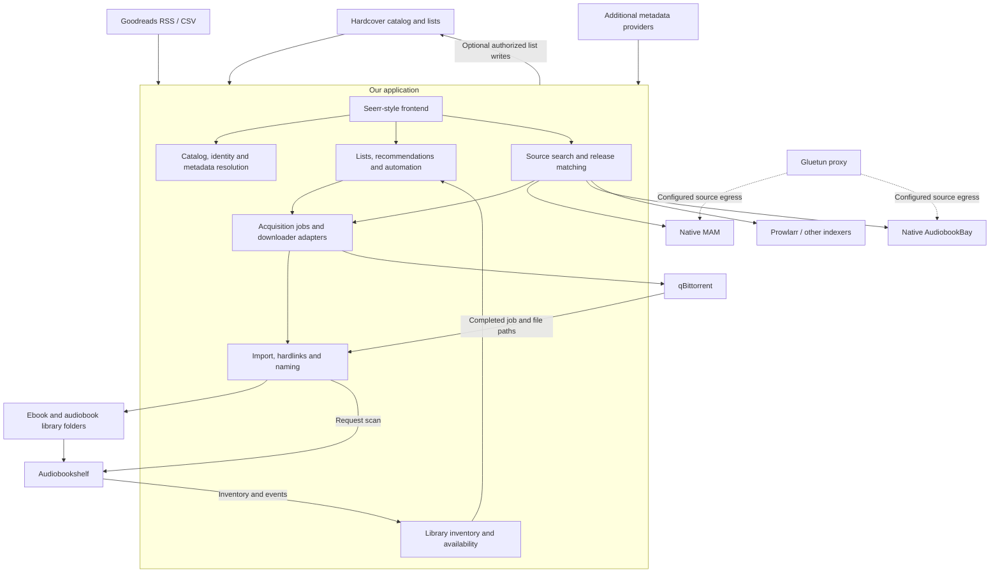

**Product architecture: a standalone book discovery and acquisition app**

Updated September 17, 2026, following the clarified product direction. This is the active plan. It supersedes the earlier recommendation to evaluate or depend on another acquisition application. We are building a new application, using existing projects as source-code and design references. Implementation has started; see [current status](docs/IMPLEMENTATION-STATUS.md). No production deployment or live media-library changes have occurred.

The researched P0/P1 choices are now recorded in [Implementation Decisions](IMPLEMENTATION-DECISIONS.md), which supplies the concrete technical baseline, authority rules, failure handling and acceptance gates where this overview previously left choices open.

The development handoff is now defined in the [PRD](PRD.md), [staged implementation plan](IMPLEMENTATION-PLAN.md), and [acceptance plan](ACCEPTANCE-PLAN.md). These specify scope, requirement IDs, work packages and release evidence; this document remains the architecture overview.

**Product boundary.** The app owns catalog discovery, curated lists, source aggregation, acquisition policies, direct download-client dispatch, and organization of the files it acquires. Audiobookshelf owns serving and playback. The app reads ABS inventory to show ebook/audio availability and prevent duplicate acquisition, and requests a scan after an import. It keeps its own catalog, editions, acquisition history, and mapping to ABS items.

Required initial integrations are native MAM, native AudiobookBay, optional Prowlarr, qBittorrent, Gluetun proxy routing, Hardcover, Goodreads RSS/CSV, and Audiobookshelf. No Bindery, Shelfarr, Chaptarr, or other acquisition manager is required. Their implementations can inform individual modules.

Seerr supplies the intended visual language: familiar navigation, cover cards, horizontal shelves, detail pages, badges, dialogs, activity and settings layouts. Book-specific models sit behind those components. This is deliberate frontend adaptation rather than adopting Seerr's movie/TV domain model.

Gluetun's HTTP proxy handles configured HTTP source traffic. qBittorrent's torrent egress is a separate deployment/network setting; saving a proxy address in our app does not automatically route torrents through it.

**Code references and intended reuse.** These findings come from source inspection of the repository snapshots recorded in `research/source-snapshot.json`; they are not runtime test results.

| Reference | Useful code / behavior | Treatment in our app |
|---|---|---|
| [Seerr components](https://github.com/seerr-team/seerr/tree/develop/src/components) | Layout/Sidebar/MobileMenu, Common buttons/badges/dialogs, TitleCard, MediaSlider, settings layout | Adapt visual components to our book view models; replace service/data bindings |
| [MouseSearch app](https://github.com/sevenlayercookie/MouseSearch/blob/main/app.py) | `/mam/search`, native search fields, detail enrichment, cookie/proxy handling, completion tracking, `_perform_organization` | Extract and adapt bounded capabilities into modules; keep detailed MAM results |
| [MouseSearch client interface](https://github.com/sevenlayercookie/MouseSearch/blob/main/clients/base.py) and [qBittorrent client](https://github.com/sevenlayercookie/MouseSearch/blob/main/clients/qbittorrent.py) | Client normalization, job lookup, categories, file enumeration and submission | Reference for a downloader adapter with durable acquisition IDs |
| [Shelfmark release sources](https://github.com/calibrain/shelfmark/blob/main/shelfmark/release_sources/__init__.py) | Common release structure with source-specific extra fields and registered source adapters | Lossless normalized results plus richer provider details |
| [Shelfmark AudiobookBay](https://github.com/calibrain/shelfmark/tree/main/shelfmark/release_sources/audiobookbay) | Search, detail parsing and acquisition handling | Native ABB adapter reference; isolate scraper changes from core logic |
| [Shelfmark Prowlarr client](https://github.com/calibrain/shelfmark/blob/main/shelfmark/release_sources/prowlarr/api.py) | Per-indexer Torznab queries and richer returned attributes | Additional configured indexers; preserve origin and metadata |
| BookOrbit metadata modules, below | Per-field preference resolution and candidate agreement | Independently implement the pattern, or deliberately account for AGPL if incorporating source |
| [ReadMeABook Hardcover sync](https://github.com/kikootwo/ReadMeABook/blob/main/documentation/backend/services/hardcover-sync.md) and [RSS sync](https://github.com/kikootwo/ReadMeABook/blob/main/documentation/backend/services/goodreads-sync.md) | Provider-specific ingestion feeding shared synchronization logic | Reference architecture; resolve to our work/edition model rather than requiring Audible ASINs |
| [Audiobookshelf router](https://github.com/advplyr/audiobookshelf/blob/master/server/routers/ApiRouter.js) | Inventory and scan endpoints | Backend adapter and final availability confirmation |

Seerr, MouseSearch and Shelfmark have MIT licenses in the inspected repositories. BookOrbit and ReadMeABook are AGPL. The selected baseline is an MIT project with attributed compatible reuse and independent implementation of concepts from AGPL references. Keep a file/dependency reuse ledger and retained notices; see decision D05 for the boundary.

**What BookOrbit actually does.** Its [metadata preference resolver](https://github.com/bookorbit/bookorbit/blob/main/server/src/modules/metadata-preferences/metadata-preference-resolver.ts) assigns each field its own enabled flag, provider order and merge strategy. It supports global rules and library overrides, special genre merging, and provider-ID preferences. There is not merely one global provider ranking.

Its [fetch pipeline](https://github.com/bookorbit/bookorbit/blob/main/server/src/modules/metadata-fetch/metadata-fetch-pipeline.ts) selects configured providers, handles cooldowns, checks candidate agreement before field resolution, and returns resolved fields with sources and diagnostics. Provider response speed does not determine authority. [Candidate agreement](https://github.com/bookorbit/bookorbit/blob/main/server/src/modules/metadata-fetch/candidate-agreement.ts) selects an anchor using ISBN evidence or query relevance, then checks other candidates against it. Its exact thresholds are implementation choices, not a model we must copy unchanged.

Our proposed metadata pipeline is: gather candidates → establish work/edition identity → reject conflicts or mark ambiguity → apply field-specific priorities → store values with provenance → expose overrides. Metadata from an uncertain candidate can be offered for review without becoming the basis of automatic acquisition.

Proposed configurable defaults, not claims about any provider's universal accuracy:

| Data | Preference / scope |
|---|---|
| Work title, author, synopsis, series | Hardcover first; verified alternative catalog mappings as fallback |
| Ebook ISBN, publisher, publication and language | The specifically matched ebook edition |
| Audiobook narrator, duration, abridgment and language | The specifically matched recording; recording providers and corroborating source details |
| Release title and release description | The original source, preserved verbatim in stored data and safely rendered |
| File format, codec, size and file layout | Source claims before download; actual inspected files afterward |
| Genres/tags | Optional deduplicated union with provider attribution and filtering |
| Cover | Configurable preference, including a selected edition's cover |
| Availability and local asset identifiers | Audiobookshelf inventory |

Do not combine a narrator from one recording with duration or chapters from another. Do not replace MAM's release description with a catalog synopsis. They belong in different fields and different UI panels. Field preferences should offer fill-missing, preferred-provider replacement, and manual lock; genre unions are a separate operation. Retain each rating provider and sample count rather than presenting an invented combined rating.

**The catalog and source views.** A title can be discovered through Hardcover search, a list, ABS inventory, or a source-native search. A title missing from Hardcover must still be usable: create a local provisional work with its MAM/source identity, then enrich or match it later. Preserve a manual correction path.

The main book page represents the work. Its cover, author, synopsis, series, related titles and list memberships create the bookstore experience. Beneath that, independent ebook and audiobook panels describe availability and the selected acquisition policy.

Use tabs such as Overview, Editions & Narrators, Sources, Lists, and Activity. The Sources tab aggregates all configured sources for that title. Source Details in a drawer shows the raw title, posting description, flags and technical metadata; Catalog Details shows the normalized book/edition record. Raw and normalized values are both available, so aggregation does not discard what makes MouseSearch useful.

| Source | Raw release title | Medium | Narrator / edition | Format | Size | Seeds | Match | Action |
|---|---|---|---|---|---|---|---|---|
| MAM | Original source text | Audio | Named recording | M4B | Source value | Source value | Exact / likely / uncertain | Download / inspect |
| AudiobookBay | Original source text | Audio | Claimed recording | MP3 | Source value or unknown | Unknown if unavailable | Exact / likely / uncertain | Download / inspect |
| Prowlarr → tracker | Original source text | Ebook | Matched edition | EPUB | Source value | Source value | Exact / likely / uncertain | Download / inspect |

Rows above are a UI schema, not real search results. Do not invent missing seed counts or infer edition certainty from a similar title. Show per-source loading and failures independently; one slow source must not erase other results. Save fetch times and let users refresh. MAM-native advanced search remains available as well as catalog-first search.

**Identity and versions.** Use separate internal entities for Work, Edition/Recording, SourceRelease, DownloadJob, ImportManifest, LibraryAsset, ListMembership and AcquisitionIntent. A file set can represent several works, and one recording can consist of several files. Keep those relationships instead of assuming one torrent equals one book.

A work can have multiple ebook editions and multiple recordings. An acquisition intent identifies a work, target medium, language and edition constraints. It asks either for any acceptable recording or for a specific one. Quality preferences choose an encoding within that requirement. Changes to format preference must not automatically convert a request for one narrator into a different recording.

The default policy is to keep a qualifying owned version. Alternate narrators and upgrades require explicit intent or an enabled upgrade policy. Existing ABS files can be represented and matched without renaming them. Our importer organizes new acquisitions and does not retroactively take ownership of the existing library.

Work-level ownership is independent of acquisition-policy satisfaction: a confirmed ebook OR audiobook makes the work “In library.” A policy requesting both may still want the missing medium, but never removes that ownership check. Other catalog editions/recordings do not make an owned work incomplete. Tracker postings and alternate encodings are download releases, not additional catalog editions. See [the metadata, availability and collections refinement](research/metadata-and-collections.md) for the current defaults and detailed rules.

**The exact list-to-library lifecycle.**

1. A user adds a title to a subscribed Hardcover or accessible Goodreads shelf.
2. A scheduled provider sync records the membership and resolves the work.
3. The policy resolver determines whether this list wants ebook, audiobook, both, or browse-only.
4. The availability service checks qualifying ABS assets, pending jobs and persistent user exclusions.
5. Create intents only for unsatisfied targets. Uncertain matches or stale inventory hold automatic dispatch for reconciliation.
6. Search native MAM, native ABB and configured Prowlarr sources for each requested medium.
7. Apply eligibility checks, rank eligible releases, and persist the choice and explanation.
8. Submit the selected artifact to qBittorrent using a stable job association.
9. Track completion and validate the actual file set; organize and hardlink to the appropriate library root.
10. Request an ABS scan and reconcile events/inventory until the imported asset is confirmed.
11. Display a green “In library” check for the work once either medium is confirmed, and update the separate medium/edition status and automation progress. Optional external list write-back runs afterward as its own job.

Polling an unchanged list must have no new acquisition effect. A torrent added successfully just before a crash must be found through its hash/tag/client association on restart, rather than blindly added again. A completed import awaiting an ABS scan remains pending confirmation; it is not redownloaded.

**Deduplication is policy satisfaction, not title-string equality.**

| Existing state | Desired policy | Result |
|---|---|---|
| Qualifying ebook and audio in ABS | Both | Mark satisfied; no download |
| Ebook in ABS | Both | Request only audio |
| Audio job already downloading | Audio | Associate the new list reason with the existing compatible intent |
| Recording A in ABS | Any acceptable recording | Satisfied if its language/edition meets policy |
| Recording A in ABS | Specifically recording B | B remains wanted |
| Matching title but ambiguous author/edition | Auto-download | Resolve or review; do not guess |
| ABS connection unavailable | New automation backfill | Show stale inventory; reconcile before dispatch |

Perform a check during list reconciliation and another immediately before dispatch, with a transactional reservation so two workers cannot acquire the same target concurrently. Reuse matching in-flight imports. Cross-source torrent deduplication uses origin identity or infohash where known; a matching hash does not erase tracker-specific metadata or seeding obligations.

A work can belong to several lists. Keep all acquisition reasons. Removing one list or membership stops only that reason, and does not delete downloaded files or cancel another user's independently requested edition. Maintain explicit exclusions so recurring imports do not resurrect a rejected title.

**List policies and settings.** The policy order is: per-request choice → per-list override → user default → instance default, subject to administrative restrictions. Support separate ebook/audio profiles and destinations.

The normal list form shows sync mode, desired media, acquisition profile and whether to include existing list entries. The profile supplies language, source/format priorities and collection behavior; display a short inherited summary. Narrator constraints, retry cadence, limits, upgrades and individual overrides belong in expandable advanced settings. No list requires re-entering global defaults. Show a preview of how many targets are already owned, missing by medium, pending or unresolved before enabling a backlog.

For “both,” create independent ebook and audio targets. Failure to find an ebook should not block a valid audio acquisition; automation can remain partially satisfied while the title is “In library.” A pack containing both can satisfy both after verifying its files and importing them to their configured roots.

**Sync directions must be explicit.**

| Connection | Inbound | Outbound | Default |
|---|---|---|---|
| Hardcover | Catalog, accessible lists, memberships, selected reading signals | Authorized list membership changes and optional dedicated available/owned lists | Import subscriptions; opt in to writes |
| Goodreads RSS | Feed items and observed additions | None through RSS | Inbound subscription; CSV for initial/backfill data |
| Audiobookshelf | Inventory, edition evidence, item events, optionally user progress | Scan requests; open-player links | Inventory and scan integration |
| Local app lists | Native membership changes | Export/share by deliberate user action | Full local control |

Hardcover documents list mutations and scopes in its [API action reference](https://github.com/hardcoverapp/hardcover-docs/blob/main/src/content/docs/api/GraphQL/Actions.mdx). Goodreads RSS is read-only; no architecture can make it bidirectional by itself. Keep “downloaded,” “owned,” “want to read,” and “read” separate. Acquiring a book must never mark it read.

For an externally owned list, incoming membership is authoritative by default. App-originated mutations use an outbox with operation IDs and acknowledgments so the next poll does not become a sync loop. A write failure does not undo a successful import. Missing entries in an incomplete or windowed RSS response do not authorize removal. Destructive two-way mirroring is outside the initial scope.

**Search and ranking.** Native MAM is the primary source, not a fallback contingent on Prowlarr. Preserve its author/narrator/series fields, posting description, media information and tracker flags. Keep its credentials/session rotation and configurable egress in its adapter. ABB has its own parser and health state. Prowlarr adds other configured sources; optionally exclude its MAM instance if native MAM already owns that search path.

Search can try identifiers where supported, then suitable title/author variations and source-specific fields. Validate returned candidates against the selected work and edition. A shared query string is not enough to preserve each source's capabilities. Retain a manual source search for cases where automatic matching has low confidence.

Eligibility precedes preference: correct work, target medium, language and edition requirements, usable files, source permissions, and exclusions. A series-pack preference broadens the search to known series titles and reconciles expected coverage before ranking. Among eligible releases, use the profile's ordered priorities for coverage, format, source and swarm health; retain popularity as an optional source-specific signal. Presets supply the ordering without numeric weight configuration. Allow a manual selection with its reasons visible. File-extension preference is not a complete measure of audio quality. Detailed pack semantics and proposed profile defaults are in the refinement document.

**Import and naming.** Our app owns the importer, with separate destination profiles for ebooks and audio. A proposed template can include author, title, series, sequence, year, narrator, language and edition ID. Profiles need live preview, sensible behavior for missing tokens, path sanitization, collision handling and an explicit hardlink/copy policy.

The concrete filesystem contract is defined in [Audiobookshelf import and organization](research/audiobookshelf-import-layout.md). Default to author / optional series / book-and-version folders, with one recording per ABS item. Optional book / version nesting requires explicit leaf metadata and compatible library metadata precedence. An app-level work aggregates these separate items. Do not put alternate complete narrations or duplicate audio encodings in a shared ABS item folder. Distinct ebook editions get separate items by default; equivalent formats of one edition can share a folder subject to ABS's primary/supplementary ebook behavior.

The importer maps the client's reported path to the container-visible source, waits for complete/stable files, inspects media types, computes an import manifest, creates links under a temporary staging path on the destination filesystem but outside every ABS-scanned root, and publishes each finished item directory. Each manifest records source job, files, destination and imported edition. Retry verifies existing files rather than treating an existing filename as proof of success. Metadata is rendered into new sidecars at item leaves using resolved per-book data; inherited pack metadata must not label every contained book identically.

Downloads and library destinations must be on a hardlink-compatible filesystem visible to the importing container. Default to hardlink-required with a clear failure; allow an explicit copy fallback. Keep original torrent paths and file bytes unchanged for seeding. Metadata rewriting or audio conversion creates an independent output; it must not modify shared hardlink bytes. Protect existing unrelated destination files from overwrite.

ABS confirmation is based on the returned asset, not solely on qBittorrent completion or a successful scan HTTP response. Store server/instance identity, library/item IDs, file evidence and matched work/edition. Events accelerate updates; periodic full inventory repairs missed events. Missing metadata can leave an item needing mapping even when the file is physically present.

**Frontend and discovery.** Adapt Seerr's visual shell and component styling directly where useful: responsive navigation, cover grids and shelves, status overlays, book detail layout, dialogs and service settings. Expose book-native component data such as work ID, cover, authors, ebook state, audio state and edition count. This keeps familiar styling while accommodating two media types and several recordings.

Discovery shelves can combine provider-attributed trending, followed lists, local curated lists, series continuation, related books, favorite authors and narrators, and books already available to read. A recommendation should explain why it appears. Do not let acquisition popularity stand in for taste, and do not require a title to have a confirmed download before it can appear in the catalog.

The primary green badge means “In library” when ANY confirmed ebook or audiobook asset maps to the work, regardless of the requested media policy. Separate ebook/audio icons expose format availability; catalog edition/recording counts expose other versions. Automation progress (such as “Audio wanted”) is secondary and cannot replace the ownership badge. Download releases are counted separately under Sources. A stale inventory is labelled with its last confirmed state rather than treated as absence.

**Internal structure and delivery sequence.** Use a modular application with React/TypeScript/Vite frontend, Python/FastAPI API, SQLAlchemy/psycopg/Alembic over PostgreSQL, and Procrastinate workers sharing the application codebase. Separate catalog providers, list providers, release sources, download clients, import profiles and library backends through typed interfaces. Compose runs API/static UI, worker and PostgreSQL. Decision D12 explains atomic job enqueue, recovery, version certification and backup handling. The engineering acceptance gates in Implementation Decisions refine the milestone sequence below.

Build in coherent slices:

1. Book-native UI shell, identity schema and ABS inventory; ebook/audio badges and manual match corrections.
2. Native MAM search/details and qBittorrent dispatch; durable jobs, collection manifests with per-book mapping, templates, hardlinks and ABS-confirmed completion.
3. ABB and Prowlarr aggregation; release comparison, source-aware matching and ranking.
4. Hardcover and Goodreads subscriptions; global/per-list format policies, backfill preview and idempotent automation.
5. Rich curation, recommendations, selected Hardcover write-back and more library/metadata adapters.

These are implementation milestones for our app, not a request to trial existing applications. Acceptance scenarios should use the user's exact workflows: a new list containing already-owned books, ebook present/audio absent with the overall ownership check preserved, alternate narrators, a repeated sync, concurrent list additions, a download completed across restart, a source outage, a delayed ABS scan, a series pack containing owned and missing books, an incomplete pack, and an inseparable omnibus. The defining result is that list additions reliably become the right missing media, with green checks only after library confirmation.
