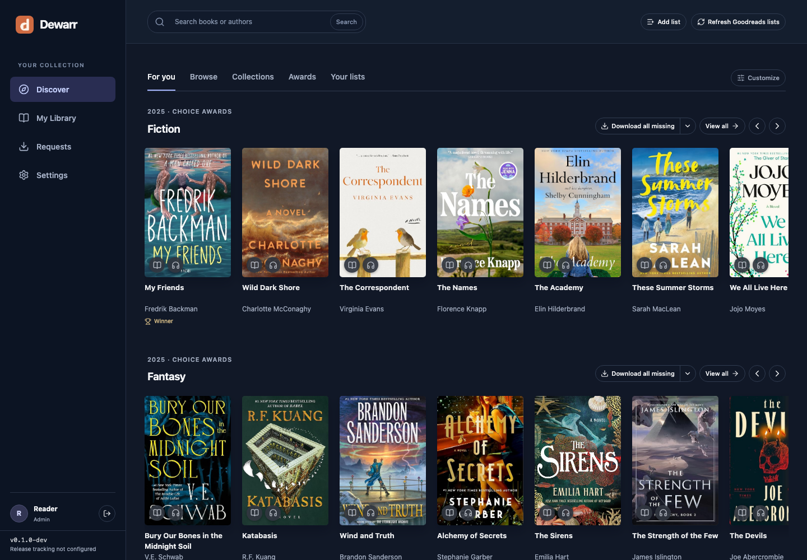
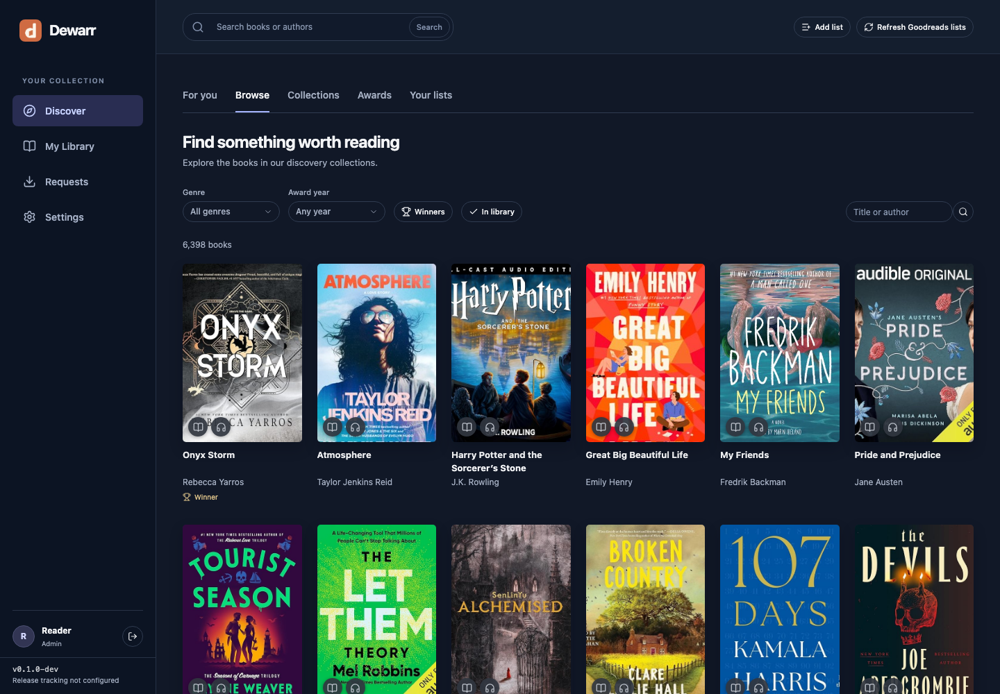
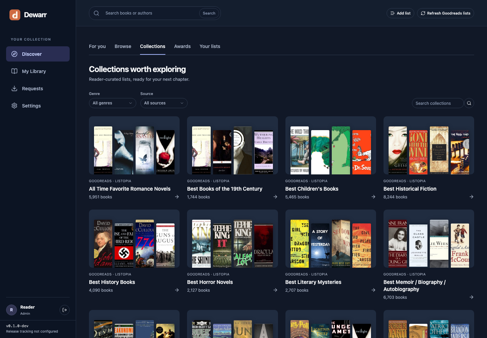
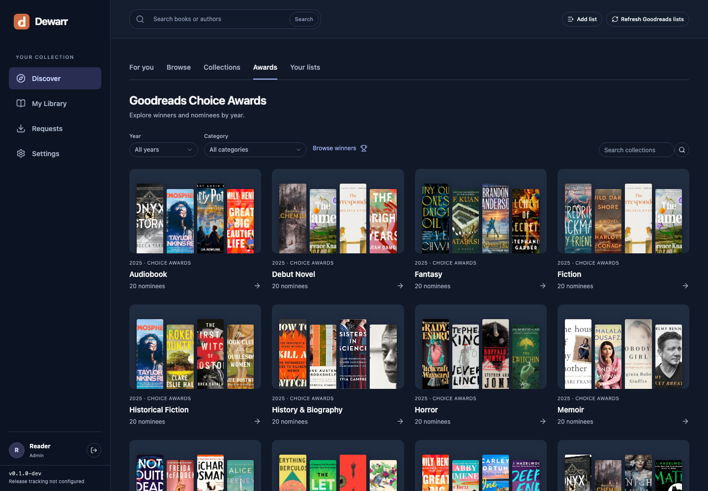
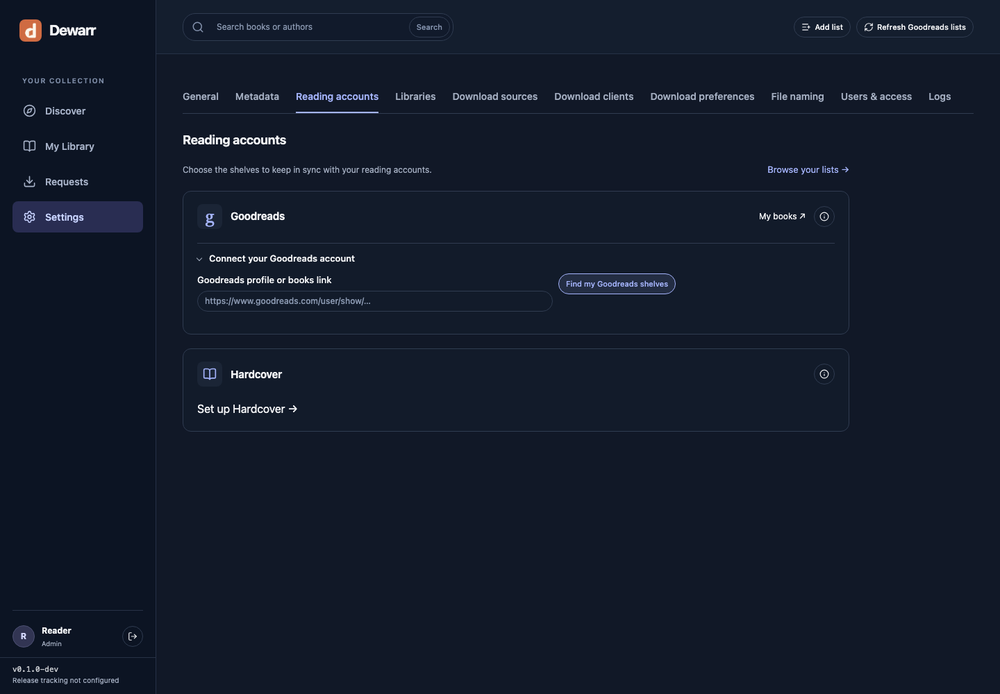
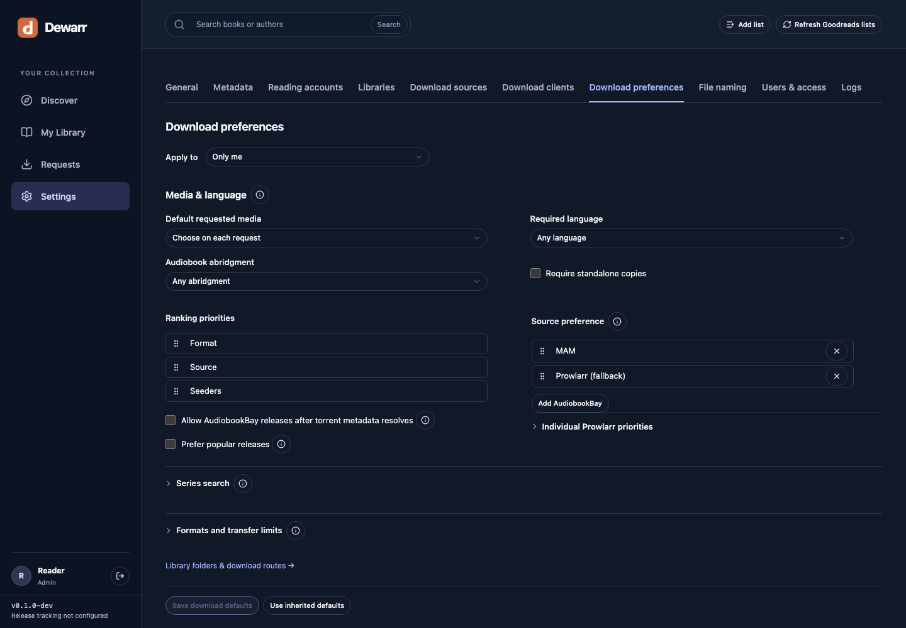
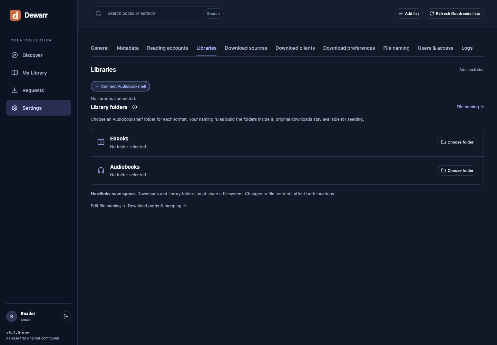

<p align="center"></p>
<h1 align="center">Dewarr</h1>
<p align="center">Your reading lists, audiobook library, and downloads in one place.</p>



## Features

- **Audiobookshelf integration** — browse your library, see what you own, and import completed downloads into verified library folders.
- **Goodreads sync** — follow shelves, import CSV exports, and check for new books automatically.
- **Hardcover sync** — track your lists and lists you follow, including private lists your account can access.
- **Custom Goodreads lists** — add public lists, track changes, and pin them to your discovery page.
- **For you** — personalize shelves with followed lists, recommendations, trending books, and new releases.
- **Auto download** — find and select eligible releases using list policies and approved import routes.
- **Download priorities** — rank sources and formats, apply size and seed preferences, and control download capacity.
- **Book discovery** — browse collections, awards, authors, and series.
- **Download sources** — connect MyAnonamouse, Prowlarr, and AudiobookBay; send transfers to qBittorrent.
- **Shared library** — individual accounts, reading lists, permissions, and download activity.
- **Self-hosted** — Docker, PostgreSQL, and an MIT license.

Early release. Automatic downloads are off by default. Goodreads RSS imports can be partial; CSV import fills historical gaps. See [reading accounts](docs/READING-ACCOUNTS.md) for sync behavior.

## Quick start

Requires Docker with Compose v2, Git, and Python 3. No Node.js installation is needed for Docker.

```sh
git clone https://github.com/logabell/dewarr.git
cd dewarr
python3 scripts/init_env.py --mode compose
docker compose up -d
```

Open [localhost:8000](http://localhost:8000). Create your first administrator account directly on the welcome page. After that, only an administrator can add more users.

The included `compose.yaml` runs Dewarr, its worker, and PostgreSQL:

```yaml
name: dewarr

x-application: &application
  image: ${DEWARR_IMAGE:-ghcr.io/logabell/dewarr:latest}
  env_file: .env
  user: "${BOOK_UID:-1000}:${BOOK_GID:-1000}"
  secrets:
    - app_key
  read_only: true
  tmpfs:
    - /tmp
  security_opt:
    - no-new-privileges:true
  cap_drop:
    - ALL

services:
  postgres:
    image: postgres:18.3-bookworm@sha256:80630f83606d8db77d30b3851b16a9f78be2d0d4dda6f7b82a1fdca5ebe3acba
    environment:
      POSTGRES_USER: book
      POSTGRES_DB: book
      POSTGRES_PASSWORD_FILE: /run/secrets/postgres_password
    secrets:
      - postgres_password
    volumes:
      - postgres:/var/lib/postgresql
    healthcheck:
      test: [CMD-SHELL, "pg_isready -U book -d book"]
      interval: 5s
      timeout: 5s
      retries: 12
    restart: unless-stopped

  migrate:
    <<: *application
    command: [alembic, upgrade, head]
    depends_on:
      postgres:
        condition: service_healthy

  api:
    <<: *application
    ports:
      - "${DEWARR_BIND:-127.0.0.1}:${DEWARR_PORT:-8000}:8000"
    depends_on:
      migrate:
        condition: service_completed_successfully
    healthcheck:
      test: [CMD, python, -c, "import urllib.request; urllib.request.urlopen('http://127.0.0.1:8000/api/health/ready', timeout=3)"]
      interval: 15s
      timeout: 5s
      retries: 5
    restart: unless-stopped

  worker:
    <<: *application
    command: [python, -m, app.jobs.worker]
    depends_on:
      migrate:
        condition: service_completed_successfully
    restart: unless-stopped

volumes:
  postgres:

secrets:
  app_key:
    file: .local/secrets/app_key
  postgres_password:
    file: .local/secrets/postgres_password
```

Then open **Settings**:

1. Connect your Audiobookshelf server and libraries.
2. Connect Goodreads and/or Hardcover and choose lists to track.
3. Add download sources and qBittorrent if you want downloads.
4. Configure shared folders and verify your library routes before enabling automation.

Dewarr runs an API/UI container, a background worker, and PostgreSQL. A short-lived migration container prepares the database.

**More setups:** [Docker guide](docs/DOCKER.md) · [Build from source](docs/DOCKER.md#build-from-source) · [Shared media folders](docs/DOCKER.md#shared-media-folders) · [Audiobookshelf stack](docs/DOCKER.md#add-audiobookshelf) · [Native development](docs/DEVELOPMENT.md)

## Screenshots

Actual Dewarr UI captured with an isolated demo account. Connected services and library contents depend on your setup.

### Browse books


### Collections and awards



### Reading accounts


### Download preferences


### Library connections



## Updates

```sh
docker compose pull
docker compose stop api worker
docker compose up -d
```

Back up PostgreSQL and `.local/secrets` before updating. Keep the encryption key with your backups. [Backup and restore instructions](docs/DOCKER.md#backups).

## License

[MIT](LICENSE). Third-party libraries and assets retain their own licenses; see [notices](docs/notices/).
