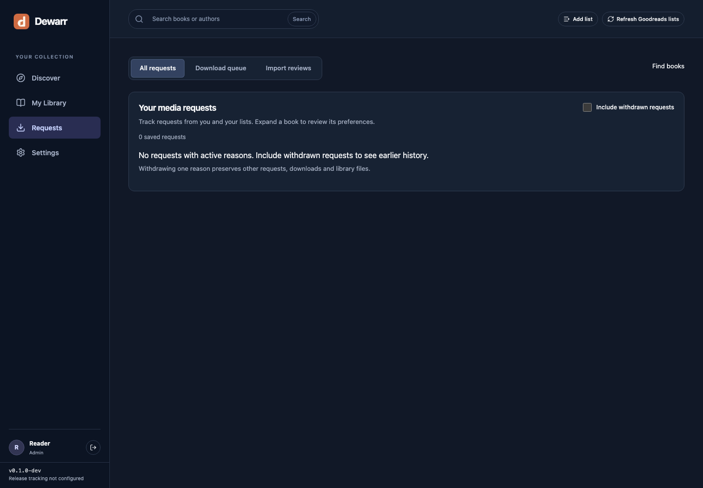
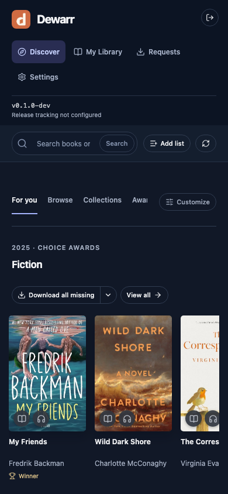

<p align="center"></p>
<h1 align="center">Dewarr</h1>
<p align="center">Your reading lists, audiobook library, and downloads in one place.</p>

## Features

- **Audiobookshelf integration** — browse your library, see what you own, and import completed downloads into verified library folders.
- **Goodreads sync** — follow shelves, import CSV exports, and check for new books automatically.
- **Hardcover sync** — track your lists and lists you follow, including private lists your account can access.
- **Custom Goodreads lists** — add public lists, track changes, and pin them to your discovery page.
- **For you** — personalize shelves with followed lists, recommendations, trending books, and new releases.
- **Auto download** — find and select eligible releases using list policies and approved import routes.
- **Download priorities** — rank sources and formats, apply size and seed preferences, and control download capacity.
- **Book discovery** — browse collections, awards, authors, and series.
- **Download sources** — connect MyAnonamouse, Prowlarr, and AudiobookBay; send transfers to qBittorrent.
- **Shared library** — individual accounts, reading lists, permissions, and download activity.
- **Self-hosted** — Docker, PostgreSQL, and an MIT license.

Early release. Automatic downloads are off by default. Goodreads RSS imports can be partial; CSV import fills historical gaps. See [reading accounts](docs/READING-ACCOUNTS.md) for sync behavior.

## Quick start

Requires Docker with Compose v2, Git, and Python 3. No Node.js installation is needed for Docker.

```sh
git clone https://github.com/logabell/dewarr.git
cd dewarr
python3 scripts/init_env.py --mode compose
docker compose up -d
```

Open [localhost:8000](http://localhost:8000). Create your administrator account using the setup token stored in `.local/secrets/bootstrap_token`.

Then open **Settings**:

1. Connect your Audiobookshelf server and libraries.
2. Connect Goodreads and/or Hardcover and choose lists to track.
3. Add download sources and qBittorrent if you want downloads.
4. Configure shared folders and verify your library routes before enabling automation.

Dewarr runs an API/UI container, a background worker, and PostgreSQL. A short-lived migration container prepares the database.

**More setups:** [Docker guide](docs/DOCKER.md) · [Build from source](docs/DOCKER.md#build-from-source) · [Shared media folders](docs/DOCKER.md#shared-media-folders) · [Audiobookshelf stack](docs/DOCKER.md#add-audiobookshelf) · [Native development](docs/DEVELOPMENT.md)

## Screenshots

Actual Dewarr UI captured with an isolated demo account. Connected services and library contents depend on your setup.

### For you


### Browse books


### Collections and awards


### Reading accounts


### Download preferences


### Library connections


<details>
<summary>Downloads and mobile</summary>




</details>

## Updates

```sh
docker compose pull
docker compose stop api worker
docker compose up -d
```

Back up PostgreSQL and `.local/secrets` before updating. Keep the encryption key with your backups. [Backup and restore instructions](docs/DOCKER.md#backups).

## License

[MIT](LICENSE). Third-party libraries and assets retain their own licenses; see [notices](docs/notices/).
