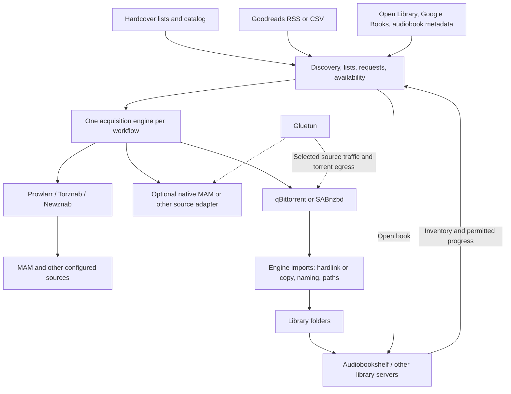

**A discovery and curation layer for a self-hosted book stack**

**Superseded direction:** This document preserves the initial ecosystem research. The user subsequently chose to plan a standalone application with native source, downloader and import modules, using existing projects as code/design references. The active plan is [PRODUCT-ARCHITECTURE.md](../PRODUCT-ARCHITECTURE.md); recommendations below to evaluate or depend on an existing acquisition engine are no longer the chosen direction.

Research snapshot: September 17, 2026. This is a planning document, not an implementation specification or a production evaluation. Findings come from current upstream documentation and selected source code; no applications were deployed and no authenticated MAM, Hardcover, Goodreads, or personal-library calls were made. Default-branch features may be newer than published releases. The accompanying source snapshot records the inspected commits.

The recommendation is to keep Audiobookshelf as the serving and playback system, evaluate an existing acquisition engine, and put any new work into discovery, curation, list subscriptions, and a trustworthy view of availability across libraries. Before committing to a fork, compare Bindery, Shelfarr, ReadMeABook, and Stackarr against the exact workflow. Several already implement substantial parts of it.

**Where the product belongs.** The proposed app primarily occupies Seerr's position: choosing what to read, collecting titles, requesting missing formats, and showing when they become available. Renaming, hardlinking, monitoring failed downloads, and quality upgrades belong to the acquisition manager beneath that experience. These can appear in one settings interface without requiring that interface to implement every operation.

| Layer | Responsibility | Suitable existing components | Proposed app's role |
|---|---|---|---|
| Catalog and social metadata | Works, editions, authors, descriptions, lists, popularity | Hardcover, Open Library, Google Books; audiobook-specific providers | Normalize identities, cache permitted data, attach provenance |
| Discovery and curation | Browse, recommendations, custom lists, subscriptions, requests | Stackarr; parts of Shelfarr and ReadMeABook; Seerr as a UI reference | Main product focus |
| Acquisition management | Desired formats, release selection, retries, import, upgrades | Bindery, Shelfarr, Chaptarr, ReadMeABook, LazyLibrarian | Delegate through one selected engine adapter |
| Source aggregation | Tracker/indexer connections, capability discovery, searches | Prowlarr/Jackett; optional native source adapters | Preserve book-specific fields and explain results |
| Transfer and network | Torrent/NZB jobs, seeding, VPN egress | qBittorrent, SABnzbd, Gluetun | Show status and configure connections |
| Serving and consumption | Inventory, reading/listening, progress, device clients | Audiobookshelf, BookOrbit, Grimmory, Kavita, Calibre-Web | Sync availability and open the appropriate player |



The engine adapter is a choice, not a requirement to deploy all the applications shown. Prowlarr can route its own tracker requests through a configured proxy; the diagram separates application responsibility from network topology.

**The existing projects worth evaluating.** These assessments describe fit, not measured reliability. A feature in a README or a recently merged branch is not proof that it works with a particular library.

| Project | Findings and fit | Main qualification | License observed |
|---|---|---|---|
| [Bindery](https://github.com/vavallee/bindery) | Broad acquisition candidate: independent ebook/audio slots, indexers, download clients, naming, hardlinks, metadata fallbacks | Test matching, API behavior, and MAM fields with real examples | MIT |
| [Shelfarr](https://github.com/Pedro-Revez-Silva/shelfarr) | Request-oriented ebook/audio system with acquisition, output processing, and ABS/BookOrbit/Grimmory connections | Confirm the desired list/curation experience separately | GPL-3.0 |
| [ReadMeABook](https://github.com/kikootwo/ReadMeABook) | Particularly close for audiobook requests, ABS/Plex, Prowlarr, Goodreads/Hardcover subscriptions, recommendations | Audiobook-centered; ebook sidecars differ from equal treatment of two formats | AGPL-3.0 |
| [Stackarr](https://github.com/katalyst88/stackarr) | Closest discovery reference: personalized shelves, reading history, series, ebook/audio support; delegates acquisition to Chaptarr | Alternate engine adapters and richer list policies would need evaluation or development | MIT |
| [Shelfmark](https://github.com/calibrain/shelfmark) | Multi-source search and requests, metadata providers, download processing | Explicitly excludes ownership tracking and background monitoring; maintained on a best-effort basis | MIT |
| [MouseSearch](https://github.com/sevenlayercookie/MouseSearch) | Preserve as the MAM quality benchmark; rich filters, session management, proxy routing and organization | Tracker-first experience; not a complete cross-provider catalog | MIT |
| [Chaptarr](https://github.com/Chaptarr/chaptarr) | Current public source; dual media, narrator/edition handling, naming and upgrades | Declared beta; inspect metadata-service dependencies and compatibility with the target release | GPL-3.0 |
| [LazyLibrarian](https://lazylibrarian.gitlab.io/) | Established author monitoring and automated ebook/audio acquisition | Useful backend comparison; assess its workflow and matching against modern alternatives | GPL-3.0 |
| [AudioBookRequest](https://github.com/markbeep/AudioBookRequest) | Lightweight audiobook request UI, Prowlarr integration, ABS availability checks | Narrower than the desired ebook/audio curation product | Verify LICENSE if reusing code |
| [Listenarr](https://github.com/Listenarrs/Listenarr) | Audiobook automation alternative | Several social/library features appear in its roadmap; do not treat roadmap entries as implemented | AGPL-3.0 |

Bindery's user guide specifically documents a per-Hardcover-list download toggle and a scheduled sync; disabling downloads leaves list items available for browsing and selective acquisition. It distinguishes this from Goodreads CSV import. This is a strong reason to test it before recreating list automation. [Bindery list and import behavior](https://github.com/vavallee/bindery/blob/main/docs/User-Guide-Wiki.md).

ReadMeABook has separate implemented [Hardcover sync](https://github.com/kikootwo/ReadMeABook/blob/main/documentation/backend/services/hardcover-sync.md) and [Goodreads RSS sync](https://github.com/kikootwo/ReadMeABook/blob/main/documentation/backend/services/goodreads-sync.md). Both resolve titles toward Audible ASINs and create requests. That establishes feasibility, but also exposes a design limitation to test: books absent from Audible and titles with several eligible recordings. Its [file-organization documentation](https://github.com/kikootwo/ReadMeABook/blob/main/documentation/phase3/file-organization.md) describes copying originals for seeding; do not assume a hardlink pipeline.

Readarr itself is retired following metadata failures. It is a historical reference rather than the recommended new foundation. Bookshelf/Librarr continuations and newer Livrarr/Librarry projects broaden the field, but were not audited deeply enough here to outrank the shortlist. [Readarr's retirement announcement](https://readarr.com/), [Bookshelf](https://github.com/pennydreadful/bookshelf), [Librarr](https://github.com/Rorqualx/Librarr), [Librarry](https://github.com/bandoracer/librarry).

Audiobookshelf, BookOrbit, Grimmory, Kavita, and Calibre-Web are primarily downstream library/reader integrations in this design. BookWyrm is an adjacent open social-reading project worth studying if community lists or federation become central; it does not replace the acquisition engine. [BookWyrm documentation](https://docs.joinbookwyrm.com/), [Grimmory](https://github.com/grimmory-tools/grimmory), [Kavita](https://www.kavitareader.com/), [Calibre-Web](https://github.com/janeczku/calibre-web).

**Integration contracts and their practical limits.**

| Integration | Verified surface | Recommended treatment |
|---|---|---|
| Audiobookshelf | REST library/item inventory, scan requests; Socket.IO item/library events | Full initial inventory, incremental events, periodic reconciliation; version-test the adapter |
| BookOrbit | `/api/v1` controllers for libraries, paginated book queries, scans; optional generated OpenAPI | Second library adapter; do not assume a permanent service-token or stable external upload contract |
| Hardcover | GraphQL catalog, list and reading-library queries, search and trending actions; scoped PATs | Primary list provider and discovery source, called server-side |
| Goodreads | No new public developer keys; working OSS integrations use shelf RSS | Best-effort inbound RSS, CSV for baseline/backfill; avoid dependency on account scraping |
| Prowlarr | JSON search and per-indexer Torznab/Newznab endpoints | Default source aggregation, retain rich attributes |
| MAM directly | MouseSearch implements authenticated `jsonLoad.php` queries, cookie rotation, proxy and dynamic-IP handling | Optional specialized adapter when the Prowlarr path loses necessary behavior |
| AudiobookBay | Shelfmark implements a scraper and acquisition handler | Optional source adapter with explicit degraded/unavailable states |
| qBittorrent | Web API for authentication, torrent submission, jobs, files, categories, paths, tags, seeding settings | Existing engine owns jobs; UI observes through its engine adapter |
| Gluetun | HTTP proxy and VPN container networking | Network infrastructure, not a search or acquisition backend |
| Bindery | `/api/v1` metadata/book operations, interactive source search, grab queue and lifecycle endpoints | Promising reusable engine; verify exact request/response schemas |
| Shelfarr | Scoped API tokens, request CRUD/retry, search-results and grab endpoints; custom HTTP sources | Particularly promising if native MAM needs to plug into an existing importer |

Audiobookshelf's published API reference says it is no longer maintained. Current [router source](https://github.com/advplyr/audiobookshelf/blob/master/server/routers/ApiRouter.js) confirms `GET /api/libraries`, `GET /api/libraries/:id/items`, `GET /api/items/:id`, and `POST /api/libraries/:id/scan`. Its current [API key controller](https://github.com/advplyr/audiobookshelf/blob/master/server/controllers/ApiKeyController.js) also exists independently of older user-token examples. Pin and test against the installed server version. [Published reference](https://api.audiobookshelf.org/).

BookOrbit's [development guide](https://github.com/bookorbit/bookorbit/blob/main/docs/DEVELOPMENT.md) documents optional Swagger/OpenAPI exposure. Its [library controller](https://github.com/bookorbit/bookorbit/blob/main/server/src/modules/library/library.controller.ts) uses `GET /api/v1/libraries` and `POST /api/v1/libraries/:id/books` for book queries; its [scanner controller](https://github.com/bookorbit/bookorbit/blob/main/server/src/modules/scanner/scanner.controller.ts) exposes scan triggers. Shelfarr already has a [BookOrbit client](https://github.com/Pedro-Revez-Silva/shelfarr/blob/main/app/services/book_orbit_client.rb), useful as integration evidence.

Bindery exposes operations such as `/api/v1/author/book`, `/api/v1/book/:id/search`, `/api/v1/indexer/search`, and `/api/v1/queue/grab`; its REST API is also used by its own UI. Shelfarr separately offers `/api/v1/requests/:id/search_results` and `/api/v1/requests/:id/grab`. Their identity and permission semantics differ, so an adapter must translate them instead of assuming an *arr-compatible endpoint means identical behavior. [Bindery API](https://github.com/vavallee/bindery/blob/main/docs/API.md), [Shelfarr API](https://github.com/Pedro-Revez-Silva/shelfarr/blob/main/docs/api.md).

Shelfarr's [custom acquisition interface](https://github.com/Pedro-Revez-Silva/shelfarr/blob/main/docs/custom-acquisition-providers.md) calls a configured service's health, search, and acquire endpoints. This provides a concrete possible home for MAM-specific behavior while Shelfarr retains transfer/import responsibility. A MouseSearch-backed provider would be new integration work, not an existing capability established by this research.

**Preserving the MAM experience without prematurely duplicating Prowlarr.** Prowlarr has a native [MAM implementation](https://github.com/Prowlarr/Prowlarr/blob/develop/src/NzbDrone.Core/Indexers/Definitions/MyAnonamouse.cs), including `mam_id` handling and book queries. Shelfmark explicitly uses [per-indexer Torznab queries](https://github.com/calibrain/shelfmark/blob/main/shelfmark/release_sources/prowlarr/api.py) to preserve richer book and tracker fields than generic JSON search. This means Prowlarr does not automatically imply losing the useful MAM experience.

Compare the same 20–30 searches in MouseSearch and the candidate engine: obscure titles, author initials, narrator-specific editions, non-English books, series, and packs. Measure result coverage, fields, ranking and timeouts. Keep source-origin information rather than flattening everything into a filename. Distinguish a successful empty response from an unavailable source.

Use native MAM only if that comparison identifies material losses. Its session must be dedicated: MouseSearch documents rotating cookies and warns against sharing the same session with another app. Proxy routing and the expected search/seedbox egress need explicit configuration. A generic proxy URL in an app does not guarantee torrent traffic uses the same VPN. [MouseSearch session/proxy documentation](https://github.com/sevenlayercookie/MouseSearch/blob/main/README.md), [Gluetun HTTP proxy](https://github.com/qdm12/gluetun-wiki/blob/main/setup/options/http-proxy.md), [qBittorrent API](https://github.com/qbittorrent/qBittorrent/wiki/WebUI-API-%28qBittorrent-5.0%29).

MAM results returned through both Prowlarr and a native adapter need deduplication using tracker identity/torrent ID or infohash where available. Keep distinct tracker access paths and seeding obligations attached to the result even when content is identical.

**Metadata and list providers.**

Hardcover is the preferred starting point. Its current docs expose scoped PATs; list/catalog reading can use limited read scopes. Free access lists 5,000 daily requests and 60/minute, with additional burst and GraphQL complexity limits. Use response headers, shared budgets and caching. Public/commercial reuse of user-owned lists, reviews and reading data is restricted unless appropriately authorized; aggregate data has separate attribution rules. A private integration does not establish permission to republish community data. [Hardcover's current policy and API guide](https://github.com/hardcoverapp/hardcover-docs/blob/main/src/content/docs/api/Getting-Started.mdx).

Its [search guide](https://github.com/hardcoverapp/hardcover-docs/blob/main/src/content/docs/api/guides/Searching.mdx) covers books, authors, lists and other entities. Its [GraphQL action catalog](https://github.com/hardcoverapp/hardcover-docs/blob/main/src/content/docs/api/GraphQL/Actions.mdx) includes `books_trending`, lists and followed lists. Validate scopes, accessible fields and coverage with a real token before promising every community feature. The existence of trending or list queries is not evidence of an unrestricted personalized recommendation API.

Goodreads is an import/subscription source, not the new app's core catalog. New developer keys have been unavailable since December 2020. Begin with RSS for the user's accessible shelves and CSV for complete initial imports. RSS may be a bounded window; never interpret a vanished feed item as permission to delete a book or as proof it left the shelf. Private shelves, full historical coverage, write-back, and Listopia require separate verification. [Official developer notice](https://www.goodreads.com/group/show/8095-goodreads-developers), [implemented RSS adapter reference](https://github.com/kikootwo/ReadMeABook/blob/main/documentation/backend/services/goodreads-sync.md).

Open Library provides work/edition identities, search, authors, subjects, covers and list APIs. It is a useful fallback, but its usage policy favors low-volume human-facing requests; it specifies 1 request/second unidentified and 3 identified, and data dumps for bulk use. Do not crawl its entire catalog through per-book calls. [Open Library API](https://openlibrary.org/developers/api). Google Books supplies another search/ISBN/covers source and optional personal-bookshelf integration; it does not establish access to Goodreads's recommendation graph. [Google Books API](https://developers.google.com/books/docs/v1/using).

For audiobook identity, investigate **AudiobookDB** as well as Audnexus. Audnexus now points new projects toward AudiobookDB while remaining maintained. AudiobookDB distinguishes a work from its recordings and documents ASIN resolution, search and an OpenAPI specification. This is promising for narrator/recording matching, but catalog coverage and service terms still need evaluation. [Audnexus](https://github.com/laxamentumtech/audnexus), [AudiobookDB API](https://audiobookdb.org/docs). Its word “release” means a catalog recording/edition; our download-source release is a separate entity.

Direct Audible endpoints used by existing OSS projects are useful evidence, not a guarantee of a supported public integration. Keep them optional and replaceable. A fallback metadata provider may improve descriptions while still lacking the external identifiers needed to prove that two records represent the same work.

**The identity model that prevents the expensive mistakes.** This is a proposed design. Store an internal stable identifier and external mappings rather than making an ISBN, an ASIN, or a provider's current primary ID the database primary key.

| Entity | Meaning | Examples of fields |
|---|---|---|
| Work | The intellectual title | Internal ID, title, authors, series relationships |
| Edition / recording | A language/version/performance of that work | ISBN/ASIN, narrator, abridgment, dramatization, duration, publication date |
| Source release | A downloadable package offered by a source | Tracker ID, infohash, format, files, size, seeders, access requirements |
| Library asset | What a backend actually serves | Backend and instance IDs, item ID, detected media types, edition mapping, last seen |
| List membership | A user's reason for wanting a work | Provider/list ID, upstream item ID, position, first/last seen |
| Acquisition intent | The requested outcome | Work, ebook/audio, language, edition requirements, quality profile, requester |

Record mapping evidence and confidence. Exact edition identifiers are strong evidence; normalized title+author is a candidate match. Narrator, language, duration, series number and abridgment can contradict it. Missing identifiers should produce a reviewable ambiguity rather than aggressive auto-merging.

An ebook holding does not satisfy an audiobook request. A folder containing only cover art does not satisfy either. An ABS item might contain audio plus an ebook, so inspect asset fields rather than just the library's label. A box set may contain several works, and several files may make up one recording. Handle those relationships explicitly.

Maintain different status dimensions: possession, accessibility to this user, acquisition progress, and reading progress. An unavailable backend is “last seen available, sync stale,” not “missing.” A remote book marked Read is not proof it exists in the server library. Chaptarr's [identity contract](https://github.com/Chaptarr/chaptarr/blob/develop/docs/API_IDENTITY_AND_LIFECYCLE.md) is a particularly relevant implementation reference for scoped identities and ambiguity.

**The proposed reader experience.** Use Seerr's familiarity while designing the information around books. Main navigation can be Discover, Search, Lists, My Library, Activity, with Connections/Settings for administrators. Keep a global Ebook / Audiobook / Both filter, then preserve separate availability badges within a shared work card.

Discover should offer a small number of understandable shelves: From your lists; Available now in your library; Next in a series; More from authors you rated highly; Narrators you enjoy; Trending on a named provider; Newly published in your preferred language; and Related to a chosen book. Every recommendation should explain its source or reason.

The book page is the center of the experience. Show the work's synopsis and series, then distinct ebook and audiobook panels. For audio, expose narrator, duration, language and edition. Present Read/Listen if a permitted library copy is present, Request/Get if absent, and a secondary Sources view for choosing an exact download. An alternative narrator should remain selectable even if another recording is owned.

The Sources view can be a comparison table: source, release title, edition match, language, format/codec, narrator, duration, size, seeders when relevant, tracker flags, and selection explanation. Do not represent missing seed counts as zero. Fetch detailed source availability on demand or for watched requests rather than querying every indexer for every cover in a discovery grid. Timestamp cached results; label unchecked availability honestly.

Lists need independent controls for Follow, Save a snapshot, and Automate. Following a public list should not silently authorize all future downloads. A list page should make the useful actions obvious: Get selected, Get missing ebooks, Get missing audiobooks, Preview automation, and Exclude title. Local lists, imported snapshots, and live provider subscriptions need visible origin and freshness.

Example of a proposed list summary: “42 titles · 18 ebooks available · 11 audiobooks available · 7 waiting · updated 12 minutes ago.” These are overlapping counts because some titles exist in both formats. A format filter should make that clear.

Activity should answer what happened and what needs attention: waiting for a qualifying release, approval required, downloading, import failed, waiting for library scan, or available. Avoid a single “downloaded” badge that hides whether the user can actually open the item.

**List automation as explicit policy.** The following configuration is an example of the intended product behavior, not an existing project's settings syntax.

```yaml
list: "Hardcover / Audiobooks next"
sync: enabled
automation: download_missing
media: audiobook
language: en
edition:
  abridged: reject
  dramatized: allow_only_if_selected
quality_profile: preferred_audio
source_order: [mam, other_configured_sources]
backfill: preview_before_enabling
on_removal: stop_future_requests_if_no_other_reason
delete_existing_files: false
max_new_requests_per_day: 5
```

Model sync as snapshots/deltas plus durable jobs: fetch all accessible pages; resolve identities; reconcile against library holdings and pending requests; evaluate per-list rules; preview first-time backfill; create idempotent intents; hand approved intents to the engine; reconcile final library availability. Persist provider errors and resume after throttling.

User controls should include browse-only, manual selection, request-for-approval, auto-download missing, and monitor future availability. Offer “all current items,” “new additions from now,” or a selected backfill. An unresolved match goes into review. Repeated syncs cannot create duplicate requests.

A work on three lists retains three reasons but should normally produce one compatible acquisition per format. Conflicting narrator or language requirements can legitimately create distinct intents. Removing one list membership must not cancel another user's request. Removing a list must not delete seeded files or existing library copies.

For new-release monitoring, distinguish the original work date from the language/recording's publication date. “Published” does not mean a qualifying file exists on any configured source. Retry through the engine with backoff, source budgets, and a visible last-search time.

**Release ranking.** Use two separate systems: book recommendations choose titles; acquisition ranking chooses files for a selected title. Community popularity should inform discovery, not override a wrong narrator or language.

First apply hard eligibility checks: title/work match, requested format, required language and edition, completeness, configured size limits, source access, and blocklist. An unknown field can require review when the corresponding requirement is strict. Then rank eligible candidates with ordered preferences: source priority, edition preference, format/codec and chapter quality, seed availability, and a size tie-breaker.

Provide profiles such as MAM first, Best matching edition, and Fastest eligible download. A strict source tier should be explicit; otherwise a weighted score might unexpectedly let hundreds of seeders defeat the user's source preference. Cap the contribution of seeder count. Direct downloads and Usenet have no comparable seed metric; evaluate their availability differently.

Example explanation: “Selected: MAM; preferred narrator; unabridged; M4B; sufficient seeds.” Rejection example: “Different recording: dramatized adaptation.” A preview should show these explanations before enabling automation. Container extension is not proof of audio quality; an M4B can contain poor audio, and a well-tagged multipart MP3 may be preferable.

**File organization and hardlinks.** Give exactly one component responsibility for each download/import workflow. Do not let MouseSearch auto-organize and a new engine independently import the same torrent. Keep the download client's original files available for seeding and make the library arrangement a separate view.

```text
/data/
  downloads/books/...
  library/ebooks/Author/Title/...epub
  library/audiobooks/Author/Series/01 - Title [Narrator]/...m4b
```

The importing container should see a common filesystem/mount path covering both download and library destinations. Matching host paths or using the same physical disk alone is not sufficient: mount boundaries and datasets matter. Verify hardlink capability in the actual container. Use explicit hardlink-required or hardlink-with-copy-fallback policies and make fallback visible. [Bindery storage guidance](https://github.com/vavallee/bindery/blob/main/docs/Storage-And-Hardlinks-Wiki.md).

A hardlink shares file contents. An in-place tag or cover-art write on the library copy can alter the torrent's bytes. Renaming a directory entry is different from modifying the file. Use database/sidecar metadata, or create a separate copy before transformations. Merging MP3s into M4B creates a new output and does not preserve zero-copy storage. Import completion should trigger or await a backend scan, then only mark the request available after the backend returns the asset.

**Recommendations without rebuilding Goodreads.** Start with deterministic candidates: next-in-series, author backlists, favorite narrators, genre similarity and chosen lists. Apply personal feedback and diversity caps. Separate “what should I get?” from “what can I read tonight?” so owned books remain useful recommendations in the latter view.

Stackarr is a concrete [algorithm reference](https://github.com/katalyst88/stackarr/blob/main/RECOMMENDATIONS.md): it uses reading signals, metadata candidates, weighted reasons, diversity and external similarity results. Its exclusions and assumptions are product choices, not universal requirements. For this app, downloading a book should not automatically imply liking it; explicit ratings and consumption are better signals.

Do not promise Amazon/Goodreads-equivalent collaborative filtering without an authorized interaction dataset. If semantic matching is later useful, start with permitted descriptions and tags, measure improvement, and keep its contribution explainable. LLM suggestions must resolve to real catalog entries before becoming requests. External recommendation outages should leave local list and series shelves usable.

Keep reading-progress sync separately owned. [ShelfBridge](https://github.com/rohit-purandare/ShelfBridge) already specializes in ABS-to-Hardcover progress. Reuse it or replace its role deliberately; two progress writers can create conflicts. Public community discovery should retain attribution, access boundaries, and permission-aware caching; local households can share their own lists without mirroring another service's social graph.

**Reuse and fork decisions.**

| Strategy | Advantage | Cost / tradeoff | Recommendation |
|---|---|---|---|
| Configure an existing candidate | Fastest route to learning the actual gaps | UX may not match the desired experience | First step |
| Extend Stackarr with another engine/list adapter | Reuses discovery and recommendation concepts | Existing Flask/UI structure and Chaptarr assumptions may need adaptation | Strong alternative to a greenfield app |
| New UI above Bindery or Shelfarr | Own the curation experience while outsourcing file management | Maintain catalog/identity mappings and adapter contract tests | Preferred custom-build direction if gaps remain |
| Fork Shelfmark | Reuses Python source providers and download work | Desired ownership and automation features diverge from explicit upstream scope | Intentional fork, not a likely small upstream addition |
| Fork Seerr wholesale | Familiar navigation, cards and requests | TMDB/movie/TV identifiers, schemas and server integrations need replacement | Poor default starting point |
| Build all layers | Maximum control | Largest maintenance surface; repeats work that already exists | Defer unless integration spikes disprove reuse |

Seerr's [TMDB title card](https://github.com/seerr-team/seerr/blob/develop/src/components/TitleCard/TmdbTitleCard.tsx) imports server movie/TV models and calls movie/TV routes. Its frontend is not a provider-neutral theme package. Reuse selected MIT components or visual patterns, preserve applicable notices, and introduce book-native view models. Shelfmark, MouseSearch, Bindery, Stackarr and Seerr have MIT repository licenses; ABS/Chaptarr/Shelfarr are GPL and BookOrbit/ReadMeABook are AGPL. API integration and incorporating source are different reuse decisions. Check dependencies/assets as well as the repository license before packaging a derivative.

For a fresh implementation, a reasonable small stack is React/TypeScript, TanStack Query for remote state, accessible Radix primitives, and a backend with a durable job store and a relational database. Python/FastAPI/Pydantic is attractive if adapting MouseSearch or Shelfmark internals; staying with an existing project's language is cheaper if extending it. These are proposed choices, not prerequisites. [TanStack Query](https://tanstack.com/query/latest/docs/framework/react/overview), [Radix](https://www.radix-ui.com/primitives/docs/overview/introduction), [FastAPI](https://fastapi.tiangolo.com/), [Pydantic](https://docs.pydantic.dev/latest/).

Use typed contracts for catalog providers, list providers, library backends and acquisition engines. Each advertises capabilities: reading private lists, incremental sync, manual release selection, narrator fields, scan triggers, or per-user visibility. A persistent queue needs retry state, leases and idempotency; a process-local timer is insufficient for acquisition intent. Begin as a modular application rather than a network of new microservices. Add a separate search index or recommendation service only when measured needs justify one.

**A practical evaluation before any large fork.**

1. Collect a representative set of about 30 titles: ordinary ebooks, obscure MAM titles, multiple narrators, two languages, series entries, omnibuses and split audiobooks. Include books already present in ABS.
2. Test Bindery as the first acquisition candidate. Check Hardcover custom-list toggles, independent format ownership, MAM/Prowlarr result quality, manual release selection, file naming and hardlinks.
3. Test Shelfarr's public API and custom-provider boundary as the second option. Check whether it offers enough control for a separate frontend and a specialized MAM provider.
4. Compare ReadMeABook's audiobook and RSS flows and Stackarr's recommendation/discovery flow. This is a UX and behavior comparison, not a commitment to deploying all four.
5. Build only an identity/availability proof: import permitted ABS inventory, map the test set, display ebook/audio holdings, and list ambiguous matches. No new player is needed.
6. Exercise list synchronization in preview mode: initial backfill, repeated polling, duplicate memberships, truncated RSS, provider throttling, edition mismatch, and a stale library backend.
7. Run one controlled end-to-end acquisition into an isolated library root. Confirm seeding, actual import mode, naming and eventual backend availability, including a restart between stages.

The decision gates are straightforward: preserve MAM search quality; never auto-acquire a demonstrably wrong language/edition; do not duplicate a completed request on retry; do not confuse stale inventory with missing books; and retain truthful, format-specific availability. If an existing app clears these and its UX is acceptable, configuration or a focused contribution is better than creating another overlapping project.

A sensible first custom release would cover ABS, Hardcover custom lists, Goodreads RSS/CSV, local lists, one acquisition engine, source comparison, format-aware availability, and simple explainable recommendations. BookOrbit and additional catalog adapters follow. Global community federation, universal two-way sync and a sophisticated learned recommender can wait until the central workflow is reliable.

**Open decisions for the next brainstorming pass.** The most useful choices are whether this is a personal/household app or a public hosted product; whether ebooks and audiobooks are equally important on day one; whether MAM-specific controls justify a native provider; and whether a new React interface matters more than extending Stackarr or the chosen engine. None requires forking Seerr in advance.
