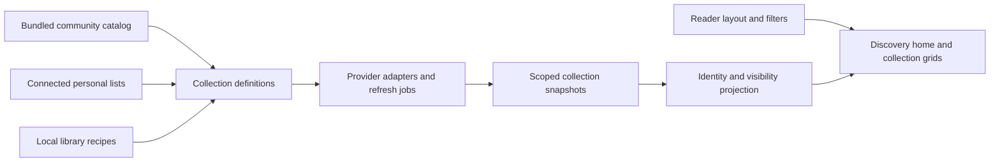

# Discovery as a curated book destination

Research and proposal, September 20, 2026. Based on the current working tree and public primary sources. This is a proposed direction, not implemented functionality. No authenticated provider calls were made, and no third-party Hardcover list IDs or RSS endpoints were certified as shipping defaults. Existing application edits were left untouched.

## Recommended product direction

Ship an inviting discovery home with about six useful rows, a browsable catalog of optional collections, and personal shelves from connected accounts. Offer a blank layout as a preference, not the first-run experience. The user's subsequent refinement makes popular public Goodreads lists, a dedicated full Choice Awards archive, connected-account lists, and manual list addition core product requirements. Start with roughly 12–20 maintained public-list defaults across genres; that limit does not cap the awards archive. See [the Goodreads expansion](goodreads-discovery-and-awards.md) for research, coverage requirements, and delivery gates.

The core product distinction is that people can discover **books** and discover **collections worth following**. A collection might be an award archive, a reader's list, a rotating editorial selection, a personal shelf, or a saved query. All can appear as book rows, but their membership and freshness rules differ.

GitHub should hold the community's collection definitions and original curation. Each installation resolves those definitions using its configured providers. Start with contributions through issues and pull requests; a hosted social service, public profiles, and popularity telemetry are unnecessary for the first version.

## What the project already has

| Working-tree component | Existing behavior | Opportunity |
| --- | --- | --- |
| `apps/web/src/pages/Discover.tsx` | Fixed sequence of trending, new releases, library additions, followed lists, series continuation, local additions | Replace fixed composition with persisted row definitions and reader preferences |
| `services/app/adapters/hardcover_discovery.py` | Monthly trending, releases from the last 90 days, related books | Retain adapters; introduce named recipes and explicit ranking semantics |
| `services/app/adapters/hardcover_community.py` | Public list search and follower-count ordering, preview hydration | Feed a broader collection catalog; distinguish popular lists from editorial selections |
| `apps/web/src/components/FollowedLists.tsx` | List preview panels containing tracking and synchronization detail | Render selected lists as full book rows; keep routine tracking details in list management |
| `docs/READING-ACCOUNTS.md` | Goodreads RSS/CSV, Hardcover owned/followed lists, per-reader connections and durable tracking | Add a separate “Show on Discover” preference and sensible onboarding selections |
| `services/app/api/discovery.py` | Discovery cards with local identity and availability projection | Reuse identity and visibility rules across collection sources |
| `services/app/api/metadata.py` | Account-generation-scoped provider access; community and list operations explicitly bypass response caching | Add a deliberate discovery snapshot mechanism without weakening authoritative sync or privacy checks |

The current release row sorts by release date; it is not an editorial “best new books” selection. The current public-list index orders by reported followers; that does not verify quality, completeness, or correct award membership. Those distinctions should survive the redesign.

## Browsing experience

Use five destinations within Discover, with the home retaining the streaming-style presentation:

- **For you:** a compact editorial spotlight, horizontal book rows, and an unobtrusive Customize action.
- **Browse:** a book grid with genres and filters. This is the place to explore beyond the home-page samples.
- **Collections:** a catalog of lists with cover mosaics, short descriptions, curator/source attribution, and Add to Discover.
- **Awards:** a dedicated year/category browser, starting with Goodreads Choice Awards, with winner and nominee views.
- **Your lists:** connected-account shelves and manually added lists, with Add list accessible here and from the Discover home.

Suggested home order after setup:

1. A featured collection, such as “Award-winning science fiction,” with a cover collage and one sentence explaining the selection.
2. Trending on Hardcover, when connected.
3. Your Want to Read, when selected during account setup.
4. A selected genre or award collection.
5. Ready in your library, when inventory exists.
6. New releases or another selected collection.
7. Continue a series, when relevant.

Treat this as a layout recipe that skips ineligible rows and fills from other selected collections, not seven permanent empty panels. With no account and no library, independently curated starter collections supply the book content. Their titles/authors can ship as original factual records; cover enrichment happens through supported metadata providers. Do not promise fully illustrated offline browsing without shipping appropriately reusable art.

Every row gets a clear title, a short reason/source, View all, and a menu to hide, reorder, or manage it. Use consistent cover sizes, useful availability badges, keyboard controls, and touch scrolling. Keep a meaningful View all route even when a row has no next preview page. Prefer a modest collection spotlight over a full-screen rotating banner that pushes books below the fold.

Book actions are View details, Save to list, Request, and Read/Listen where available. “Available audiobook edition” and “Audiobook in your library” are separate facts. Never infer that a book was read because it is owned, or that an audiobook is available because its work exists in a catalog.

## Defaults and customization

Use a small default layout and a larger optional catalog. During onboarding, allow optional genre interests and a Books / Audiobooks / Both preference, with Skip. Connected-account setup can preselect Want to Read and offer up to two more lists; show those selections before saving. Do not silently pin every existing list or automatically add every future list.

Persist these controls independently:

| Control | Meaning |
| --- | --- |
| Show on Discover | Pin this collection as a home row |
| Keep updated | Refresh its saved membership on schedule |
| Download automatically | Explicit acquisition policy, off by default |

Removing a row preserves its tracked list. Pausing tracking preserves the last saved membership. Adding a row never enables downloads or provider writeback. An advanced “Show new lists from this account automatically” preference can be offered later.

Collection catalog filters should include genre, theme, award, language, source, and connection requirement. Book-grid filters can later add reading status, publication year, and known format/ownership. Give collection tags and per-book genres separate fields: a fantasy collection may legitimately contain nonfiction companion books.

## Provider research and integration choices

**Hardcover:** use the existing integration for account-backed discovery and personal lists. Its published guide describes private backend tokens, scoped access, a free limit of 5,000 daily and 60 per-minute requests, and additional burst/top-level query limits. It also restricts public/commercial reuse of user-owned list data. Therefore, an open-source repository is not permission to mirror arbitrary readers' lists: store references and use authorized access; independently curate defaults or obtain the relevant permission. Resolve ambiguous public-list reuse with Hardcover before distributing it as a core dataset. [Official API guide](https://raw.githubusercontent.com/hardcoverapp/hardcover-docs/main/src/content/docs/api/Getting-Started.mdx).

Hardcover's search supports lists as well as books, but the documented search interface lacks arbitrary parameter filtering. Do not design universal genre filters around an assumed search parameter. Start with our own collection taxonomy; add per-book facets through normalized metadata or separately verified GraphQL queries. [Official search guide](https://raw.githubusercontent.com/hardcoverapp/hardcover-docs/main/src/content/docs/api/guides/Searching.mdx).

**Goodreads:** retain the project's RSS/CSV path for personal shelves. Its current adapter and reading-account documentation explicitly treat RSS as incomplete observations. Add distinct Listopia and Choice Awards adapters as core planned capabilities. Follow-up research retrieved a Listopia genre index, ranked list, and award pages; this verifies useful public content, but not a supported API or reliable server-side extraction. Serve validated snapshots and track source coverage. See [the Goodreads expansion](goodreads-discovery-and-awards.md). [Official awards page](https://www.goodreads.com/choiceawards/best-books-2025).

**Open Library:** consider it for a later additional list adapter and unauthenticated enrichment. Its official search result describes list seeds and edition endpoints; this session could not retrieve the full page, so validate the contract before scheduling implementation. [Lists API](https://openlibrary.org/dev/docs/api/lists).

**RSS generally:** support feeds with identifiable book entries through explicit adapters. An article feed mentioning books is not automatically a reliable book collection. Preserve source IDs, ambiguity, and partial coverage rather than guessing membership.

**Seerr:** its upstream custom-slider component is a useful reference for user-created discovery rows. Adopt the idea of configurable content recipes and consistent row presentation, with book-specific provenance, editions, and series rules. [Upstream component](https://raw.githubusercontent.com/seerr-team/seerr/develop/src/components/Discover/CreateSlider/index.tsx).

## A concrete starter catalog

These are proposed collections with verified source pages, not completed imported datasets. Award collections should record award year, category, winner/finalist status, and a source link per entry. Preserve presentation year separately from publication eligibility year where they differ. Create original short descriptions rather than copying award citations.

| Candidate | Source and implementation | Default treatment |
| --- | --- | --- |
| Trending on Hardcover | Existing provider adapter; label its time window | On when connected |
| Recently published | Existing provider adapter; honestly label chronological order | On when connected |
| Your Want to Read | Selected synced personal shelf | On when selected |
| Ready in your library / Continue a series | Existing local inventory and series data | On when useful |
| Hugo Best Novel winners | Independently maintain factual entries against [official history](https://www.thehugoawards.org/hugo-history/) | Optional SFF pack |
| Nebula Best Novel winners | Verify against [official awards by year](https://nebulas.sfwa.org/awards-by-year/) | Optional SFF pack |
| Booker winners | Verify against [official archive](https://thebookerprizes.com/the-booker-library/features/full-list-of-booker-prize-winners-shortlisted-and-longlisted-authors) | General starter candidate |
| Pulitzer Fiction winners | Verify against [official category archive](https://www.pulitzer.org/prize-winners-by-category/219) | General starter candidate |
| National Book Award fiction / nonfiction | Separate collections from [official awards](https://www.nationalbook.org/national-book-awards/) | Optional literary/nonfiction pack |
| Audie winners by category | Preserve the winning recording/narrator where identifiable; [official winners](https://www.audiopub.org/audie-awards-winners) | Audio starter candidate |
| Goodreads Choice winners by year/category | Curated snapshot using [official results](https://www.goodreads.com/choiceawards/best-books-2025); not a live RSS claim | Popular-reading candidate |
| Start here: fantasy / science fiction / mystery / romance | Original community selections with contributor attribution | Optional genre packs |
| Short reads / standalone novels / completed series | Explicit editorial selection first; dynamic rules only after metadata coverage is adequate | Later optional collections |

Do not launch a shelf called “Most popular books everywhere” from a single provider's ranking. Prefer “Trending on Hardcover,” “Most-followed Hardcover lists,” or a named community selection. Do not rely on raw mean rating alone; if a later ranking uses ratings, retain source and sample size.

## GitHub community catalog

Begin with a `discovery-catalog/` directory in this repository. Split into a separate repository when contribution volume justifies it. Suggested structure:

```text
discovery-catalog/
  schema.json
  taxonomy.json
  collections/awards/
  collections/genres/
  collections/provider-lists/
  packs/
  CONTRIBUTING.md
```

Each definition needs a stable ID, original title/description, curator, source type, references, language, collection tags, supported capabilities, update policy, last review date, revision, and attribution/reuse information. Membership is either an ordered set of identifiers with title/author fallbacks, a provider list reference, or a named supported query recipe. Do not allow executable code or arbitrary GraphQL in community manifests.

For original static selections, record multiple corroborated identifiers when possible. ISBNs identify editions, so resolve to the canonical work for ordinary discovery; preserve a recording target for an Audie winner. Uncertain matches remain unresolved until reviewed.

A contributor opens an issue or PR. CI validates schema, duplicate identifiers, supported source types, required attribution, and taxonomy. A maintainer checks curation and source access. Publish a versioned catalog with releases; ship a bundled known-good copy. Later, allow catalog-only updates via a versioned release manifest with integrity validation. Updates preserve user ordering, disabled rows, and pins. Newly contributed collections appear in the collection browser rather than silently joining everyone's home page.

The initial community experience can be “Suggest a collection,” “Report a broken collection,” and contributor credits linking to GitHub. Public popularity rankings would require a separate data collection policy and service; don't imply local follows provide global statistics.

## Technical implementation

Keep definitions, resolved contents, and reader layout separate:



Suggested new models:

- `DiscoveryCollection`: stable definition ID, kind, metadata, source configuration, visibility and ownership where applicable.
- `DiscoverySnapshot`: scoped resolved items, source order, fetched time, freshness/error state, coverage (`complete`, `partial`, `unknown`), and definition revision.
- `UserDiscoveryRow`: user, collection ID, enabled state, position, and row-specific display preferences.

Reuse `BookList`, `ListSubscription`, identity matching, and acquisition policies for tracked lists. Public preview should not require importing thousands of books into the user's saved catalog. Provider references can remain preview items until saved or requested.

Proposed routes are a home layout endpoint, paginated collection index/detail endpoints, paginated collection books, and reader-layout updates under `/api/discovery`. Extend rather than duplicate the current community-list routes where practical. Feed existing `DiscoveryShelf` and book-card presentation from a common projection layer; expand provider types as new adapters are introduced.

Add normalized genre/subject facets with source provenance before offering global book filtering. Apply filters before pagination over a known collection snapshot or supported source query. Filtering only the first 20 remote hits would give misleading empty pages and counts. Report partial coverage explicitly when the source cannot provide a complete collection.

Preserve source ordering for ranked lists. The existing Hardcover preview currently orders membership by list-book ID; verify whether a provider rank field is available before claiming that preview reflects the curator's ranking. Home previews may diversify repeated works across rows, but a collection's View all must preserve complete membership and its documented order.

Performance defaults to test: serve cached snapshots first; load the first two rows promptly and defer the rest; batch book hydration; coalesce repeated provider work. Poll personal lists on the existing worker schedule. Use slower refresh for public selections and release-based updates for static award sets. Disabled, unused provider collections should not all poll in the background. Handle provider failures per row.

Keep private snapshots scoped to reader/account generation. The current uncached community preview path rechecks public visibility; introducing caching requires an explicit revocation/invalidation strategy. Do not turn a formerly private or removed list into an indefinitely accessible shared cache. Separate ordinary stale content from denied access: authorization failures cannot be treated as a reason to keep serving restricted content.

## Delivery sequence

**1. Configurable discovery home.** Persist pin/hide/order preferences, convert selected followed lists to book rows, add View all, and separate display from tracking. Reuse existing providers. Deliver an immediate UX improvement without new sources.

**2. Curated starter catalog.** Add the manifest schema and contribution guide, author and verify 12–20 definitions, ship a small default pack, and build the collection browser with source/genre filters. Include a useful no-account experience and clear connection badges.

The refined scope includes Listopia defaults across genres, an Awards destination covering historical year/category combinations, and a shared manual Add list flow. Build these through the verification and archive-backfill stages in [the Goodreads expansion](goodreads-discovery-and-awards.md); do not claim full historical coverage before the coverage inventory passes.

**3. Rich browse.** Add normalized book facets, filtered grids, saved query recipes, reader-status exclusion where known, and explicit audiobook recording support. Verify provider capabilities before promising universal filters.

**4. Community catalog distribution.** Add independent catalog releases, health reporting, contributor attribution, and pack import/export. Consider external registries or a hosted community only after actual usage demonstrates the need.

Acceptance checks: a fresh install can browse starter titles; existing users retain their layout across upgrades; hiding a row does not pause tracking; pinning never starts acquisition; one failed source does not block the page; private lists never cross readers; RSS omissions never remove saved entries; filters produce correct pagination; award/recording distinctions survive identity resolution. Verify desktop/mobile layout and keyboard/touch browsing.

The first implementation should prove that curated collections make choosing a book easier. A large list marketplace and complex recommendation engine can follow once the home page and starter catalog work well.
